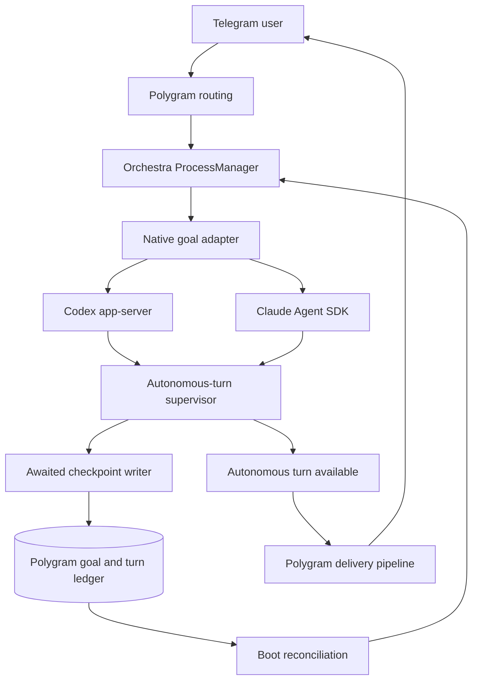
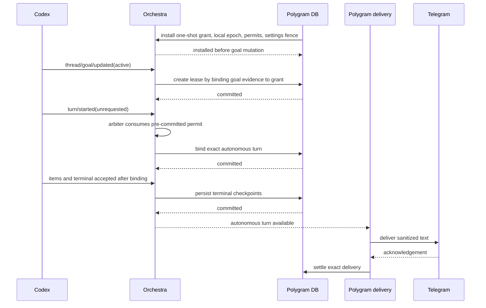
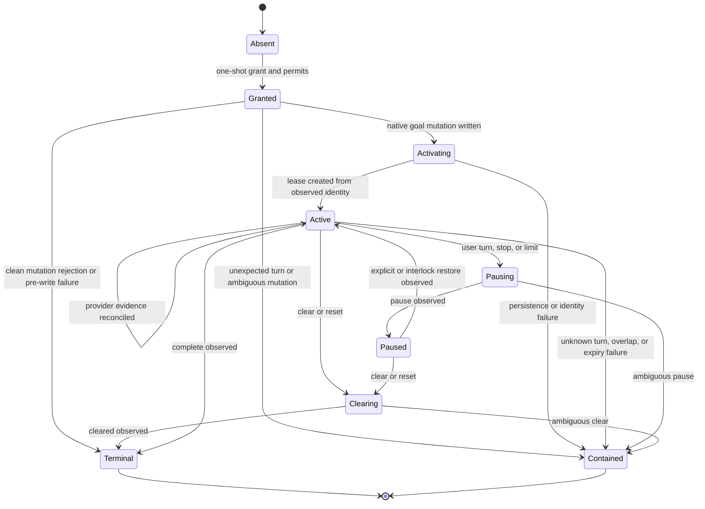
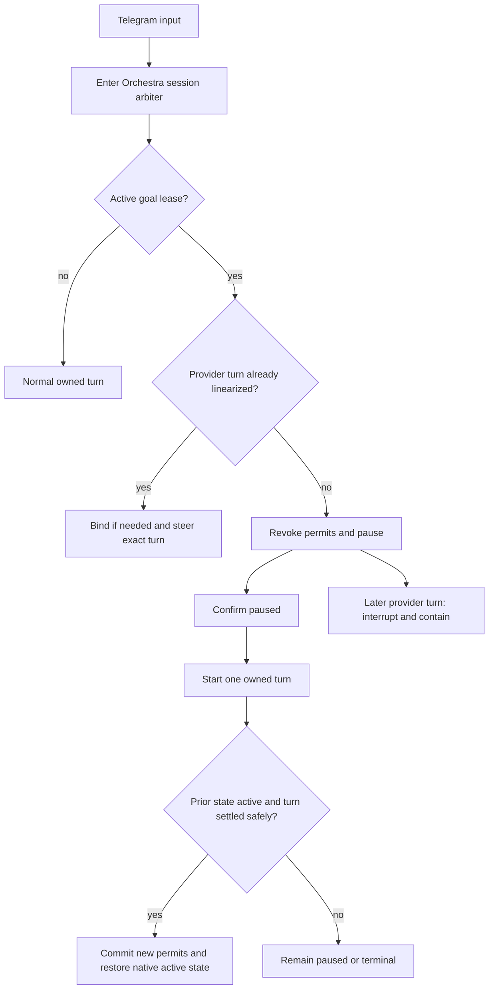

# Native Provider Goals and Autonomous Turns - Deferred Specification

> [!IMPORTANT]
> **Status: DEFERRED — not implemented.** Polygram-managed Codex sessions
> temporarily set `[features] goals = false` as a safety gate while runtime
> switching ships. That gate is temporary and applies only to Polygram's
> dedicated Codex profile; it is not the final goal architecture. When this
> work resumes, use the providers' native Codex and Claude goal systems
> described here. Do not build a Polygram-owned goal evaluator. Revalidate
> pinned provider facts and rollout details before execution.

This reviewed design is stored outside `docs/plans/` deliberately so automatic
plan discovery does not treat deferred goal work as the current implementation
target.

## Goal Capsule

- **Objective:** Keep Codex and Claude native goal systems while making autonomous turns safe, durable, interruptible, and deliverable through Polygram.
- **Authority:** Native provider goal semantics stay authoritative. Polygram owns orchestration safety. Existing session isolation, runtime attestation, containment, and Telegram delivery rules remain mandatory.
- **Execution profile:** Land a deliberately narrow Codex MVP first. Add Claude and rich-output parity only after their capability gates pass.
- **Stop conditions:** Stop if a provider turn cannot be bound to an exact current session, lease epoch, and pre-committed continuation permit; if the pinned runtime cannot safely resume behind that fence; if cancellation cannot stop both future continuation and current work; or if recovery must guess.
- **Tail ownership:** Orchestra lands and releases before Polygram consumes it. Native-goal-enabled Codex routing stays disabled until this specification's deterministic gates pass. Ordinary Codex sessions may ship separately with native goals disabled.

---

## Product Contract

### Summary

Add a provider-native goal layer rather than a Polygram-owned goal evaluator. Orchestra supervises native goal state and autonomous provider turns. Polygram owns Telegram commands, durable authorization metadata, delivery, recovery, and operational limits.

### Problem Frame

The first Polygram 0.28.2 Codex canary completed an owned Telegram turn and delivered its reply. That turn created a native Codex goal. Codex then started another same-thread turn 109 ms later without a client `turn/start`.

Orchestra correctly treated the second turn as unowned and entered `unexpected-turn-start` containment. The current ownership rule assumes every turn begins with a Polygram request. Native goals violate that assumption by design.

Disabling Codex goals would avoid the incident but remove a useful native capability. Rebuilding goals in Polygram would duplicate provider evaluators, continuation logic, budgets, and completion semantics. The required change is a new ownership class for bounded provider-originated turns, not a replacement goal engine.

The current Codex app-server protocol does not identify a `turn/started` notification as goal-originated. An active native goal therefore cannot prove the cause of each same-thread autonomous turn. The design must authorize the broader bounded behavior explicitly.

Claude has a native `/goal` command and completion evaluator. Unlike Codex, the reviewed public Claude Agent SDK surfaces do not expose a structured goal state API equivalent to `thread/goal/get`. Full managed parity is conditional on a pinned-runtime spike proving machine-observable state and reliable cancellation without parsing human UI text.

### Requirements

#### Native provider semantics

- R1. Polygram must use native Codex and Claude goals and must not implement its own goal evaluator, completion classifier, or policy that decides whether another goal turn is needed. It may pause and restore the provider's prior active state solely to serialize an intervening user-owned turn.
- R2. Orchestra must expose provider-shaped goal capabilities without pretending Codex and Claude have identical fields or lifecycle signals.
- R3. Codex goal control must use the pinned app-server's structured `thread/goal/set`, `thread/goal/get`, and `thread/goal/clear` methods.
- R4. Claude goal control must use native `/goal` through the Agent SDK only if the pinned-runtime gate proves safe machine control.
- R5. Existing non-goal Claude SDK and CLI behavior must remain unchanged.

#### Authorization and turn ownership

- R6. A native goal authorization lease must bind one Polygram session key, provider, provider session, current runtime generation, a local monotonic lease epoch, exact provider goal creation evidence, an immutable settings and security snapshot, and fixed safety bounds.
- R7. A Codex lease authorizes bounded provider-originated turns on its exact thread. It does not claim that app-server proved each turn was caused by the goal.
- R8. Every provider-originated turn must consume a durable one-use continuation permit on a grant or its bound lease that existed before the provider could start that turn. Its exact provider turn ID must be durably bound before Orchestra accepts or processes any item notification. The protocol does not prove that the provider waited for that binding before beginning provider-side execution.
- R9. One lease may have at most one active provider turn. A second distinct active turn, cross-thread turn, stale generation, expired lease, or duplicate identity must fail closed: accept no items, issue exact-turn interrupt when an ID exists, consume no unused permit, deliver nothing, and quarantine on generation or security-snapshot drift.
- R10. Unowned turns outside an active lease must retain the existing `unexpected-turn-start` containment behavior.

#### Delivery, recovery, and persistence

- R11. Every autonomous assistant result must use the same sanitization, chunking, file validation, Telegram delivery, and outbound acknowledgement rules as an owned result. The MVP must visibly mark autonomous updates and emit one bounded activation and terminal/paused/limited/contained status notice with `/stop` or the next valid action.
- R12. Autonomous delivery must not depend on the current fire-and-forget `onAutonomousAssistantMessage` callback.
- R13. Polygram must persist provider-autonomous turns in their own ledger without inventing a Telegram source message or overloading the client request-mutation ledger.
- R14. A restart must reconcile native goal state, exact provider turn, terminal state, and Telegram delivery before resuming or redelivering.
- R15. Recovery must use provider history plus durable identifiers. It must quarantine or disable the lease when exact reconstruction is unavailable.
- R16. Goal objectives and assistant content must not be added to structural telemetry or durable goal metadata. Only bounded status, length, keyed fingerprints, counters, and opaque IDs may be stored there.

#### User control and concurrency

- R17. `/stop` must first prevent future native continuation, then interrupt the exact active turn, and acknowledge success only after both facts are observed.
- R18. `/new`, `/reset`, and `/clear` must terminate the native goal before retiring or replacing its session.
- R19. The Codex MVP requires the pinned runtime to steer an admitted provider-autonomous turn; failure stops the MVP. For a later provider that lacks steering, Polygram must durably queue and acknowledge the input, pause future continuation, and start one owned turn only after the autonomous turn is terminal.
- R20. A user message between autonomous turns must pause native continuation before starting a client-owned turn. If the provider wins the race and starts a turn, the message must steer that turn instead.
- R21. Goal turns must preserve the session's selected model, reasoning effort, workspace, permission profile, and credentials. An active goal must reject model or effort changes when the provider cannot prove the new setting will apply.
- R22. Goal state and normal input must share one serialized mutation gate per provider session.

#### Safety and parity

- R23. Every lease must have immutable local maximums for autonomous turns, cumulative reported usage, wall-clock duration, per-turn duration, transcript bytes, result bytes, and Telegram chunks in addition to provider-native limits. Capacity is consumed on admission and goal updates cannot reset it. Turn count and known local state are admission ceilings; cumulative provider-reported usage is a soft post-observation stop. Because R8 exposes no execution hold and usage reports may lag, usage/time may overshoot by at most the one in-flight turn, which is recorded and never restores capacity.
- R24. Any lease termination—wall-clock expiry, exhaustion of an R23 maximum, explicit revocation, runtime disable, or downgrade—must revoke unused permits, pause or clear the native goal, and interrupt active work through the verified cancellation contract.
- R25. Goal turns must not widen filesystem, network, approval, MCP, credential, or cross-chat boundaries. Activation and fenced resume additionally require the frozen snapshot to match an explicit operator-configured autonomous-eligible policy; no profile is eligible merely because it is valid for interactive turns.
- R26. Files, approvals, and questions from autonomous turns must stay unsupported until their durable identity and delivery paths pass the same gates as text.
- R27. Topic isolation must follow the existing Polygram session key. A chat configured with shared topics also shares the provider-native goal.
- R28. Native-goal rollout must stay disabled by default, start with one private Codex canary, and preserve any quarantine present at rollout until its separately reviewed release procedure completes.
- R29. Native goal existence must never create, refresh, or enlarge Polygram authorization. A durable per-session eligibility decision and one-shot activation grant must pre-exist any newly authorized goal epoch. The grant is bindable only to the exact goal-mutation transaction and runtime generation; failure, ambiguity, timeout, or completion without observed binding durably revokes it and all permits.
- R30. Every goal mutation, provider turn admission, client turn start, steer, interrupt, and runtime-generation replacement must linearize through one Orchestra-owned per-session arbiter. The arbiter serializes discrete state transitions only, never a turn lifetime, so stop and steer can acquire it promptly.
- R31. Telegram delivery recovery must never rerun a provider turn. A chunk is known-unsent only when failure is proven before the transport dispatch begins; every failure or timeout after dispatch begins is delivery-unknown. Known-unsent chunks may retry; delivery-unknown is not retried automatically, revokes unused permits, and pauses the goal until an authorized user explicitly accepts or retries the stored chunk.
- R32. Runtime disable or downgrade must revoke admission, pause or clear the native goal, interrupt admitted work, and settle or quarantine unresolved delivery before routing away from Codex.

### Key Flows

- F1. Native goal activation
  - **Trigger:** An opted-in user explicitly sends the private MVP `/goal <objective>` command; later, U8 makes this provider-neutral.
  - **Steps:** Polygram first durably creates a one-shot activation grant and pre-commits its continuation permits, then submits the native Codex goal mutation. When Codex reports the new active goal, Orchestra validates the thread and atomically binds a new lease to the grant using `(threadId, createdAt)` plus redacted evidence. If that exact mutation settles or times out without binding, the grant and all permits are revoked. Goal updates reconcile state but cannot create, refresh, or enlarge authority.
  - **Outcome:** Native semantics remain provider-owned while turn authority becomes explicit and bounded.
- F2. Autonomous turn delivery
  - **Trigger:** The provider starts a turn without a client `turn/start` while the exact lease is active.
  - **Steps:** Under the session arbiter, Orchestra consumes the next pre-committed permit, binds its exact turn ID through an awaited durable checkpoint, then accepts its items. Polygram stores the terminal result reference; an ordered delivery worker sanitizes, chunks, delivers, and settles it.
  - **Outcome:** The user receives a durable autonomous result with no fake inbound message and no provider rerun for delivery.
- F3. User interruption
  - **Trigger:** The user sends `/stop`, `/new`, `/reset`, or `/clear`.
  - **Steps:** Polygram closes authorization, the provider goal is paused or cleared, the exact active turn is interrupted, and both states are reconciled before success is acknowledged.
  - **Outcome:** No later continuation can restart after the acknowledgement.
- F4. User steering during a goal
  - **Trigger:** A normal Telegram message arrives while a native goal is active.
  - **Steps:** One Orchestra manager call enters the session arbiter. If a provider `turn/started` linearized first, it binds that turn and steers it. Otherwise the input revokes unconsumed permits, pauses the goal, starts one owned turn, and restores the provider's prior active state with new permits only after that owned turn settles.
  - **Outcome:** User input has priority without overlapping turns.
- F5. Boot recovery
  - **Trigger:** Polygram starts with an active or unsettled goal lease.
  - **Steps:** Polygram loads the exact durable lease, generation fence, settings snapshot, and unused permits into Orchestra before any `thread/resume`. Orchestra resumes behind that fence, reconciles goal state and exact history, restores pending delivery, and decides active, paused, complete, or containment. If the pinned runtime cannot inspect or safely resume this way, the gate fails and Codex stays quarantined.
  - **Outcome:** No turn or delivery is replayed by inference.

### Acceptance Examples

- AE1. Given no active lease, when Codex emits an unknown same-thread `turn/started`, then Orchestra enters the existing containment path.
- AE2. Given an active exact Codex lease, when one new same-thread provider turn starts, then it consumes a pre-committed permit and its exact ID is durable before any item notification is accepted.
- AE3. Given an active Codex provider turn, when a Telegram message arrives, then the pinned runtime steers that exact turn and no client `turn/start` is sent. A provider without the proven steering capability queues and acknowledges the input, pauses continuation, and starts no owned turn until terminal.
- AE4. Given an active goal between turns, when a Telegram message arrives, then the goal is paused before an owned turn starts, unless a new provider turn wins the race and receives steering.
- AE5. Given an active goal and turn, when `/stop` arrives, then success is acknowledged only after the native goal cannot continue and the exact turn is terminal.
- AE6. Given a terminal autonomous text response, when a known-unsent Telegram attempt fails, then restart retries its exact ordered chunk; when Telegram may have accepted a send but its acknowledgement was lost, then restart marks delivery unknown and does not automatically duplicate it. Neither case creates a user inbound or reruns the provider.
- AE7. Given a stale process callback or another thread's goal notification, when it arrives, then it cannot refresh a lease, admit a turn, or deliver output.
- AE8. Given an active Codex goal whose autonomous model or effort cannot be proven, when the user requests a setting change, then the command fails visibly without mutating configured or running state.
- AE9. Given a Claude runtime whose spike lacks structured state or reliable clear semantics, when native-goal management is requested, then Claude managed goals remain unsupported and existing behavior is preserved.
- AE10. Given an autonomous turn that requests an approval or file delivery before the full-parity gate, when the item arrives, then it is denied or contained without silent approval or delivery.
- AE11. Given an active provider goal with no durable opt-in, activation grant, or restored lease, when it emits a same-thread turn, then the notification cannot create authority and the runtime contains it.
- AE12. Given `/stop` racing a new provider turn, when cancellation enters the arbiter first, then no permit remains and the later turn is interrupted/contained; when the turn enters first, then it is durably bound and `/stop` interrupts that exact turn.
- AE13. Given Telegram redelivery of the same `/goal` update, when activation is pending or active, then Polygram returns the current status without another grant or native mutation; a different `/goal` while non-terminal is rejected visibly.

### Success Criteria

- The original Codex goal-continuation trace completes without `unexpected-turn-start`, duplicate provider work, or a fabricated inbound owner; Telegram delivery follows the explicit known-unsent versus delivery-unknown contract.
- The same trace without an active exact lease still enters containment.
- `/stop` produces no later continuation during the pinned-runtime observation window.
- A crash at each durable boundary recovers to exact ordered retry when provably unsent, delivery-unknown when acknowledgement was lost, exact fenced resume, explicit disabled lease, or quarantine.
- One representative private coding goal reaches native completion, produces its requested repository outcome, accepts mid-turn steering, and returns the session to ordinary chat.
- Existing Claude, Codex owned-turn, steering, model/effort, reset, replay, and containment suites remain green.

### Scope Boundaries

#### Deliberately narrow Codex MVP

- Structured Codex goal observation and control.
- One durable authorization lease per Codex session.
- Bounded sequential same-thread provider-autonomous text turns.
- Durable text delivery and boot recovery.
- `/stop`, session reset, user-input priority, and fixed model/effort behavior while a goal is active.
- Per-session native-goal eligibility through private configuration plus an explicit one-shot `/goal <objective>` activation bound to the exact chat/topic.
- A private disabled-by-default VPS canary after release gates.

The MVP adds only private Codex `/goal <objective>`, `/goal status`, and delivery-unknown disposition needed for explicit authorization and operation. It does not add provider-neutral pause/resume/clear UX, autonomous file delivery, autonomous approval/question cards, or new Claude behavior. A goal created by the model during an ordinary message has no activation grant and remains unauthorized. Manual pause/resume remains diagnostic; user-facing control beyond `/stop` is U8.

All deterministic fixtures, crash matrices, direct pinned app-server spikes, and isolated macOS/Linux compatibility gates run before production enablement. Revalidate the current containment state at execution time and follow its documented release procedure; this deferred design carries no reboot assumption.

#### Full parity after the MVP

- Provider-neutral `/goal`, `/goal pause`, `/goal resume`, `/goal clear`, and status UX for Codex, independent of Claude support.
- Claude native-goal management after its capability gate passes; this scope is impossible on the current design if the gate finds no machine-observable lifecycle.
- Autonomous files, approvals, questions, and richer status events, enabled separately for Codex and Claude.
- A separate experimental-settings spike before any active-goal model or effort changes using Codex `thread/settings/update`.

#### Outside this plan

- A Polygram-owned goal evaluator or policy scheduler. The narrow pause/restore interlock around a user-owned turn is in scope and never decides goal completion.
- Codex CLI or tmux integration.
- An API-key OpenAI Responses backend.
- Parsing provider TUI output or human-readable goal status as a durable protocol.
- Force-clearing any runtime quarantine.
- Rebooting the local Mac.

---

## Planning Contract

### Verified Provider Facts

- Codex 0.145.0 declares goals stable and enabled by default.
- Its generated schema exposes `thread/goal/set`, `thread/goal/get`, and `thread/goal/clear`.
- Codex goal statuses are `active`, `paused`, `blocked`, `usageLimited`, `budgetLimited`, and `complete`.
- A goal includes `threadId`, `createdAt`, `updatedAt`, objective, token counters, time used, and an optional token budget.
- `thread/goal/updated` includes an exact thread, goal state, and a nullable or optional `turnId`.
- `turn/started` does not include goal origin, goal revision, predecessor turn, continuation sequence, or an authorization token.
- `turn/interrupt` targets one exact thread and turn.
- Claude Code 2.1.220 exposes native `/goal`. A bounded local CLI probe accepted it in print mode.
- The reviewed public Claude surfaces do not document a structured goal state API equivalent to Codex goal RPCs.

### Estimates and Design Judgments

- Codex goal notification ordering and the meaning of `thread/goal/updated.turnId` are undocumented.
- An active goal is a deliberate authorization policy for bounded same-thread autonomy, not provenance for an individual turn.
- Claude full parity is fragile unless the pinned Agent SDK exposes machine-observable activation, completion, and clear signals.
- The fire-and-forget autonomous callback is legacy delivery glue, not a durable settlement boundary.
- Goal continuation may not honor per-turn model and effort overrides because no client `turn/start` exists. The MVP freezes changes while active unless the spike proves inheritance.

### Key Technical Decisions

- KTD1. **Use native provider goals.** (session-settled: user-directed — chosen over a Polygram-owned goal engine: provider-native completion and continuation semantics must remain authoritative.) Polygram supplies orchestration safety, not goal judgment.
- KTD2. **Use a capability-shaped goal adapter.** (session-settled: user-approved — chosen over one forced common schema: Codex has structured RPCs while Claude currently exposes a native command surface.) Normalize only lifecycle authority, status class, and cancellation outcomes.
- KTD3. **Authorize Codex autonomy with an explicit grant, lease, and pre-committed permits.** (session-settled: user-approved — chosen over disabling goals: native continuation is required despite missing per-turn provenance.) Provider state binds and reconciles authority that Polygram already granted; it can never create or enlarge that authority.
- KTD4. **Do not label provider turns as proven goal turns.** Telemetry and persistence use `provider-autonomous`, with the lease as authorization evidence.
- KTD5. **Create a native autonomous-turn record, not a synthetic Telegram inbound.** The record has no outbound request mutation and cannot enter ordinary inbound replay. `codex_turn_attempts` remains client-request evidence only.
- KTD6. **Pre-authorize, then bind before accepting items.** Because app-server does not expose an execution hold, continuation permits are committed before provider execution is possible. Orchestra awaits Polygram's exact turn-binding checkpoint before it accepts item notifications; the plan does not claim this delays provider-side effects.
- KTD7. **Keep three evidence classes separate.** Provider-neutral grant/lease rows prove product authorization, autonomous-turn rows prove provider observations and delivery, and existing Codex attempt rows prove exact client app-server mutations.
- KTD8. **Use provider history for payload recovery.** Durable ledgers retain opaque IDs, keyed HMAC fingerprints, lengths, and state, not assistant content or goal objectives.
- KTD9. **Stop future continuation before current work.** Goal pause or clear precedes exact-turn interrupt. Ambiguous state-changing RPCs fail closed.
- KTD10. **Give Orchestra one per-session arbiter.** Provider admission, goal mutations, owned turn start, steering, interruption, and generation replacement share one linearization point. Polygram calls one intent-level manager method instead of composing these races.
- KTD11. **Freeze active-goal model and effort in the MVP.** This avoids silently adopting experimental thread mutation. Full live changes require separate pinned proof and review of `thread/settings/update`.
- KTD12. **Gate Claude management on structured observability.** Do not parse human goal output as protocol. A failed gate defers Claude management without blocking the Codex MVP.
- KTD13. **Roll out from a disabled feature flag.** Native-goal authorization remains disabled until tests, authenticated gates, release, and the current containment procedure permit a canary. Ordinary goals-disabled Codex routing is a separate rollout.
- KTD14. **Use truthful Telegram settlement semantics.** Provider execution is never repeated for delivery. Known-unsent chunks retry in order; acknowledgement-lost sends become `delivery-unknown` for manual disposition in the MVP.
- KTD15. **Use local epochs, not invented provider revisions.** `(threadId, createdAt)` identifies the observed Codex goal epoch. `updatedAt`, status, objective HMAC, and length are reconciliation evidence; only the local lease epoch and turn sequence are monotonic authority.

### Provider Goal Adapter

The adapter is an optional Process capability. It reports supported operations instead of emulating missing ones.

| Operation | Codex implementation | Claude implementation | MVP |
|---|---|---|---|
| Set goal | `thread/goal/set` | Native `/goal <objective>` through Agent SDK, if proven | Codex |
| Read status | `thread/goal/get` | Pinned structured signal, if proven | Codex |
| Pause | `thread/goal/set` with `paused` | Native supported action, if proven | Codex |
| Resume | `thread/goal/set` with `active` | Native supported action, if proven | Codex |
| Clear | `thread/goal/clear` | Native `/goal clear`, if proven | Codex |
| Read exact result | `thread/read` for a known turn | Structured SDK history | Codex |
| Capabilities | Structured flags plus provider | Structured flags plus provider | Both |

Provider-specific status remains available in redacted form. “Both” for capabilities means each process can truthfully report supported or unsupported; it does not imply Claude goal support in the MVP. Polygram must not invent limits or states a provider does not support.

### High-Level Technical Design

#### Component ownership

Orchestra owns protocol validation, process generation, the per-session arbiter, active-turn ownership, turn admission, and provider interruption. Polygram owns durable authorization, Telegram delivery, recovery decisions, commands, and rollout policy.

#### Cross-repository control contract

Orchestra exposes intent-level manager operations rather than asking Polygram to compose protocol races:

- `installNativeGoalFence(snapshot, checkpointSink)` installs a committed activation grant or an already bound lease, its unused permits, exact runtime generation, and frozen settings/security snapshot before a goal mutation or `thread/resume`.
- `sendWithNativeGoalPriority(input, options)` makes one atomic decision: steer the admitted provider turn, or revoke unused permits, pause the goal, start one owned turn, and restore the prior active state after settlement.
- `cancelNativeGoal(mode)` durably revokes admission through the awaited sink, verifies pause/clear, interrupts the exact admitted turn, and returns typed observed or ambiguous evidence.
- `readNativeAutonomousTurn(reference)` returns only an exact `{sessionKey, threadId, turnId, leaseEpoch, turnSequence, runtimeGeneration}` result.
- `settleNativeAutonomousTurn(reference, disposition)` is idempotent for an exact result fingerprint and delivery disposition.

The awaited `checkpointSink(event)` receives a versioned event containing session key, provider thread, local lease epoch, permit/turn sequence, exact provider turn when known, runtime generation, and transition. It returns `committed`, `stale`, or `failed` within a bounded deadline. `committed` is required before Orchestra accepts items or announces availability; `stale` or `failed` fences the session. Availability callbacks are wakeups only. Polygram's ordered DB scanner is the source of truth.

Inside `CodexProcess`, one discriminated `activeTurn` record owns either a `client` or `provider-autonomous` turn. It carries exact IDs, lease/permit metadata where applicable, the frozen settings/security snapshot, item maps, deadline, terminal state, and settlement reference. `pendingQueue` remains only for client waiters; `_pump` cannot start while any `activeTurn` exists. Steering, interruption, item routing, terminal handling, and generation replacement all use the common record.

The arbiter linearization rule is deterministic: if provider `turn/started` enters first, it consumes and binds one permit before user input steers it; if user input or cancellation enters first, it revokes unused permits before pause/start or pause/clear, and any later provider turn is interrupted and contained. Post-write ambiguity fences the session rather than guessing.

#### Codex autonomous-turn sequence

If the live availability callback is lost after the terminal checkpoint, the normal ordered delivery scanner or boot reconciliation rediscovers the unsettled turn.

#### Lease state

Each autonomous turn separately moves through permit reserved, exact turn bound, active, terminal pending delivery, and delivered, delivery-unknown, empty-settled, or failed. At most one turn is active, while earlier terminal turns may remain queued for ordered delivery.

#### User-input priority

#### MVP Telegram feedback and ordering

- `/goal <objective>` immediately reports activation pending, then either one active notice with the fixed delivery topic, configured bounds, and `/stop` guidance, or one typed unsupported/failed/contained outcome. The objective is not repeated in structural events.
- Autonomous text replies carry a compact `Goal update <sequence>` marker. Completion, pause/blocked/limited, denied rich items, empty/tool-only cycles, containment, and limit exhaustion each produce one concise status notice with the permitted next action.
- The lease fixes its autonomous delivery home to the topic that issued `/goal`; shared-topic sessions share provider state, but autonomous updates do not jump to whichever topic spoke most recently. Control acknowledgements return to the invoking topic.
- Owned and autonomous assistant outputs for one provider session share a monotonic outbound barrier. A newer owned reply may compute while an older autonomous result is pending, but it cannot be delivered first. `delivery-unknown` blocks later assistant output until explicit disposition.
- A delivery-unknown outcome emits one bounded owner/operator notice, revokes unused permits, and pauses the goal. `/goal delivery accept` marks the FIFO head as settled without retry. `/goal delivery retry` explicitly accepts duplication risk and retries the same stored chunk without rerunning the provider. Both are restricted to the authorized private user in the MVP and produce an audited structural disposition.

Cancellation commands share one response matrix:

| State | Telegram response |
|---|---|
| Request accepted | Immediate “stopping” or “resetting” acknowledgement; never success wording |
| No active goal/turn | Idempotent “nothing active” outcome |
| Goal non-admitting and turn terminal | Verified success |
| Deadline or ambiguous provider evidence | Contained/quarantined failure with retry/status guidance; never success |

U8 extends this into the complete provider-neutral command matrix for no goal, activating, active, paused, blocked, usage-limited, budget-limited, complete, contained, unsupported, and ambiguous states. Every response shows scope, remaining local bounds, frozen-setting state, and an allowed next action without echoing the objective.

### Persistence Model

Polygram adds `migrations/018-native-provider-goals.sql`.

`native_goal_grants` stores the explicit one-shot activation command identity, chat/topic delivery home, local epoch, immutable bounds, frozen settings/security fingerprint, expiry, and revocation state. It owns all pre-activation permits. A clean pre-write failure or provider rejection revokes and settles it benignly; a post-write ambiguity contains. A provider notification cannot create or refresh it.

`native_goal_leases` exists only after activation evidence is observed. It stores lease ID, grant/local epoch, session and provider identity, exact runtime generation, provider `(threadId, createdAt)` goal identity, optional `updatedAt`, keyed objective fingerprint and byte length, status evidence, immutable limits, consumed counters, timestamps, and containment code.

`native_goal_permits` pre-commits one-use turn capacity by grant/local epoch and monotonic sequence, then references the lease once the grant is bound. `native_autonomous_turns` binds a consumed permit to provider/session/generation/turn identities and stores lifecycle, terminal, ordered delivery, keyed output fingerprint and byte length, Telegram outbound identity, and timestamps. Empty and tool-only denied terminals settle explicitly. No row gets a fake Telegram source, client message ID, request method, or request-delivery state.

`codex_turn_attempts` remains unchanged and client-mutation-only. Actual goal set/pause/resume/clear, interrupt, and transcript-read requests continue to use its existing mutation evidence and link to the lease or autonomous turn only when relevant.

The DB enforces one non-terminal lease per session, one active bound turn per lease, unique provider turn identity, monotonic local epoch and turn sequence, exact Codex runtime-generation binding, forward-only transitions, immutable bounds/counters, FIFO delivery, and retention of unsettled evidence. Same-`createdAt` conflicting evidence, `updatedAt` regression, or an indistinguishable replacement contains rather than renewing authority.

### Failure Semantics

- Missing or late goal notification: do not infer activation from timing; an active provider goal without an exact durable grant and lease remains unauthorized.
- Goal persistence failure or checkpoint deadline expiry: do not activate or refresh the in-memory lease, do not retry the transition in-place, revoke its permits, and fence the process.
- Unknown, overlapping, cross-thread, stale-generation, expired, duplicate, or permit-less provider turn: interrupt and contain before accepting items. The client cannot promise that provider-side effects did not begin before notification.
- Ambiguous set, pause, resume, or clear RPC: record the mutation intent/evidence and contain; never blindly retry a state-changing mutation. Response and notification order may vary, but activation, pause, resume, or terminal state becomes authoritative only after the required RPC outcome and observed goal state agree.
- Goal terminal during an active admitted turn: allow that turn to settle but admit no later turn.
- Telegram known-unsent failure: keep the ordered terminal turn pending and retry without rerunning the provider. Acknowledgement-lost sends become `delivery-unknown`, alert the private operator, block later assistant-output delivery for that provider session, and require explicit accept-or-retry disposition.
- Lost live callback: the normal-operation delivery scanner retries ordered unsettled work; boot is not required.
- Missing, duplicate, structurally incomplete, or wrong-generation exact transcript: disable the lease and quarantine Codex.
- A well-formed transcript/result exceeding configured byte or chunk limits: settle the turn as limit-exceeded, pause the goal, and notify without quarantining Codex.
- Limit reached: pause or clear, interrupt active work, record a structural event, and notify without goal contents.
- Claude gate failure: preserve existing Claude behavior and leave managed goals unsupported.
- Settings inheritance failure: keep active-goal model and effort changes disabled in the MVP.
- Resume race: install the durable lease, remaining permits, and runtime fence before `thread/resume`; if the pinned protocol cannot do that safely, do not resume.
- Cancellation race: the arbiter winner decides. A turn admitted first is interrupted exactly; cancellation admitted first revokes permits and any later turn is interrupted/contained. No second race turn is admitted.
- Empty or tool-only terminal in the text-only MVP: persist and settle it without a Telegram message after unsupported effects are denied.
- Goal status `blocked`, `usageLimited`, or `budgetLimited`: revoke unused permits and remain non-terminal but non-admitting until an explicit supported resume; `complete` and clear are terminal.

### Security Boundaries

- A lease expands authority from client-started turns to bounded same-thread autonomy. It is not a provenance claim.
- Cross-chat, cross-topic, cross-thread, stale-generation, and stale-host events remain unauthorized.
- Existing Codex permission-profile attestation and Claude permission handling remain unchanged.
- The frozen lease snapshot includes model, effort, cwd/workspace roots, sandbox and network policy, approval policy/reviewer, permission profile, MCP availability, credential/environment identity, and `CODEX_HOME`. Drift revokes admission.
- A configured autonomous-eligibility predicate is checked at activation and every fenced resume. It is separate from ordinary interactive validity, so an operator must deliberately allow each sandbox/network/approval/MCP policy combination used unattended.
- Autonomous approvals, questions, files, background processes, and proactive subagents stay denied in the MVP. Each is enabled only after transitive ownership, durable identity, cancellation, and restart tests pass.
- Goal objectives, prompts, assistant text, commands, patches, paths, and file contents stay out of structural logs.
- Objective and output reconciliation use a keyed HMAC whose key follows the existing Polygram secret lifecycle; short plaintext cannot be recovered by dictionary matching. Fingerprints are evidence, not authentication.
- Goal events cannot alter runtime selection, credentials, `CODEX_HOME`, cwd, or permission profile.
- A provider cannot extend its Polygram lease limits.
- If an unauthorized turn begins provider-side work before its notification is bound, immediate interrupt and the frozen sandbox/approval/network policy are the only available containment. This residual exposure is accepted only for explicitly eligible private-canary profiles and is a U1 stop condition if the observed behavior escapes them.
- The MVP defaults are disabled globally. Enabling a session requires explicit operator values for autonomous-turn count, cumulative reported tokens, goal wall time, per-turn timeout, transcript/result bytes, and Telegram chunks; absent or invalid limits keep the feature off. The private canary values are recorded in non-production test configuration, not hard-coded as wider application defaults.
- The emergency kill switch is an operation, not a Boolean shortcut: revoke grants and permits, pause or clear goals, interrupt active turns, settle or quarantine pending deliveries, then disable routing. Ambiguity retains quarantine.
- The existing macOS/Linux app-server process and runtime-generation fences remain authoritative. This plan adds no tmux dependency, API key, new credential store, or Linux boot-identity requirement; Windows remains unsupported unless the existing Codex preflight is separately proven there.

### Dependencies and Sequencing

1. Run U1 and record pinned evidence. Codex ordering and cancellation must pass.
2. Freeze the versioned cross-repo control/checkpoint contract in U2.
3. Implement Orchestra U3-U4 and Polygram U5 in parallel. Release U2-U4, pin that exact Orchestra release in Polygram, then begin U6 and land U6-U7 behind a disabled flag.
4. Run deterministic cross-repository tests and authenticated local/VPS gates.
5. Release the Codex MVP. Revalidate production containment and complete any required release procedure before the private canary.
6. Canary one private Codex session and expand only after observation.
7. Run U8-U12 independently for command UX, Claude, rich items, and experimental settings without widening the validated Codex MVP.

The Claude path is not on the Codex MVP critical path. A failed Claude gate does not justify replacing native Codex goals with a Polygram scheduler.

### Effort Estimate

Engineer-days include implementation, deterministic tests, fixtures, review fixes, and release preparation. They exclude calendar soak and external provider fixes.

| Phase | Orchestra best / likely / worst | Polygram best / likely / worst | Combined best / likely / worst |
|---|---:|---:|---:|
| U1 pinned capability spikes | 2 / 3 / 5 | 1 / 2 / 3 | 3 / 5 / 8 |
| U2 goal adapter and control contract | 3 / 5 / 8 | 0 / 0 / 0 | 3 / 5 / 8 |
| U3 Codex arbiter and autonomous supervisor | 5 / 9 / 15 | 0 / 0 / 0 | 5 / 9 / 15 |
| U4 result, settlement, and cancellation APIs | 3 / 5 / 8 | 0 / 0 / 0 | 3 / 5 / 8 |
| U5 durable grants, leases, permits, and recovery | 0 / 0 / 0 | 6 / 10 / 16 | 6 / 10 / 16 |
| U6 delivery and user controls | 0 / 0 / 0 | 6 / 10 / 16 | 6 / 10 / 16 |
| U7 cross-repo test, release, and rollout | 2 / 3 / 5 | 3 / 5 / 8 | 5 / 8 / 13 |
| **Codex MVP subtotal** | **15 / 25 / 41** | **16 / 27 / 43** | **31 / 52 / 84** |
| U8 Codex/provider-neutral command UX | 0 / 1 / 2 | 3 / 5 / 8 | 3 / 6 / 10 |
| U9 Claude managed goals (conditional) | 4 / 7 / 12 | 4 / 7 / 12 | 8 / 14 / 24 |
| U10 Codex rich output parity | 3 / 6 / 10 | 4 / 8 / 13 | 7 / 14 / 23 |
| U11 Claude rich output parity (conditional) | 3 / 6 / 10 | 4 / 8 / 13 | 7 / 14 / 23 |
| U12 active-goal settings spike and change | 2 / 4 / 7 | 2 / 3 / 5 | 4 / 7 / 12 |
| **Full-parity total** | **27 / 49 / 82** | **33 / 58 / 94** | **60 / 107 / 176** |

The wide worst case reflects undocumented provider ordering, Claude's observability gap, crash recovery, and separately durable rich interactions. The Codex MVP critical path is U1 → U2 → U3 → U4 → U6 → U7; U5 begins from U2's frozen contract and joins before U6. The full-parity total assumes the Claude gate succeeds; if it fails, U9 and U11 are impossible on the current safe design and are not spent.

### Alternatives Considered

- **Disable native goals as the final architecture.** Rejected by user direction; it removes the desired capability. The current Polygram-managed Codex goal gate is a temporary safety measure while this work is deferred.
- **Build a Polygram goal engine.** Rejected; it duplicates provider semantics and still needs durable autonomous delivery.
- **Accept every same-thread unowned turn.** Rejected; it removes generation, goal-state, bounds, and recovery authorization.
- **Classify, interrupt, and notify without delivering autonomous work.** Credible smaller alternative: it would avoid the containment incident with much less recovery machinery, but it would make native goals unable to perform their intended multi-turn work. Keep it as the fallback if U1 invalidates safe admission.
- **Infer origin from nullable `turnId` or timing.** Rejected; neither is a documented admission contract.
- **Put all goal logic in Polygram.** Rejected; protocol validation and exact interruption belong beside the process in Orchestra.
- **Put Telegram delivery in Orchestra.** Rejected; it couples the process library to Polygram and Telegram.
- **Force one identical provider schema.** Rejected; it would expose false parity.
- **Use `thread/settings/update` immediately.** Deferred; it is experimental and the existing settings design intentionally avoided it.

---

## Implementation Units

### U1. Pin native-goal capability and race behavior

- **Goal:** Convert provider unknowns into checked fixtures before changing ownership.
- **Requirements:** R2-R4, R8-R9, R17, R19, R21, R23, R25-R26, R29-R31
- **Dependencies:** None
- **Target repos:** Orchestra and Polygram
- **Files:** Orchestra: `tests/codex-app-server-spike.test.js`, `tests/codex-app-server-client.test.js`, `tests/fixtures/codex-app-server-0.145.0/`; Polygram: `scripts/spikes/`, `tests/codex-app-server-spike.test.js`, `tests/claude-sdk-gate-oracles.test.js`
- **Approach:** Pin Codex goal RPCs, response/notification ordering, continuation, pause/clear, interrupt, transcript recovery, resume behavior, settings/security inheritance, and status transitions. Deliberately stall or fail the local notification checkpoint while the turn attempts filesystem, command, MCP, approval, and subagent effects; confirm there is no provider execution hold and validate pre-committed permits as the authorization primitive. Probe Claude Agent SDK activation, autonomous cycles, completion, status, clear, interrupt, resume, and stable identifiers without parsing human text.
- **Execution note:** Add characterization coverage before changing the protocol allowlist.
- **Test scenarios:**
  - A Codex goal reports active state around its first provider continuation and records exact ordering.
  - Blocking the notification consumer either proves an execution hold or records that provider effects can precede exact turn binding; the MVP proceeds only with pre-committed permits.
  - Pause or clear plus exact-turn interrupt produces no later turn during a bounded window.
  - `turn/steer` targets an admitted provider-autonomous turn; failure stops the Codex MVP.
  - `thread/read` returns one exact known autonomous turn and authoritative completed top-level assistant text, and rejects missing, duplicate, incomplete, oversized, and wrong-generation results.
  - `thread/resume` can be fenced by an already installed durable lease and permits before any immediate continuation; otherwise the Codex MVP stops.
  - Model, effort, cwd/workspace, sandbox/network, approval policy, permissions, MCP set, credentials/environment, and `CODEX_HOME` either persist exactly or the capability stays disabled.
  - Background processes and proactive subagents are denied unless exact descendant cancellation is proven.
  - Untrusted transcript/tool content cannot acquire authorization: native goal creation outside an exact `/goal` grant remains unleased and its continuation is interrupted/contained.
  - Reported usage counters are pinned for presence, units, monotonicity, update timing, regression handling, and resume behavior; absence or regression stops admission.
  - Telegram transport instrumentation proves the pre-dispatch boundary; every error after `sendMessage` dispatch begins is fixture-classified delivery-unknown.
  - Claude activation and clear expose stable machine state and IDs, or the gate records unsupported without a parser.
- **Verification:** Every admission and cancellation field used later is fixture-backed. A failed Codex gate stops the MVP; a failed Claude gate defers U9.

### U2. Add provider-shaped native goal capabilities

- **Goal:** Expose safe goal control and observation through Orchestra.
- **Requirements:** R1-R5, R16, R29-R30
- **Dependencies:** U1
- **Target repo:** Orchestra
- **Files:** `lib/codex/protocol-schema.json`, `lib/codex/app-server-client.js`, `lib/process/codex-process.js`, `lib/process/sdk-process.js`, `lib/process/process-manager.js`, `tests/codex-app-server-client.test.js`, `tests/codex-process.test.js`, `tests/process-manager-generic.test.js`, `tests/process-manager-sdk.test.js`
- **Approach:** Strictly project Codex goal RPCs, notifications, and the minimum exact transcript read. Freeze the versioned manager/checkpoint contract and typed outcomes from the Cross-repository control contract. Add optional capabilities; keep objectives out of events and checkpoints. Leave Claude unsupported until U9.
- **Execution note:** Implement protocol changes test-first.
- **Test scenarios:**
  - Valid set, get, pause, resume, and clear bind the exact thread.
  - Response-before-notification and notification-before-response both reconcile through persisted mutation intent without timing guesses.
  - Unknown fields, oversized values, malformed counters, invalid statuses, and cross-thread responses fail closed.
  - Notifications expose only approved fields and never log raw objectives.
  - Claude and missing processes return typed unsupported outcomes.
  - Normal turns, steering, settings, and containment remain unchanged.
- **Verification:** Callers can feature-detect goal operations and no process claims unproven capability.

### U3. Supervise Codex provider-autonomous turns

- **Goal:** Admit bounded autonomous turns under a current durable lease.
- **Requirements:** R6-R10, R22-R25, R29-R30
- **Dependencies:** U1, U2
- **Target repo:** Orchestra
- **Files:** `lib/process/codex-process.js`, `lib/process/process-manager.js`, `tests/codex-process.test.js`, `tests/process-contract.test.js`, `tests/fixtures/fake-codex-app-server.mjs`
- **Approach:** Add the Orchestra-owned per-session arbiter and common discriminated `activeTurn`. Install only committed grants, leases, frozen snapshots, and one-use permits. Classify an unrequested turn as provider-autonomous only when it consumes the next exact permit and every identity, bound, uniqueness, and no-overlap rule passes. Await exact turn binding before accepting items; never treat the callback as a provider execution hold.
- **Execution note:** Start with the production symptom as a failing test.
- **Test scenarios:**
  - Covers AE1. An unleased provider turn still contains.
  - Covers AE2. A leased turn is admitted only from a pre-committed permit and accepts no item before exact binding commits.
  - Client and autonomous turns share one `activeTurn`; `_pump`, steering, interruption, timeout, terminal handling, and generation replacement cannot overlap it.
  - Concurrent, stale, expired, wrong-thread, reused, conflicting-goal-evidence, or permit-less turns contain.
  - Paused, complete, blocked, usage-limited, budget-limited, or cleared goals authorize no new turn.
  - Duplicate and late notifications cannot reopen or redeliver.
  - Checkpoint failure prevents item processing.
  - Every fail-closed branch interrupts the exact observed turn when possible and emits a bounded structural reason.
  - Two rapid inputs, duplicate input delivery, turn-vs-stop, turn-vs-pause, terminal-vs-goal-complete, disconnect, and generation-replacement interleavings follow the arbiter winner.
  - Covers AE10-AE11. Files, approvals, questions, background work, and proactive subagents are denied/contained; model-created goals without exact grants remain unauthorized; empty and tool-only terminals settle explicitly.
- **Verification:** The canary trace passes only with a valid lease.

### U4. Add result, settlement, and cancellation APIs

- **Goal:** Give Polygram exact result recovery, delivery settlement, and two-part goal cancellation.
- **Requirements:** R11-R12, R15, R17-R18, R24, R30-R32
- **Dependencies:** U2, U3
- **Target repo:** Orchestra
- **Files:** `lib/process/codex-process.js`, `lib/process/process-manager.js`, `tests/codex-process.test.js`, `tests/process-manager-generic.test.js`
- **Approach:** Expose exact result reads and settlement references; retain output until settlement. Add cancellation that first revokes admission through the awaited sink, then pauses or clears with exact mutation evidence, interrupts the admitted turn, resolves open interactions, and reports observed or ambiguous states. Pin eviction while work or delivery is unresolved.
- **Execution note:** Implement cancellation tests before `/stop` integration.
- **Test scenarios:**
  - Result reads require exact `{sessionKey, threadId, turnId, leaseEpoch, turnSequence, runtimeGeneration}` and reject stale, cross-session, wrong-generation, settled, missing, duplicate, incomplete, oversized, or ambiguous histories.
  - Only authoritative completed top-level assistant text is returned with bounded status, keyed fingerprint, and length.
  - Settlement is tokenized and idempotent only for the exact lease/turn/result fingerprint.
  - Covers AE5. Cancellation acknowledges only with both goal and turn evidence.
  - Covers AE12. Cancellation-vs-turn-start follows the arbiter winner and never admits a second race turn.
  - Ambiguous goal mutation, missing terminal, or post-cancel continuation contains.
  - Eviction and shutdown remain pinned while unresolved.
- **Verification:** Polygram can deliver and stop without process internals.

### U5. Persist native goal leases and turns

- **Goal:** Make authorization, delivery, and recovery durable without contents.
- **Requirements:** R6, R8, R13-R16, R23, R27, R29-R32
- **Dependencies:** U1, U2
- **Target repo:** Polygram
- **Files:** `migrations/018-native-provider-goals.sql`, `lib/db.js`, `lib/db/native-goals.js`, `lib/db/codex-reconciliation.js`, `lib/db/codex-retention.js`, `tests/db.test.js`, `tests/codex-reconciliation.test.js`, `tests/codex-retention.test.js`, `tests/helpers/db-fixture.js`
- **Approach:** Add separate grant, lease, permit, and autonomous-turn tables. Keep `codex_turn_attempts` request-only. Make opt-in, pending activation, permit reservation/consumption, exact turn binding, terminal state, FIFO delivery, and revocation atomic with runtime-generation ownership. Enforce local monotonic epochs/sequences, immutable bounds, forward-only transitions, uniqueness, and retention.
- **Execution note:** Start with migration and transition tests that fail on schema 017.
- **Test scenarios:**
  - Schema 017 migrates without changing the semantics of existing Codex request attempts.
  - Covers AE7. Stale generation or cross-session writes fail atomically.
  - One session cannot have multiple non-terminal leases or active turns.
  - Provider turn identity, permit, local lease epoch, and turn sequence cannot be reused or move backward.
  - Covers AE11. Goal notifications cannot create/refresh a grant, reset counters, extend expiry, or replace `(threadId, createdAt)`.
  - Unbound grants and permits revoke on mutation failure, ambiguity, timeout, or settlement without activation and cannot bind a later goal.
  - Covers AE13. Telegram update identity makes activation idempotent; while a grant or lease is non-terminal, a duplicate returns current state and a different objective is rejected without another mutation.
  - Same-timestamp conflicting evidence and stale updates contain.
  - Missing, invalid, or mutable autonomous limits leave eligibility off and cannot be repaired by a provider update.
  - Unsettled evidence survives retention.
  - Objective and assistant plaintext never enter structural rows.
- **Verification:** A DB crash matrix reconstructs exact grant, lease, permit, autonomous turn, terminal, and delivery states.

### U6. Route delivery, user control, and input priority

- **Goal:** Integrate goals with Telegram while keeping replies, steering, and settings truthful.
- **Requirements:** R11-R12, R17-R22, R26, R30-R32
- **Dependencies:** U3-U5
- **Target repo:** Polygram
- **Files:** `lib/codex/runtime-controller.js`, `lib/codex/delivery-finalizer.js`, `lib/sdk/callbacks.js`, `lib/handlers/abort.js`, `lib/handlers/slash-commands.js`, `lib/handlers/gate-inbound.js`, `lib/pm-interface.js`, `polygram.js`, `tests/codex-runtime-controller.test.js`, `tests/codex-delivery-finalizer.test.js`, `tests/sdk-callbacks.test.js`, `tests/polygram-codex-autosteer-wiring.test.js`, `tests/handlers-dispatcher.test.js`
- **Approach:** Add the private Codex `/goal <objective>`, status, and delivery-disposition surface needed by the MVP. Run an ordered normal-operation delivery scanner; availability callbacks only wake it. Keep the legacy Claude callback but exclude new Codex turns from it. Extend stop/reset. Submit normal input through the single Orchestra intent-level operation; restore prior active state only as the defined serialization interlock. Reject active-goal settings changes unless proven.
- **Execution note:** Reproduce fire-and-forget loss and post-stop continuation risks as failing tests first.
- **Test scenarios:**
  - Covers AE3-AE4. Input steers or pauses before an owned turn without overlap.
  - Covers AE5. `/stop` reacts success only after verified cancellation.
  - Covers AE6. Known-unsent Telegram failure retries the ordered chunk; acknowledgement-lost becomes `delivery-unknown`; neither reruns the provider.
  - Reset cannot retire active goal or pending delivery.
  - Covers AE8. Active-goal settings changes fail without partial config mutation.
  - User-visible `/config` and status explain that model/effort are frozen during an active MVP goal.
  - Activation, autonomous updates, terminal/denied/contained states, and cancellation use the MVP feedback and response matrices.
  - Shared-topic autonomous replies stay in the activation topic while control acknowledgements return to the invoking topic.
  - Owned replies wait behind older autonomous outbound sequences; delivery-unknown blocks later assistant output until the private user explicitly accepts or retries it.
  - Admission denial, permit exhaustion, quarantine, and delivery-unknown produce bounded operator-visible events; owner notices contain no objective or assistant content beyond the normal delivery channel.
  - Unsupported files, approvals, questions, background work, and proactive subagents fail closed before MVP release.
  - Empty and denied-tool-only turns settle with one concise status notice rather than an empty Telegram message.
  - Existing Claude wakeups and owned Codex delivery remain unchanged.
- **Verification:** Autonomous text uses the existing sanitizer and acknowledgement path with no fake inbound.

### U7. Recover, gate, release, and canary the Codex MVP

- **Goal:** Prove crash recovery and production behavior before widening routing.
- **Requirements:** R14-R16, R23-R25, R28-R32
- **Dependencies:** U1-U6
- **Target repos:** Orchestra and Polygram
- **Files:** Orchestra: `tests/codex-app-server-spike.test.js`, `tests/codex-process.test.js`; Polygram: `lib/db/codex-reconciliation.js`, `lib/handlers/codex-reconciliation.js`, `lib/handlers/replay-disposition.js`, `scripts/spikes/codex-app-server.mjs`, `tests/codex-runtime-integration.test.js`, `tests/replay-disposition.test.js`, `tests/polygram-boot-smoke.test.js`, `docs/CODEX_SUPPORT_ESTIMATE.md`, `README.md`
- **Approach:** Reconcile active leases and ordered delivery-pending turns during normal operation and boot. Preload the runtime fence before resume. Add fake and authenticated goal/restart gates. Keep native goals disabled by default. Release Orchestra first, pin it in Polygram, then revalidate the current production containment and rollout state before one private native-goal canary.
- **Test scenarios:**
  - Covers AE6. Crashes at every grant, permit, binding, terminal, and delivery boundary avoid duplicate provider work and follow the documented Telegram ambiguity policy.
  - Immediate continuation during `thread/resume` is admitted only behind the preloaded exact fence.
  - Any quarantine present when this work resumes stays blocked until its separately reviewed release procedure completes.
  - Feature-off behavior remains equivalent.
  - Canary covers owned turn, goal continuation, steer, stop, resumed normal turn, one restart, feature disable, and rollback.
  - A representative bounded coding goal reaches provider-native `complete`, produces the requested repository outcome, delivers its updates in order, and returns to ordinary chat; this is required before expansion.
  - Structural logs contain no goal or turn contents.
- **Verification:** Deterministic and authenticated macOS/Linux gates pass before one private canary. Expansion requires at least three completed representative goals, twenty admitted autonomous turns, one mid-turn steer, one stop race, one fenced restart, one simulated known-unsent retry, and one manually resolved delivery-unknown over at least two hours of active observation. Any unexplained admission, post-stop continuation, cross-session event, provider rerun, plaintext leak, or unresolved cancellation immediately revokes the canary and retains quarantine.

### U8. Add Codex and provider-neutral goal command UX

- **Goal:** Let Telegram users inspect and control the already-safe Codex native goal without waiting for Claude parity.
- **Requirements:** R1-R3, R16-R18, R21-R24, R29-R32
- **Dependencies:** U7
- **Target repo:** Polygram
- **Files:** `lib/handlers/slash-commands.js`, `lib/handlers/abort.js`, `lib/pm-interface.js`, `lib/db/native-goals.js`, `tests/handlers-dispatcher.test.js`, `tests/codex-runtime-controller.test.js`
- **Approach:** Add provider-neutral `/goal`, pause, resume, clear, and redacted status UX over capability-shaped operations. Unsupported providers answer truthfully. Commands grant or revoke authority explicitly and never expose objective text through structural logs.
- **Execution note:** Keep the UI provider-neutral while preserving provider-specific status details.
- **Test scenarios:**
  - Set, status, pause, resume, and clear affect the exact chat/topic session only.
  - A manual resume creates bounded permits and preserves all prior accounting.
  - Unsupported Claude sessions change no state and explain the missing capability.
  - `/model`, `/effort`, and `/config` remain frozen/truthful while the active-goal settings gate is closed.
  - The command-response matrix covers no goal, activating, active, paused, blocked, usage-limited, budget-limited, complete, contained, unsupported, and ambiguous outcomes with remaining bounds and valid next actions.
- **Verification:** Codex goal control is independently usable even if U9 never ships.

### U9. Add managed Claude native goals

- **Goal:** Expose Claude's native goal system without emulating Codex.
- **Requirements:** R1-R5, R11-R25, R29-R32
- **Dependencies:** U1 Claude gate passes; U5-U8
- **Target repos:** Orchestra and Polygram
- **Files:** Orchestra: `lib/process/sdk-process.js`, `lib/process/process-manager.js`, `tests/process-manager-sdk.test.js`, `tests/claude-sdk-gate-oracles.test.js`; Polygram: `lib/sdk/callbacks.js`, `lib/handlers/slash-commands.js`, `lib/db/native-goals.js`, `tests/sdk-callbacks.test.js`, `tests/claude-sdk-gate-oracles.test.js`
- **Approach:** Dispatch native commands, build leases only from proven machine signals and pre-existing grants, use provider session and stable SDK cycle IDs, preserve provider fields, and stay unsupported if lifecycle is human-text-only.
- **Execution note:** Treat this as a gated feature, not a compatibility shim. If the gate fails, Claude managed goals are impossible within this plan's safety boundary.
- **Test scenarios:**
  - Covers AE9. Failed capability exposes unsupported and changes no behavior.
  - Native operations use Claude commands without a Polygram evaluator.
  - Managed autonomous output becomes durable while unrelated wakeups stay unchanged.
  - Stop, reset, input, restart, and completion close the exact lease.
  - Claude settings, permissions, and resume stay native.
- **Verification:** Claude passes applicable acceptance examples with documented provider differences.

### U10. Add Codex rich autonomous output

- **Goal:** Enable Codex files, approvals, questions, and richer status one item type at a time.
- **Requirements:** R11, R23-R26, R30-R31
- **Dependencies:** U7
- **Target repos:** Orchestra and Polygram
- **Files:** Orchestra: `lib/process/codex-process.js`, `lib/process/process-manager.js`, `tests/codex-process.test.js`; Polygram: `lib/codex/runtime-controller.js`, `lib/handlers/questions.js`, `lib/telegram/process-agent-reply.js`, `tests/codex-runtime-integration.test.js`, `tests/channels-tool-dispatcher-pipeline.test.js`
- **Approach:** Bind each item to the exact lease, turn, request, actor, chat/topic, expiration, and runtime generation. Reuse existing UX only after adding durable answer and settlement state.
- **Execution note:** Flip one denied MVP capability at a time with positive, cancellation, and restart tests.
- **Test scenarios:**
  - Valid files deliver under existing validation and invalid files reject.
  - Approval/question answers cannot cross chat, topic, lease, turn, request, expiration, actor, or stale runtime.
  - Restart restores one exact open interaction.
  - Completion waits for accepted item settlements.
- **Verification:** Codex rich items have the same exact-identity and recovery guarantees as text.

### U11. Add Claude rich autonomous output

- **Goal:** Extend the proven Claude native-goal adapter with durable rich interactions.
- **Requirements:** R5, R11, R23-R26, R30-R31
- **Dependencies:** U9, U10 patterns
- **Target repos:** Orchestra and Polygram
- **Files:** Orchestra: `lib/process/sdk-process.js`, `lib/process/process-manager.js`, `tests/process-manager-sdk.test.js`; Polygram: `lib/sdk/callbacks.js`, `lib/handlers/questions.js`, `lib/telegram/process-agent-reply.js`, `tests/sdk-callbacks.test.js`, `tests/channels-tool-dispatcher-pipeline.test.js`
- **Approach:** Apply the same product identity and settlement guarantees through Claude's proven native cycle identifiers without forcing Codex field shapes.
- **Execution note:** Ship independently per supported item type; leave the rest denied.
- **Test scenarios:**
  - Claude rich items preserve native permission handling and exact session isolation.
  - Cancellation and restart resolve each accepted interaction once.
  - Existing non-goal Claude wakeups remain on their current path.
- **Verification:** Claude rich parity is enabled only for item types with complete provider evidence.

### U12. Spike and optionally add active-goal settings changes

- **Goal:** Decide whether model and reasoning effort can change safely while a Codex goal is active.
- **Requirements:** R21, R25
- **Dependencies:** U7; independent of U9-U11
- **Target repos:** Orchestra and Polygram
- **Files:** Orchestra: `lib/codex/protocol-schema.json`, `lib/codex/app-server-client.js`, `lib/process/codex-process.js`, `tests/codex-app-server-spike.test.js`; Polygram: `lib/handlers/slash-commands.js`, `lib/codex/runtime-controller.js`, `tests/handlers-dispatcher.test.js`
- **Approach:** Separately review and pin experimental `thread/settings/update`. Verify response/notification evidence, inheritance by the next autonomous turn, rollback, persistence, and compatibility. If any gate fails, keep the MVP freeze permanently truthful.
- **Execution note:** This is a spike followed by an optional change, not assumed parity.
- **Test scenarios:**
  - Successful mutation is observed before the next autonomous turn and survives resume.
  - Ambiguous or unsupported mutation changes neither configured nor running state.
  - `/model`, `/effort`, and `/config` report the exact applied/frozen state.
- **Verification:** Live changes ship only with pinned proof; otherwise the documented freeze remains the final behavior.

---

## Verification Contract

| Gate | Applies to | Done signal |
|---|---|---|
| Orchestra deterministic suite | U2-U4, U9-U12 | Existing and new process/protocol tests pass with no skips |
| Polygram deterministic suite | U5-U12 | DB, controller, callback, command, replay, boot, and integration tests pass with no skips |
| Red-to-green incident proof | U3, U6 | Production-shaped continuation and stop tests fail on baseline and pass after change |
| Exact pinned Codex spike | U1, U7, U12 | Goal and `thread/settings/update` ordering, pause/clear, interrupt, transcript, inheritance, resume, rollback, restart, and delivery match fixtures |
| Exact pinned Claude spike | U1, U9 | Lifecycle and stable identity are structured, or a fixture-backed unsupported result defers U9 without blocking U1 |
| Security review | U2-U12 | Cross-thread, stale, duplicate, permit, limit, redaction, approval, and file boundaries fail closed |
| Release validation | U7 | Published Orchestra tarball tests pass, Polygram installs that exact version, and Polygram's full deterministic suite passes against it |
| Private VPS canary | U7 | Owned turn, continuation, steering, stop, and resumed turn follow ordered delivery and ambiguity rules |
| Soak | U7-U12 | No unexplained admission, provider rerun, containment regression, or post-stop continuation |

---

## Definition of Done

- All requirements applicable to the Codex MVP scope are implemented and verified.
- Every autonomous Codex turn has a current explicit grant, lease epoch, pre-committed permit, exact generation/thread binding, terminal state, and delivery disposition.
- Ordinary unowned turns remain contained.
- `/stop` prevents current and future goal work before success acknowledgement.
- Boot recovery never guesses or reruns a provider turn to recover delivery.
- Goal objectives and assistant contents remain outside structural metadata and logs.
- Existing Claude and non-goal Codex behavior remains compatible.
- Claude managed goals are either proven and implemented under U9 or remain explicitly unsupported without parsing or emulation.
- Rich items remain denied until their provider-specific U10/U11 gate passes.
- Regression tests demonstrably fail on the pre-change baseline and pass after implementation.
- The temporary Polygram-managed Codex `features.goals=false` safety gate is removed only after native goal support passes this specification's gates; no Polygram-owned goal evaluator is introduced.
- Production routing changes only under explicit gates and approvals.

---

## Appendix

### Sources and Code Anchors

- [Codex configuration reference](https://learn.chatgpt.com/docs/config-file/config-reference.md)
- [Codex app-server reference](https://learn.chatgpt.com/docs/app-server.md)
- [Codex long-running work](https://learn.chatgpt.com/docs/long-running-work.md)
- [Claude Code goals](https://code.claude.com/docs/en/goal)
- [Claude Code hooks](https://code.claude.com/docs/en/hooks)
- [Claude Agent SDK slash commands](https://code.claude.com/docs/en/agent-sdk/slash-commands)
- Orchestra ownership and containment: `lib/process/codex-process.js`
- Orchestra protocol projection: `lib/codex/app-server-client.js` and `lib/codex/protocol-schema.json`
- Orchestra callback routing: `lib/process/process-manager.js`
- Polygram durable Codex controller: `lib/codex/runtime-controller.js`
- Polygram autonomous legacy callback: `lib/sdk/callbacks.js`
- Polygram attempt schema: `migrations/016-agent-turn-attempts.sql`
- Polygram boot reconciliation: `lib/db/codex-reconciliation.js` and `lib/handlers/replay-disposition.js`
