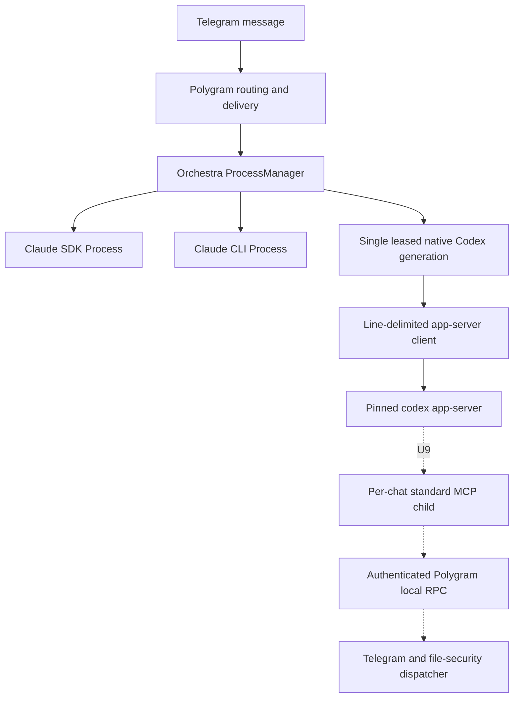
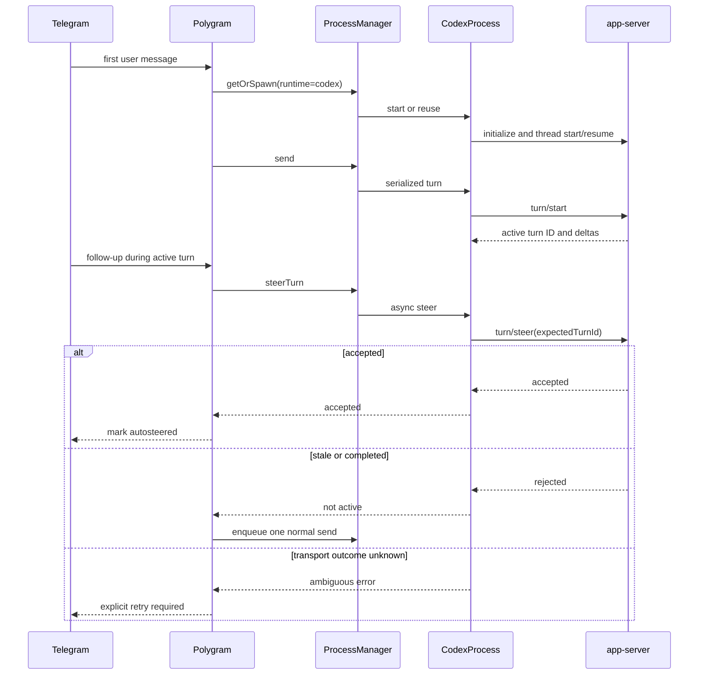
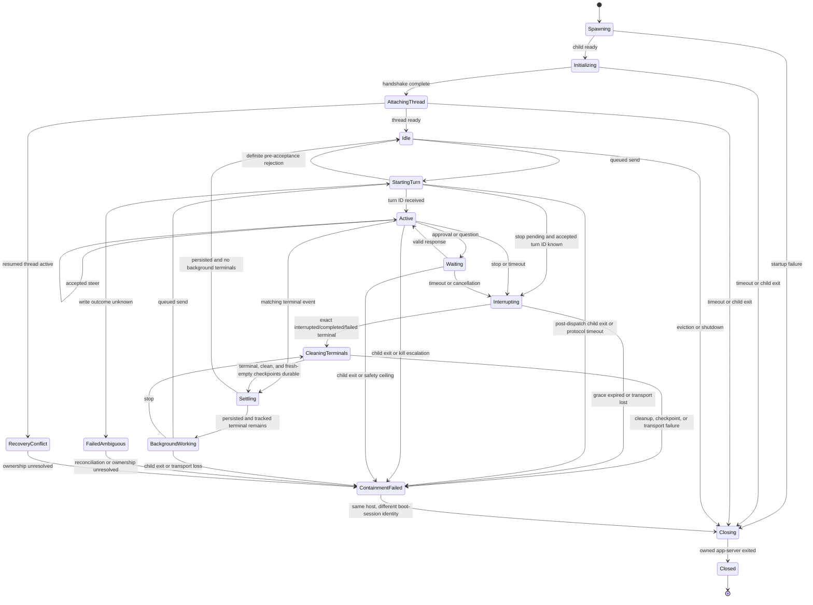

# Codex App-Server Backend with Mid-Turn Steering - Plan

> **Revision 2026-07-27 — live model/effort settings.** The
> [live-settings amendment](./2026-07-27-003-codex-live-model-effort-settings-amendment.md)
> supersedes the original provider-thread-immutable model/effort assumption.
> A normal Codex model/effort change preserves the process generation, thread
> ID, and history: the active turn remains on its admitted pair, while every
> subsequent `turn/start` carries the selected full pair. Experimental
> `thread/settings/update` is characterized but remains outside the product
> allowlist. Static runtime/security-policy changes still require verified
> replacement.

## Goal Capsule

Add an opt-in Codex backend to Orchestra and Polygram that uses the JavaScript stack to supervise `codex app-server`, resumes one durable Codex thread per chat/topic, and supports true mid-turn steering through `turn/steer`.
Existing Claude SDK and CLI behavior must remain unchanged.

Authority, in descending order:

1. The user-settled choices in this plan: JavaScript, app-server, true steering, no Codex tmux backend, and no `@openai/codex-sdk` session adapter.
2. The accepted [native macOS beta containment amendment](./2026-07-26-002-codex-native-macos-beta-amendment.md), now folded into this plan.
3. The accepted [live model/effort settings amendment](./2026-07-27-003-codex-live-model-effort-settings-amendment.md), now folded into this plan.
4. The existing Orchestra `Process`/`ProcessManager` contracts and Polygram per-chat delivery, persistence, replay, and security behavior.
5. The protocol generated by the pinned Codex CLI and the official [Codex app-server documentation](https://developers.openai.com/codex/app-server).
6. The research and estimates in [`docs/CODEX_SUPPORT_ESTIMATE.md`](../CODEX_SUPPORT_ESTIMATE.md).

Execution profile:

- Two repositories: Orchestra owns the app-server protocol client and process lifecycle; Polygram owns runtime selection, persistence, Telegram behavior, credentials, and rollout.
- Orchestra implementation must start from `v0.5.0` (`b788efb`), the exact baseline Polygram consumes, rather than the older local `feat/claude-session-containment` checkout.
- The first usable milestone is text input/output plus Codex's built-in command/file tools inside a product-owned, version-pinned beta permission profile that grants writes only to the workspace while denying the Codex credential home and daemon-secret roots, streaming, resume, model/effort selection, queued turns, interrupt, and true merge-mode autosteer.
- During that milestone a dedicated non-temporary `CODEX_HOME` selects `polygram-session` through `default_permissions`, uses `approvalPolicy: "never"`, disables command network and model-native web search, and exposes no product MCP servers. Legacy `sandbox_mode`, `sandbox_workspace_write`, `sandbox`, and `sandboxPolicy` inputs are rejected rather than combined with the profile. Initialization opts into the experimental API because correct `/stop` behavior requires the version-pinned `thread/backgroundTerminals/list` and `clean` methods. Negotiation enables the server's experimental protocol generally, so separate outbound-method and inbound-request/notification allowlists deny every other experimental surface locally. The app-server client exposes only a positive allowlist of required RPC methods; any unexpected client method, server request, or notification faults the generation instead of hanging or being ignored. Interactive approvals begin only in U9.
- U7a keeps `thread/settings/update` outside that production allowlist and
  adds model/effort only to the existing positive `turn/start` projection.
- MCP tools, file replies, approvals, user questions, compact/fork, and broader operational parity follow behind the same contracts.
- No commit, package publication, release, deployment, or production configuration change is authorized by this document alone.

Stop implementation if the pinned app-server cannot reliably start/resume threads, address the intended active turn in `turn/steer`, or return a distinguishable definite ended/stale outcome under the real service launcher.
Also stop if implementation would require changing the synchronous Claude hot-path methods, silently falling back from Codex to Claude, replaying an ambiguous turn, exposing one chat's tools/files/approval responses to another chat, or allowing a Codex command to recover daemon credentials through filesystem aliases, process introspection, Keychain, inherited descriptors, or local sockets. A failed integrated same-user isolation gate stops before U2. Strong arbitrary-descendant containment is explicitly deferred from the single-owner native macOS beta; a known ambiguous hard failure instead quarantines all native Codex work until the same host has rebooted.

### Execution checkpoint — native beta containment contract accepted

The authenticated and deterministic U1a work on 2026-07-26 verified these
pinned Codex 0.145.0 facts:

- the exact named profile passes config/provenance, workspace read/write,
  credential and daemon-secret denial, and command-network denial on fresh and
  resumed threads;
- two back-to-back `turn/steer` requests target the intended active turn,
  preserve order, affect the final output, and receive a distinguishable stale
  rejection after completion;
- `turn/interrupt` returns `{}` and the exact turn reaches
  `status: "interrupted"`; normal `/stop` then cleans tracked background
  terminals and verifies a fresh first page is empty, without tmux;
- every currently allowlisted state-changing request is classified as
  definitely not sent or outcome unknown at the transport boundary; and
- host-positive same-user process, debugger, Keychain, inherited-descriptor,
  TCP, UDP, DNS, and Unix-socket probes were denied inside the pinned command
  profile in the final integrated authenticated checker.

Hard app-server loss remains a separate native limitation: a replacement
cannot rediscover the old terminal, the Codex `processId` is not an OS PID, and
a deliberately detached descendant can escape the app-server process group
and POSIX session. The accepted native macOS beta therefore does not claim
arbitrary-descendant death. Healthy stop requires durable exact-terminal,
clean-accepted, and fresh-empty-registry checkpoints before stopped UI or
ownership release. Any post-write transport ambiguity, cleanup failure, or
missing checkpoint enters persisted daemon-wide `ContainmentFailed`
quarantine; no native Codex generation may start until a different kernel
boot-session identity is observed on the same validated host. Prepared-only
requests remain definitely not sent. Database relocation never releases the
quarantine automatically.

The beta permits one live native Codex generation across the daemon and warns
that detached/background development servers are unsupported and may survive
a hard app-server failure until the required host restart. Strong
arbitrary-descendant containment moves to a separate container/VM or
privileged-supervisor hardening plan before broader users/hosts. The complete
contract and estimate delta are recorded in the accepted
[native macOS beta amendment](./2026-07-26-002-codex-native-macos-beta-amendment.md).

### Execution checkpoint — U1b operational contract verified

The bounded U1b characterization also passed on 2026-07-26:

- authenticated `gpt-5.6-sol` with `xhigh` applied exactly, survived
  app-server replacement, resumed without model/config overrides, and
  completed a later turn under both the production Node binary and
  `launchctl asuser 502`;
- the real pinned core owned provider retries and ended exhausted and
  non-retryable failures with `willRetry=false` plus one failed terminal;
- six real-command marker cuts proved that item-start plus marker absence is
  still unknown/non-replayable, while first-output and
  terminal-generated-not-observed cuts had durable effects;
- one initialized app-server with an ephemeral thread consumed roughly
  114 MiB median RSS and 31 descriptors; 10/25 lab-only process points scaled
  to roughly 1.09/2.74 GiB median aggregate RSS, confirming that the accepted
  one-live-daemon lease is also the correct resource boundary; and
- this Mac has no configured session wrapper. The local beta is explicitly
  direct-binary mode; wrapper behavior is N/A, while same-UID GUI bootstrap,
  file-backed ChatGPT auth, direct child pipes, exact pin, and owned signal
  cleanup passed without loading or restarting a service. A launchd-managed
  disposable-job lifecycle remains an U8 rollout gate.

U1 is complete. The durable observations and remaining rollout-only
limitations are in Orchestra's `docs/codex-app-server-compatibility.md`; U2
may start.

### Execution checkpoint — U2-U7 implemented locally

The reviewed U2-U7a core is implemented in the Polygram feature worktree and
an isolated Orchestra worktree. Orchestra has a local signed feature commit
merged with current `main`, including the independently landed Claude Code
2.1.220 pin; Polygram remains uncommitted. Neither repository has been pushed,
published, deployed, or enabled in production, and the original Orchestra
checkout remains unchanged.

The local implementation includes the pinned app-server client, thread
resume, streamed text, model/effort preflight, daemon-wide generation lease,
true `turn/steer`, queued follow-ups, exact interrupt/clean/fresh-empty stop,
provider-aware persistence and replay fences, non-temporary IPC isolation,
bounded retirement verification, durability containment, and atomic Telegram
consumer/retirement settlement. Independent correctness, simplicity,
failure/recovery, security, migration, and test reviews were folded into the
code. In particular:

- Telegram delivery, its primary inbound, linked/queued inputs, and any
  controller-authorized stopped-generation retirement commit atomically;
- verified stop cancellation and exact lease release commit atomically;
- delivery cannot release the lease before transport closure and a live
  verifier handshake, or after verifier timeout/abort;
- failed delivery durability immediately blocks the exact process and future
  dispatch; and
- retirement verification is time-bounded while failure retains the
  process/map/lease fence.

The exact merged Orchestra `0.7.0` tarball prepared for Polygram has integrity
`sha512-KdTyokmZAtwIb1MUFauoKSx9STqk/uR5S4Ly8hZqEJ30IRcSYipwJV/A6PaOkS/ryhVlxOLxE853uI+e6X8HHw==`
and shasum `049027b859debc0b5bd7f2d3ab5c13472f4e0b0c`. Polygram's
U8-focused provider-command, model/effort, reconciliation, durability, doctor,
containment, and runtime suites are green with 294 passes, and its installed
package contract accepts the exact `0.7.0` artifact. The final merged Node 24
release-CI run remains pending; Node 26 is not the release runtime and exposes
both its removed `fs.rmdirSync({recursive:true})` API and load-sensitive timing
failures that pass in the bounded suites.

U8 local diagnostics are complete, but the real one-chat macOS canary,
rollback drill, seven-day/ten-session investment gate, package publication,
and production enablement have not run. U8 is therefore not complete. U9
(product MCP, file replies, approvals, and questions) and U10 (Linux and
broader rollout) remain deliberately deferred behind that gate.

### Execution correction — U7a required before U8 canary

The local U2-U7 implementation encoded model and effort as immutable provider
thread policy, sent them only on the first fresh turn, resumed without
overrides, and told Polygram users that a controlled replacement would occur
on their next message. A pinned-schema and current-source review disproved
that assumption:

- `turn/start.model` and `.effort` override the current and subsequent turns;
- experimental `thread/settings/update` can change a loaded thread's
  subsequent-turn settings without a transcript item, but is not required for
  the product behavior; and
- `turn/start.model` and `.effort` are the simpler stable boundary because the
  selected pair is transactional with the next turn.

U7a therefore corrects the local implementation before any canary. Model and
effort become mutable, catalog-validated session settings. Normal changes
preserve the child, generation, thread ID, and history. An active turn and its
steers keep the pair captured at turn admission; every later `turn/start`
carries the new pair. The experimental settings method is characterized but
not wired. Only static runtime/security identity continues to drive
replacement. The complete state, race, failure, security, alternative, and
test contract is in the
[live-settings amendment](./2026-07-27-003-codex-live-model-effort-settings-amendment.md).

---

## Product Contract

### Summary

Polygram will expose `pm: "codex"` as an optional per-bot, per-chat, or per-topic runtime.
The first release will run at most one pinned native Codex app-server
generation per Polygram daemon, attach it to one live Codex chat, and preserve
the current Claude backends exactly. Other Codex chats retain dormant
persistence only and receive a typed busy result until healthy teardown.
Text-only follow-ups arriving during an active Codex turn will be steered into that turn; a race lost to normal completion becomes one queued next turn, while an ambiguous transport outcome is surfaced rather than automatically duplicated.

### Problem Frame

The TypeScript Codex SDK is an `exec` wrapper: it can start or resume turns but does not expose a live input channel for genuine mid-turn steering.
The Codex TUI could be driven through tmux, but that would recreate Polygram's brittle TUI parsing, pinning, and queue-observation burden.
The app-server surface provides structured thread, turn, steering, interrupt, model, approval, and event methods without tmux, but the entire command is experimental and must be treated as a version-pinned protocol dependency.

Orchestra currently assumes two Claude backends and returns a warm process before re-evaluating backend selection.
Polygram persists one `claude_session_id` per chat session, performs Claude-specific auth checks and replay decisions, and implements autosteer through a synchronous boolean injection contract.
Those assumptions must be extended without changing existing Claude behavior.

### Requirements

#### Runtime selection and compatibility

- R1. `pm: "codex"` selects only the pinned Codex app-server runtime; missing wiring, auth, binary, model, or schema support fails visibly and never falls back to Claude.
- R2. Existing `sdk`, `cli`, `channels`, and `tmux` configuration values retain their current resolution, fallback, callback, prompt, persistence, and synchronous sentinel behavior.
- R3. Runtime selection keeps the existing topic-over-chat-over-bot precedence and can switch an idle chat between Claude and Codex without losing either provider's dormant session ID.
- R4. A runtime switch requested during an active, pinned, or question-blocked process is rejected; it does not interrupt the current turn or send the message to the old runtime.

#### Sessions, turns, and steering

- R5. Each active Codex chat/topic owns one supervised app-server child and one stable Codex thread ID, with serialized turns and a bounded local queue.
- R6. A new child resumes history for a subsequent turn, but process death never claims to continue the in-progress turn that died.
- R7. Merge-mode autosteer awaits app-server acceptance of `turn/steer` with the pinned `expectedTurnId` active-turn precondition before the Telegram message is marked steered.
- R8. The pinned runtime's distinguishable definite ended/stale rejection moves the same Telegram input into the normal next-turn queue once. Interrupting, quiescing, closed, and recovery-conflict states return a distinct non-queueable unavailable/cancelled outcome.
- R9. If steering may have been accepted but the transport result is unknown, Polygram records an ambiguous attempt, does not auto-requeue it, clears any misleading progress reaction, and tells the user to wait for the active turn to finish before explicitly reconciling the input.
- R10. Codex queue-mode autosteer uses the ordinary serialized next-turn queue; it does not map `priority: "later"` onto `turn/steer`.
- R11. `/stop` drains every queued Codex handler and quiesces the generation. For an accepted active turn it sends `turn/interrupt`; settlement accepts an exact matching `interrupted`, `completed`, or `failed` terminal when natural completion wins the race, but never an unmatched stale error. It then calls `thread/backgroundTerminals/clean` and polls `thread/backgroundTerminals/list` from a null cursor until the first page is exactly empty with no `nextCursor`. Exact terminal reconciliation, accepted clean, and fresh empty-registry observation are committed as three durable checkpoints before stopped UI, generation retirement, or ownership release. The UI may claim only those facts, not arbitrary descendant death. Any post-write ambiguity, unmatched interrupt, cleanup/list/transport failure, checkpoint failure, or accepted-generation policy drift enters persisted daemon-wide `ContainmentFailed` quarantine and cannot be replaced or reported stopped until the same validated host has a different kernel boot-session identity.

#### Delivery, persistence, and recovery

- R12. App-server delta events are normalized inside Orchestra into the cumulative text snapshots Polygram's existing streamer expects; Telegram rendering remains provider-neutral.
- R13. Polygram stores session IDs by a compatibility namespace distinct from the configured runtime, so incompatible Claude and Codex contexts are never cross-resumed.
- R14. Each Codex dispatch records runtime, immutable process-generation UUID, thread/turn IDs, Telegram source message ID, stable-host and boot-session identities, recovery state, and a redacted item-effect ledger. Every allowlisted state-changing request durably advances `prepared → write-attempted → response-observed`; prepared-only is definitely not sent, while unresolved write-attempted work is ambiguous. Model/effort selection is durable local configuration; its first external boundary is the ordinary ledgered `turn/start`.
- R15. Before boot replay or reset/deletion, Polygram reconstructs the daemon-wide lease and quarantine from unresolved write-attempted, active-turn, terminal-pending, clean-pending, and empty-registry-pending records. Boot replay automatically dispatches only work proven not sent. Started or possibly visible work requires an authorized user to mark it incorporated, explicitly authorize one retry after a duplicate-risk warning, or dismiss it without retry; input disposition never releases containment quarantine.
- R16. Polygram never resubmits an accepted or transport-ambiguous `turn/start`; only a definite pre-acceptance rejection or `CODEX_RPC_NOT_SENT` is retryable. `error.willRetry: true` means Codex owns the retry; `willRetry: false` still awaits the matching terminal event or hard-fails after a bounded protocol timeout. Auth errors, unavailable models, denials, and cancellations are not retried.

#### Models, credentials, tools, and isolation

- R17. Codex model and reasoning-effort choices are validated as one pair
  against `model/list` from the pinned authenticated runtime. Polygram
  persists the selected pair per chat/topic and every `turn/start` carries
  that pair through a positive projection. A normal change is local until the
  next turn and preserves the process generation and provider thread. The
  active turn and its steers retain their admitted pair; the next turn uses
  the new pair. The UI distinguishes selected, observed-thread, active-turn,
  not-loaded, and beta-busy states and never applies Codex-only effort values
  to Claude sessions. Experimental `thread/settings/update` remains
  characterized but is not production-allowlisted in U7a.
- R18. ChatGPT login state is supported through an explicitly provisioned, mode-`0700`, non-temporary deployment `CODEX_HOME`; Polygram does not read, copy, log, or persist credential contents. A version-pinned beta `polygram-session` permission profile is the default for every Codex command, grants only minimal runtime reads plus workspace writes, denies the credential home and configured daemon-secret roots, and disables command network. Polygram supplies the expected static config identity; Orchestra attests the materialized effective config and loaded layers, then verifies the active profile after every thread start/resume and before any user turn. Codex-launched commands cannot recover protected values through files, environment/process inspection, inherited descriptors, Keychain, or local sockets. Startup rejects any effective legacy sandbox setting, profile/config override, or source drift that could weaken this boundary.
- R19. Per-chat children provide crash and routing isolation, not hostile multi-tenant isolation; all Codex chats under one daemon normally share its OS user and Codex credential store.
- R20. Codex tools use a separate standard MCP bridge with per-process-generation authentication and chat/thread binding; the Claude Channels wire protocol remains unchanged.
- R21. File, reaction, edit, approval, and question calls reuse Polygram's existing Telegram and filesystem security decisions behind provider-neutral DTOs.
- R22. macOS and Linux are rollout targets; Windows parity is outside this plan.
- R23. The native macOS beta permits exactly one live Codex generation across the whole Polygram daemon, regardless of workspace. Orchestra `ProcessManager` owns the in-memory global lease; Polygram persists and restores it before replay. A quarantined incident blocks every new Codex start in that daemon until same-host reboot release. This does not fence Claude, another daemon, or an uninstrumented process; broader host-wide/cross-provider fencing requires a separate plan.
- R24. After U9 enables interactive approvals/questions and the MCP bridge, `/stop` expires their UI, cancels still-live requests when possible, and removes the MCP process tree if graceful interruption fails.

### Acceptance Examples

- AE1. A fresh `pm: "codex"` chat starts a pinned app-server, stores its thread ID, streams cumulative text, and returns one final Telegram reply.
- AE2. After idle eviction or daemon restart, the next message resumes the same Codex thread and retains its conversation history.
- AE3. A text follow-up received during an active turn is accepted by `turn/steer`, gets the normal autosteer reaction, and does not create a second response cycle.
- AE4. A follow-up races with turn completion, receives a stale-turn rejection, and runs exactly once as the next serialized turn.
- AE5. The app-server connection dies after a steering request was written but before its response; the message is marked ambiguous and is not automatically resent.
- AE6. Two rapid accepted steering messages preserve Telegram order.
- AE7. Codex queue mode leaves the current turn unchanged and processes the follow-up as the next turn.
- AE8. `/stop` interrupts an active Codex turn, rejects queued work with the existing interruption classification, reconciles the exact terminal when natural completion wins the interrupt race, cleans the thread's background terminals, and observes an empty fresh first page. It persists those three checkpoints before reporting settlement. The same cleanup applies when a naturally completed turn still has background work. Any ambiguity or cleanup/transport/checkpoint failure produces visible daemon-wide containment quarantine; the UI never overclaims arbitrary descendant death.
- AE9. Switching an idle chat Claude → Codex → Claude cold-spawns each requested runtime and resumes the matching provider namespace.
- AE10. Attempting the same switch while a turn is active fails visibly and leaves the active runtime untouched.
- AE11. A missing or wrong-version Codex binary, expired ChatGPT login, unavailable model, or incompatible schema affects the selected Codex chat without changing Claude traffic.
- AE12. A stale approval or question button from an interrupted/replaced Codex generation is ignored and cannot answer a new request.
- AE13. A Codex MCP request carrying the wrong generation secret or a file path outside the allowed roots is denied without invoking Telegram.
- AE14. After a crash with partial Codex output or a possible tool effect, boot replay does not resubmit the original prompt.
- AE15. A second Codex generation in the same daemon is rejected even for a different workspace, and the global lease is restored before boot replay. Diagnostics disclose that Claude, other daemons, and uninstrumented host processes are not fenced.
- AE16. After U9, `/stop` expires approval/question UI, cancels live requests when possible, and either retains a confirmed-idle MCP bridge or verifies its process tree dead.
- AE17. During an active Codex turn on model/effort A, `/model B`
  atomically remaps effort when required, preserves the same child,
  generation, and thread, reports that the current turn remains on A, and
  starts the next queued turn exactly once with B plus the selected effort.
- AE18. After a model change and daemon restart, Polygram resumes the same
  Codex thread and includes the selected pair on the first new `turn/start`;
  a stale stored model never deletes the thread.

### Success Criteria

- The Orchestra contract suite remains green without weakening or skipping an existing Claude assertion.
- Fake app-server tests deterministically cover protocol framing, thread/turn state, steering races, cancellation, malformed output, and child exits.
- Polygram's full `npm test` remains green with explicit Claude non-regression coverage.
- A real-runtime spike under the host's actual runtime mode and service identity passes first turn, resume, two ordered steers, stale-turn fallback, interrupt, child replacement, active-turn/next-turn model switching, Sol selection, and unavailable-model behavior.
- One development chat completes a 24-hour canary with no duplicate replies, cross-chat routing, orphan descendants, or Claude session resets before wider enablement.

### Outcome and Investment Gate

The primary workflow is Ivan running repository coding sessions from Telegram with ChatGPT-subscription access to current Codex/Sol models and true mid-turn steering. The present gap is not generic model choice: Claude sessions cannot provide that Codex model/access combination, while the Codex SDK wrapper cannot accept live steering.

After U1-U7a and core operationalization in U8, run at least 10 real coding sessions over at least seven days. Continue to U9-U10 only if:

- Ivan deliberately chooses Codex for at least five sessions where Claude was also available;
- at least one recurring coding workflow is materially better because of Sol access or steering, recorded with a concrete example;
- no session-loss, duplicate-effect, credential-exposure, or unresolved orphan-process event occurs; and
- the maintenance owner accepts the measured RSS/process cost and experimental-protocol burden.

If the value threshold is not met, keep Codex disabled outside the development cohort and stop at the core milestone. Correctness or security failures block rollout regardless of subjective value.
Any correctness or security incident immediately disables the cohort. Requalification requires a documented root cause, a regression gate that fails on the incident, all affected technical gates rerun, and a fresh clean 10-session/seven-day cohort. Inability to prevent Codex commands from recovering protected daemon or credential data under the shared service identity cannot be requalified by another canary; it requires an explicitly approved stronger isolation design.

### Scope Boundaries

#### First usable milestone

- Pinned app-server process supervision in Orchestra.
- Opt-in Codex runtime selection in Polygram.
- Text input/output, built-in command/file tools under the version-pinned beta `polygram-session` permission profile with `approvalPolicy: "never"`, cumulative streaming, stable thread resume, model/effort selection, serialized follow-ups, merge-mode steering, queue mode, interrupt, and safe replay classification. Command network and model-native web search are disabled, so dependency installation, remote Git, and other network-dependent shell workflows are not part of this milestone.
- The native macOS beta permits one live Codex generation across the daemon,
  with a persisted lease and quarantine restored before replay.
- No product MCP servers or interactive approvals; an unexpected server request is automatically denied and fails the turn closed.
- Existing Claude backends and production defaults remain unchanged.

#### Later units in this plan

- Standard MCP tools for file/reaction/edit replies and `ask_user`.
- Native Codex approval requests mapped to Telegram approval UI.
- Linux rollout after macOS validation.

#### Separate follow-up plans

- Provider-aware compact and fork after explicit Orchestra contracts exist.
- Rewind only after a spike proves a stable Telegram-message-to-Codex-turn mapping.
- Inbound file/image input parity beyond the text-first contract.
- Host-wide workspace ownership across Codex, Claude, multiple daemons, symlink/case aliases, and uninstrumented processes.
- Strong arbitrary-descendant containment through a per-chat container/VM or
  privileged supervisor before broader users, hosts, or hostile workloads.

#### Delivery-boundary trace

- First milestone U1-U7a: R1-R19 and R23; AE1-AE11, AE14-AE15, and
  AE17-AE18.
- Core operationalization U8: the U1-U7a contract under a bounded macOS cohort and investment gate.
- Later in-plan parity U9-U10: R20-R22 and R24; AE12-AE13 and AE16.
- Separate plans: compact, fork, rewind, and inbound file/image input parity.

#### Outside this plan

- A Codex TUI/tmux adapter.
- A durable `@openai/codex-sdk` session adapter.
- Direct OpenAI Responses API orchestration.
- A Rust port.
- Reproduction of Claude-only hooks, TUI queue events, result subtypes, autonomous wakeups, or exact subscription cost accounting.
- Windows support.
- Automatic cross-provider failover of an in-flight or ambiguous prompt.
- Hostile multi-tenant isolation under one OS user.

---

## Planning Contract

### Key Technical Decisions

- KTD1. **Stay in JavaScript and use `codex app-server`.** (session-settled: user-directed — chosen over a Rust port, a Codex tmux adapter, and the TypeScript SDK wrapper: the current stack should remain JavaScript, while real mid-turn steering requires app-server's live turn protocol.)
- KTD2. **Make steering a separate async capability.** (session-settled: user-directed — chosen over queued-only follow-ups and synchronous fire-and-forget injection: Polygram must know whether app-server accepted `turn/steer` before claiming the message was merged.) Existing synchronous `injectUserMessage`, `steer`, `drainQueue`, and `fireUserMessage` stay unchanged for Claude.
- KTD3. **Preserve the current Claude result and callback surface.** Add generic fields such as provider session and turn IDs without renaming the existing callback factory or forcing a provider-neutral refactor through stable Claude code.
- KTD4. **Run one native app-server generation daemon-wide in the beta.** U1 measured about 114 MiB median RSS for one initialized child and about 1.09/2.74 GiB for 10/25 lab-only idle children. ProcessManager therefore owns one global live Codex lease; dormant chats retain persistence but no app-server. A same- or different-workspace competitor receives `CODEX_DAEMON_GENERATION_BUSY` before factory construction, spawn, RPC write, or session mutation. Shared/multi-live supervision requires a new containment and resource plan.
- KTD5. **Separate runtime identity from session compatibility.** Config selects `codex`, live processes expose a canonical runtime, and persistence keys provider thread IDs by session namespace. Initial namespaces preserve the current Claude inline/channels invalidation boundary and isolate Codex app-server threads.
- KTD6. **Treat process generation as an ownership fence.** `CodexProcess` mints one immutable opaque `generationId` UUID, exposes it on the process and every Codex lifecycle/result event, and includes it in persisted attempts. `ProcessManager` forwards external callbacks only when both live object identity and UUID match and owns the native beta's one-live-generation lease. Teardown moves `ACTIVE → QUIESCING`, rejects new work, and invalidates approval/question UI while keeping the old generation valid for control replies and terminal cleanup. A healthy generation retires only after exact-terminal, clean-accepted, and fresh-empty-registry checkpoints are durable. `ContainmentFailed` retains its generation and daemon-wide lease until a different boot-session identity is observed on the same validated host; no replacement is installed earlier.
- KTD7. **Fail toward no duplicate external effects.** A definite stale steer becomes one queued turn; an ambiguous steer or started turn is not automatically retried. Provider switching and failover apply only to subsequent user turns.
- KTD8. **Pin the local runtime and generated protocol together.** Orchestra owns the compatible line-delimited protocol client and checked schema fixtures. Polygram injects an immutable absolute binary that reports the pinned version. For the native macOS beta, U2 launches it only through Orchestra's fixed internal process-group supervisor; adapting the configured Claude session-launcher contract is deliberately deferred to U8 host characterization because that contract cannot transparently express this supervisor. The pin freezes only the local client contract, not hosted model availability or service-side event semantics; authenticated compatibility smoke is required before every enablement/rollout.
- KTD9. **Keep the first milestone transport-simple, not effect-free.** Telegram input/output is text-first, but Codex's built-in command/file tools run inside the pinned workspace permission profile. True steering is included because it is the reason for app-server. Product MCP, Telegram file/image parity, interactive approvals/questions, compact/fork, and broader OS hardening are later units.
- KTD10. **Use one product-owned named permission profile as a pinned beta default, not legacy app-server sandbox fields.** Codex 0.145 can discover profiles without sending experimental permission request fields; the permission-profile semantics and exact active-profile provenance signal remain beta, and the app-server command remains experimental. Polygram therefore provisions `polygram-session` as `default_permissions` in a dedicated non-temporary `CODEX_HOME` and supplies its expected static identity. Orchestra attests the materialized config and every loaded layer, sends no `sandbox`, `sandboxPolicy`, or experimental `permissions` selector, and requires U1a-proven post-start/resume active-profile provenance before a user turn. U1a must capture both the bounded settings-notification path and any response extension; an undeclared response field is usable only when pinned as an exact fresh/resume golden trace with real enforcement, never inferred from the configured default alone. Profile selection stays on the non-experimental request subset even though initialization enables experimental negotiation for KTD11's cleanup methods. Any missing provenance, changed precedence, loaded-source drift, or semantic mismatch is a stop/replacement condition rather than a fallback; if a future pinned runtime cannot enforce the contract, migrate to an explicitly reviewed external sandbox or separate service identity.
- KTD11. **Use Codex's explicit two-step native stop protocol and expose no broader experimental API.** The pinned official contract states that `turn/interrupt` does not terminate background terminals. Orchestra therefore initializes with `capabilities.experimentalApi = true` and positively allowlists only `thread/backgroundTerminals/list` and `thread/backgroundTerminals/clean` from the experimental set, in addition to stable methods required by enabled units. U7a characterizes but does not production-allowlist `thread/settings/update`. Experimental negotiation is server-wide, so separate inbound request and notification allowlists fault any unrecognized experimental traffic. Controlled stop is quiesce → interrupt when a turn was accepted → reconcile the exact terminal, including a natural-completion race → clean → bounded fresh-first-page empty polling → durable terminal/clean/empty checkpoints. Pre-clean inventory may paginate with cursor-cycle and page-count guards; emptiness is never inferred by reaching the last page of a live snapshot. Command strings, cwd values, terminal handles, and OS metadata from list responses are ephemeral control-plane data only: do not log or persist them, including in malformed-line, timeout, or stderr diagnostics. Cleanup acknowledgement and empty registry are the accepted native graceful boundary, not process-tree proof. Reconnect cannot recover terminals orphaned by an app-server crash in 0.145.0, and the Codex-local `processId` must never be treated as an OS PID; such ambiguity enters daemon-wide same-host reboot-fenced quarantine.
- KTD12. **Treat model/effort as mutable session settings, not process identity.**
  Persist one desired catalog-valid pair per chat/topic, observe the loaded
  thread's reported pair, and capture the active-turn pair at turn admission.
  Update a warm process's desired pair locally under the turn-admission gate
  and include it on every `turn/start`; this is the primary application
  mechanism. The active turn is never interrupted or replayed for a settings
  change. Split dynamic model/effort validation from immutable
  binary/auth/workspace/permission/approval/MCP/environment policy; only the
  latter drives normal replacement.

### High-Level Technical Design

#### Component topology



The Codex path does not touch tmux, TUI banners, Claude JSONL logs, the Channels socket protocol, or Claude hooks.

#### Turn and steering sequence

The pinned schema requires `expectedTurnId` for active-turn steering, and the
authenticated trace proved a distinguishable definite stale/not-active result.



#### Codex process state machine



`turn/interrupt` returning successfully is only a control acknowledgement. If
the exact turn completes naturally just before the interrupt, its already
durably observed terminal permits cleanup to continue even when interrupt
returns the definite no-active-turn error; without that exact terminal the
result is ambiguous. During `StartingTurn`, a definitely unsent request is
cancelled locally, an accepted request waits boundedly for its turn ID and then
interrupts, and a written request with unknown outcome enters
`ContainmentFailed`. Cleanup settlement requires acceptance, a bounded poll
whose fresh first page is empty with no cursor, and three durable
terminal/clean/empty checkpoints. If transport disappears, 0.145.0 cannot
reconstruct the old terminal registry after resume. The native beta preserves
the daemon-wide generation lease and quarantine until the same validated host
reports a different boot-session identity; moving the database to another
host fails closed. Human waits suspend ordinary no-activity timers, but keep
request TTLs and an overall safety ceiling.

### Output Structure

The exact names may adjust during implementation, but the ownership boundary should remain:

```text
Orchestra
  lib/codex/
    app-server-client.js
    protocol-schema.json
  lib/process/
    codex-process.js
  tests/fixtures/
    fake-codex-app-server.mjs

Polygram
  lib/codex/
    binary.js
    model-catalog.js
    event-normalizer.js
    mcp-bridge-server.js
    mcp-bridge.mjs
  migrations/
    015-agent-runtime-sessions.sql
    016-agent-turn-attempts.sql
    017-config-runtime-changes.sql
```

### System-Wide Impact

- **Other Orchestra consumers:** Codex remains optional. Requiring Orchestra without Codex configuration starts no Codex process and adds no SDK dependency.
- **Persistence:** existing Claude rows survive migration and remain rollback-compatible while provider-aware rows are dual-written during canary.
- **Operations:** app-server children increase process, memory, file-descriptor, and descendant supervision load; U1 establishes the LRU cost before rollout.
- **Authentication:** ChatGPT credentials belong to the deployment identity, not a Telegram chat. `CODEX_HOME` and child environment policy become deployment inputs.
- **Security:** an MCP bridge adds a local privileged boundary. Generation credentials, chat binding, schema validation, file-root checks, payload caps, and redacted logs are mandatory.
- **Workspace concurrency:** per-chat process isolation does not prevent agents from racing on the same files. The first milestone adds only a same-daemon exact-configured-path Codex writer guard. It preserves Claude behavior and explicitly does not cover aliases, another daemon, or host-wide exclusion.
- **User experience:** merge-mode Codex follow-ups wait for an acceptance response before showing the autosteer state; the existing Claude path does not acquire that wait.

### Codex Support Policy

- The Polygram maintainer owns the integration; Orchestra owns only the pinned protocol/process contract it exports.
- Support exactly one pinned Codex CLI/schema version at a time. Upgrades are deliberate compatibility projects, never automatic.
- Treat the permission-profile behavior and two production
  background-terminal methods as pinned beta/experimental security and
  lifecycle contracts. Characterize but do not production-allowlist the
  experimental model/effort settings update in U7a. Every upgrade must re-prove config precedence,
  active-profile provenance, filesystem/network enforcement, same-user
  side-channel denial, interrupt-plus-clean ordering, fresh-first-page polling,
  transport classification, and the accepted quarantine boundary.
- Run authenticated start/resume/steer/interrupt/terminal-clean/model smoke before every cohort enablement, not only on a binary bump.
- Review upstream changes when the pinned version blocks an enabled workflow or on a monthly maintenance pass; do not chase every release.
- Recommended exit trigger for approval at plan sync: if compatibility upkeep exceeds three engineer-days in each of two consecutive 30-day windows, or sustained use falls below five real Codex sessions per month after the first 60 days, freeze new enablement and decide whether to deprecate rather than silently accumulating support debt.

### Dependencies and Sequencing

1. Start Orchestra work from `v0.5.0`/`b788efb` and keep the current local Orchestra checkout read-only until Ivan explicitly authorizes its replacement or a new worktree.
2. **Completed 2026-07-26:** U1a's protocol, auth, steering, stop, same-user isolation, and
   transport-classification gate under the accepted native beta contract. The
   Codex stop protocol is pinned as quiesce → interrupt or exact natural
   terminal → background clean → fresh-first-page empty → three durable
   checkpoints. The integrated authenticated checker must pass before U2.
3. **Completed 2026-07-26:** U1b's resource, real effect-window/recovery, retry-ownership,
   launcher/stdio/signal/auth behavior, binary pinning, and model/effort
   characterization before U2. Keep approval and MCP characterization behind
   the U8 investment gate in U9.
4. Make the Orchestra protocol/process contract locally consumable as an exact packed/versioned build before Polygram depends on it; publishing is a separate explicitly authorized release action.
5. Land Polygram schema/config changes with Codex disabled.
6. Complete the U7a live model/effort correction and its pinned-runtime gate
   after U7, then run U8's macOS development-cohort rollout.
7. Apply the Outcome and Investment Gate; build U9 MCP/approval/question parity only when the core workflow earns further investment.
8. Complete U10's parity hardening and Linux/cohort rollout last.

With U1 complete, the remaining durable critical path is U2 → U3 → U4 → U5
→ U6 → U7 → U7a → U8 core cohort → investment gate → U9 → U10.

The research estimate in [`docs/CODEX_SUPPORT_ESTIMATE.md`](../CODEX_SUPPORT_ESTIMATE.md) remains 64/122/223 best/likely/worst engineer-days. Prior protocol/containment planning amendments add 3/6/11 days in total, and the post-Opus per-turn model/effort correction adds 2/3/5 days, so the implementation-plan total is 69/131/239.
Promoting steering into the first milestone moves 7/15/28 days earlier; moving compact/fork/rewind to a separate plan moves 8/15/27 days out of U1-U10. These are scenario bounds, not additive probability estimates:

| Unit/phase | Orchestra B/L/W | Polygram B/L/W | Combined B/L/W |
| --- | ---: | ---: | ---: |
| U1a protocol/steering/isolation go/no-go | 2/4/7 | 1/2/4 | 3/6/11 |
| U1b resource/effect-window/retry characterization | 1/1/3 | 1/1/2 | 2/2/5 |
| **U1 total** | **3/5/10** | **2/3/6** | **5/8/16** |
| U2 app-server client | 5/9/16 | 0/0/0 | 5/9/16 |
| U3 Codex process, lifecycle, steering | 8/16/29 | 0/0/0 | 8/16/29 |
| U4 Orchestra manager/factory contract | 3/5/9 | 0/0/0 | 3/5/9 |
| U5 persistence/runtime/session migration | 0/0/0 | 6/11/20 | 6/11/20 |
| U6 text delivery/model/startup | 0/0/0 | 4/8/14 | 4/8/14 |
| U7 Telegram steering/queue/replay | 0/0/0 | 4/9/17 | 4/9/17 |
| U7a live model/effort settings correction | 1/2/3 | 1/1/2 | 2/3/5 |
| **First usable milestone U1-U7a** | **20/37/67** | **17/32/59** | **37/69/126** |
| U8 core diagnostics/macOS cohort | 1/2/4 | 2/4/8 | 3/6/12 |
| **Core through investment gate U1-U8** | **21/39/71** | **19/36/67** | **40/75/138** |
| U9 MCP/files/approvals/questions | 9/17/31 | 7/14/25 | 16/31/56 |
| U10 parity/Linux rollout | 3/6/11 | 2/4/7 | 5/10/18 |
| **This plan U1-U10** | **33/62/113** | **28/54/99** | **61/116/212** |
| Separate compact/fork/rewind plan | 2/5/9 | 6/10/18 | 8/15/27 |
| **Full practical parity program** | **35/67/122** | **34/64/117** | **69/131/239** |

Budget reading: U1 completed within its characterization gate and U2-U7 are
implemented locally. The next correction is U7a at 2/3/5 before canary. The
37/69/126 first milestone and 61/116/212 in-plan total remain downstream
commitment points. The 69/131/239 practical-parity figure
additionally includes the separate compact/fork/rewind plan. Moving
approval/MCP characterization behind the investment gate shifts 0/2/2
best/likely/worst days from U1b to U9 without changing either total.

Passive soak time, external review latency, package publication, and upstream breakage are excluded. The critical-path estimates do not fall linearly with more engineers because U2-U7 depend on a settled protocol, ownership, and retry contract.

### Risks and Mitigations

- **Experimental protocol, beta permission semantics, and hosted-service drift:** pin CLI plus generated schema and materialized permission behavior, reject local/config-layer mismatches, keep golden traces, and rerun the authenticated compatibility smoke and containment matrix before every enablement/rollout even when the binary is unchanged.
- **Subscription auth under services:** validate the real launchd/VPS identity and keyring behavior before canary; never infer that an interactive shell login works headlessly.
- **Baseline divergence:** branch Orchestra from the published v0.5 source, not the older local checkout.
- **Warm-process misrouting:** compare the requested canonical runtime before cache reuse and reject busy switches.
- **Model/effort race or notification drift:** persist one full desired pair,
  serialize its local warm-process update with turn admission, capture the
  pair on every `turn/start`, and accept settings notifications only for
  attach/observed/admitting/active pairs. Keep the experimental settings
  mutation outside the product allowlist.
- **Ambiguous side effects:** emit lifecycle/effect events before final settlement, persist the acceptance fence, and never automatically resubmit accepted or transport-ambiguous starts.
- **Orphan commands:** use Codex's explicit interrupt-plus-background-clean path
  while transport is healthy and verify a fresh first page is empty, but do
  not mistake registry state, one synthetic PID, app-server group death,
  reconnect, or Codex's logical `processId` for complete process-tree
  containment. On native macOS, quarantine the daemon after ambiguous hard
  loss until same-host reboot; keep the daemonizing negative fixture. Require
  strong per-session cgroup/container containment before Linux or broader-host
  rollout claims descendant death.
- **Shared credential/filesystem boundary:** document that per-chat children are routing isolation only; use the named profile, controlled command environment, positive app-server RPC allowlist, and per-generation MCP credentials. Audit readable temp roots and same-user process, Keychain, descriptor, and socket paths; any protected-value recovery stops the shared-identity design.
- **Effective-config drift:** hash every loaded config source plus the materialized profile, revalidate at the U1-proven lifecycle boundaries, and quiesce/replace rather than warm-reuse a generation whose attestation changes.
- **Concurrent worktree mutation:** the native beta rejects every second live
  Codex generation in one daemon, regardless of workspace; surface that
  Claude, other daemons, and uninstrumented host processes remain outside the
  fence.
- **Memory scale:** benchmark one idle and one hosted-active generation, plus
  controlled 10/25 lab-only initialized/local-command proxy points; shared
  supervision is a separate redesign, not an invisible optimization.

### Deferred Implementation Decisions

- U1 set the native beta to one daemon-wide live generation from measured RSS.
- U1 recorded direct mode because no session wrapper is configured. A
  launchd-managed disposable lifecycle remains an U8 rollout gate.
- U1a confirmed `expectedTurnId`, ordered semantic steering, and a
  distinguishable definite stale/not-active rejection. The remaining steering
  work is a repeatable hosted smoke that does not rely on model cooperation.
- U1a confirmed interrupt-plus-terminal cleanup for one tracked command, not
  arbitrary descendant death. The accepted native-beta contract records that
  limitation, uses durable daemon-wide quarantine after ambiguous hard loss,
  and defers strong container/VM or privileged-supervisor containment.
- U1 determines whether `clientUserMessageId` is recoverable or deduplicating. Until proved, it is correlation metadata only and absence from resumed history is not evidence that a turn was never accepted.
- U1b proved model/effort selection and replacement resume but did not test
  live future-turn settings mutation. U7a supersedes the former
  provider-thread-immutable assumption and adds the missing pinned-runtime
  gate before canary.
- U9 maps only approval scopes proved by the pinned schema; unsupported “always allow” choices remain unavailable.
- Compact, fork, and rewind require a separate plan unless a later scope revision adds explicit Orchestra methods and contracts.

---

## Implementation Units

### U1. Reconcile the baseline and freeze app-server behavior

**Goal:** Establish an executable, versioned contract before product code depends on the experimental app-server.

**Requirements:** R1, R5-R8, R11, R14, R17-R19, R23; KTD1, KTD4, KTD8-KTD11.

**Dependencies:** None.

**Files:**

- Orchestra: `docs/codex-app-server-compatibility.md`
- Orchestra: `scripts/spikes/codex-app-server-real.mjs`
- Orchestra: `scripts/spikes/codex-app-server-rpc.mjs`
- Orchestra: `tests/codex-app-server-spike.test.js`
- Orchestra: `tests/fixtures/codex-app-server-0.145.0/`
- Polygram: `scripts/spikes/codex-app-server.mjs`
- Polygram: `tests/codex-app-server-spike.test.js`

**Approach:**

**U1a — core protocol go/no-go (3/6/11 combined):**

1. Create the Orchestra implementation branch from `v0.5.0` and record the baseline relationship to Polygram's exact package.
2. Capture generated schema and content-free golden traces for initialize, model list, fresh/resumed thread, turn, two ordered steers, stale steer, interrupt, background-terminal list/clean, malformed input, and child replacement. Characterize `terminate` as upstream schema only; do not production-allowlist it. Prove the exact active-turn targeting field and a distinguishable definite stale/not-active result; otherwise stop and revise the plan before U2.
3. Run the integrated authenticated checker under the direct pinned binary.
   A configured wrapper would be a U1b gate; this host has none.
4. Record credential behavior under the intended service identity without reading or copying credential contents.
5. Drop the transport before and after writing every allowlisted
   state-changing request to classify definite-not-sent versus outcome-unknown
   boundaries; treat `clientUserMessageId` as correlation-only unless durable
   deduplication is proved.
6. Characterize the complete healthy-stop lifecycle. Prove
   `turn/interrupt` → exact terminal →
   `thread/backgroundTerminals/clean` → bounded fresh-first-page empty polling,
   including a real long-running command whose exact OS PID disappears. Add
   the race where natural completion wins interrupt while a background
   terminal remains, and still clean it. Add `StartingTurn` cases for
   definitely unsent, accepted/ID-pending, and write-outcome-unknown requests.
   Preserve a negative `setsid`/daemonizing hard-loss trace as the accepted
   native-beta limitation; it must never be relabeled as process-tree proof.
7. Provision a disposable, non-temporary, mode-`0700` `CODEX_HOME` whose strict config makes `polygram-session` the default named permission profile and pins `cli_auth_credentials_store = "file"` so validation cannot silently reuse ambient Keychain credentials. Start app-server with strict config validation; set `allow_login_shell = false`, inherit no ambient command environment, and supply controlled `HOME`, `TMPDIR`, and `PATH` values. Use `:minimal` reads, workspace-root writes, explicit denies for `CODEX_HOME` and synthetic daemon-secret roots, command network disabled, model-native web search disabled, `approvalPolicy: "never"`, and no product MCP/plugin/hook capabilities. Keep credentials, sockets, and security-sensitive service files out of `/tmp`, `/private/tmp`, `$TMPDIR`, and every other path that the pinned `:minimal` rules keep readable.
8. Initialize with `capabilities.experimentalApi = true` for the positively allowlisted background-terminal list/clean methods. Because negotiation enables the server's experimental protocol globally, apply independent positive allowlists to outbound methods and inbound requests/notifications; unexpected traffic faults the generation. Without `sandbox`, `sandboxPolicy`, or an experimental `permissions` selector, call the stable config/requirements/profile discovery methods and build a canonical attestation from the owned config hash, every loaded source/layer, materialized profile, allowed/default profile requirements, and command/web-search policy. Reject every other experimental method, legacy sandbox setting, project/profile redefinition, arbitrary app-server config override, and unexpected source before account/model preflight. For each thread start/resume, capture the response plus a bounded window for `thread/settings/updated`; require active profile `polygram-session` from the exact provenance path U1a proves on both flows, pin an undeclared response extension as a golden runtime contract when necessary, and only then permit `turn/start`. Missing or inconsistent provenance stops before U2 rather than hanging or inferring the default. U7a characterizes `thread/settings/update` from an `--experimental` generated bundle but leaves it outside this production allowlist.
9. From a real authenticated turn, use content-free probes to prove workspace reads/writes succeed while credential-store, session-state, unrelated-daemon, and outside-workspace canaries are unreadable/unwritable. Probe symlinks, pre-existing hardlinks, `..` traversal, canonical/alias paths, `/var` versus `/private/var`, and workspace-root aliases. A synthetic temp-root canary must demonstrate the known readable-temp risk; separately audit the real service/launcher configuration and fail if any protected value or privileged socket lives in such a root.
10. Probe same-user non-filesystem recovery paths under the actual runtime mode:
inherited environment and file descriptors; process argv/environment
inspection; debugger/inspection facilities available to the service identity;
Keychain access through the command-line and platform API; and local TCP, UDP,
DNS, and Unix-socket access to synthetic canary listeners. Denied access must
fail without emitting an approval request. If a command can recover a
protected value or reach a protected local service, stop until a separate
service identity or external sandbox design is approved.
11. Mutate project/profile config before preflight, between turns, during a live turn/accepted steer, and before resume/child replacement. Prove the current turn cannot gain broader authority and that any source/materialized-policy drift blocks the next turn, invalidates warm reuse, and forces quiesce/replacement. Repeat the core denial probes on fresh, resumed, steered, and subagent command paths.
12. Run representative repository read, file edit, test command, and non-mutating Git-inspection tasks under the exact first-milestone profile. Any required task that requests interactive approval or command network blocks the first milestone or forces an explicit scope revision.
13. Record the pinned binary's SHA-256 plus owner/mode chain; reject a different hash or a group/world-writable binary/path component before authentication.
14. Replace the existing U1a checker's legacy `WorkspaceWriteSandboxPolicy.readOnlyAccess`-only decision with the complete named-profile gate. Update the compatibility report, manifest, protocol/profile/steering/interrupt-clean fixtures, and both repository entry-point tests together; a profile ID or `allowed: true` without config attestation and real enforcement can never produce `CONTINUE`.
15. Record the crash-boundary negative trace without command strings, paths,
    PIDs, credentials, or session IDs: app-server-group death leaves the
    synthetic command alive; resume cannot list it; reconnect clean cannot
    terminate it; the logical `processId` is not the OS PID. Keep it as a
    regression fixture for the accepted native limitation and future strong
    containment plan; it does not dispute verified turn interruption and
    tracked-terminal cleanup.

U1a is a standalone decision gate. A failed active-turn/stale-result,
credential/profile, integrated same-user isolation, terminal cleanup, or
transport-classification result stops the program before U2. The accepted
native hard-loss limitation itself no longer stops U1b.

**U1b — operational and security characterization (2/2/5 combined; only after U1a passes):**

1. Measure cold/warm latency, RSS, file descriptors, and descendants for one
   idle and one hosted-active generation. Run 10/25 controlled lab-only
   initialized-thread and local-command proxy points to characterize scaling;
   do not label them product-valid concurrent chats or hosted turns.
2. Record the resource/capacity effect of the native beta's one-live-Codex
   daemon-wide limit and the exact diagnostics expected for a rejected second
   generation, including a different-workspace case.
3. Record whether model and effort are applied at thread start and first turn,
   then prove replacement resume without overrides. This original
   characterization did not establish live mutation; U7a must separately prove
   subsequent-turn update and per-turn override behavior before canary.
4. Induce one retryable and one non-retryable provider error, recording all request, error, retry, and terminal IDs/order. Block R16 until the report proves who retries, whether a terminal always follows, and the bounded timeout when it does not.
5. Use a command that writes a unique fixture marker, then terminate transport/child at item-start, first-output, and pre-terminal boundaries. Compare the filesystem oracle to recorded checkpoints and classify every unobservable effect window as ambiguous.
6. Run through the host's actual runtime mode and service identity. If a
   session wrapper is configured, verify it end to end; if none is configured,
   record wrapper behavior as N/A and verify direct-mode cwd, filtered
   environment, child pipes, auth store, binary pin, and owned signal cleanup.
   A launchd-managed disposable-job lifecycle is a rollout gate, not a blocker
   for the disabled U2 direct client.

**Execution note:** Treat every runtime observation as a characterization gate. Do not patch around a failed U1a result in application code. U1b completes before U2 because resource cost, retry ownership, or effect-window/recovery evidence may still require architecture or scope revision.

**Patterns to follow:** Orchestra's deliberate Claude binary compatibility gates and Polygram's real-runtime spike convention under `scripts/spikes/`.

**Test scenarios:**

- Authenticated ChatGPT login lists `gpt-5.6-sol` and its supported effort values under the service identity.
- A new thread resumes after a child replacement and starts a later turn with retained history.
- The implementation uses returned `threadId` as the durable resume key; the diagnostic `sessionId` is never substituted for it.
- Live terminal status is compared with the same turn reconstructed by `thread/resume`; any mismatch is recorded, and resumed historical turn status is never treated as replay/retry truth in place of Polygram's acknowledged ledger.
- Two steering calls are accepted in order against the same active turn.
- A steering call after terminal completion receives a definite stale/not-active result.
- A steer racing completion is classified accepted, retry-as-new-turn, or ambiguous, never both accepted and queued.
- Transport loss after a start/steer write establishes whether `clientUserMessageId` is persisted, searchable, or deduplicating.
- Interrupt alone reaches terminal state while the background terminal remains listed; the subsequent clean request reaches a bounded fresh-first-page empty state and the observed synthetic command PID dies before its natural deadline. This characterizes the accepted native graceful boundary and does not claim arbitrary descendant death.
- Natural completion may win the interrupt race only when reconciled to that exact durably observed terminal; cleanup still runs for any remaining background terminal, while an unmatched stale result fails closed.
- Killing app-server before cleanup leaves the synthetic terminal undiscoverable after resume; the report must not misclassify reconnect, a logical `processId`, or app-server process-group/session death as containment.
- An unexpected approval/question request is denied and the turn fails closed rather than waiting.
- The non-temporary `polygram-session` profile is listed and active on fresh and resumed threads; no legacy or experimental per-turn sandbox/profile selector is sent. U1-U8 expose only background-terminal list/clean from the negotiated experimental protocol; U7a characterizes settings update without wiring it.
- The owned config and all effective layers materialize exactly the expected profile before account/model preflight; post-start/resume provenance is present before the first user turn.
- Content-free command probes cannot open the ChatGPT auth store, Codex session state, unrelated daemon secrets, or outside-workspace targets even though the app-server can authenticate.
- Symlink, hardlink, traversal, canonical-alias, process-inspection, inherited-descriptor, Keychain, and local-socket probes cannot recover a protected value; the readable-temp control proves why no protected service artifact may live under a minimal-readable temp root.
- Project/config mutation cannot broaden an in-flight turn and causes the next turn or warm reuse to fail closed until a newly attested child replaces it; fresh, resumed, steered, and subagent paths retain the same boundary.
- Denied filesystem/network actions emit no approval request under `never`.
- Retryable and non-retryable provider failures prove retry ownership, terminal ordering, and timeout instead of relying on `willRetry` naming.
- Representative read/edit/test/Git tasks complete under `polygram-session`/`never` without an interactive request.
- Filesystem marker state is compared with item checkpoints at each induced crash boundary; no unknown effect is labeled invisible.
- The absolute binary passes version, checksum, owner, and mode-chain verification before startup.
- The initial/resumed model/effort pair is observed exactly and an unavailable
  effort cannot silently downgrade. U7a proves mutable future-turn settings
  before replacing the original immutable-pair implementation.
- A wrong CLI version or incompatible schema fails before a user turn starts.
- Direct mode preserves child pipes, cwd, environment policy, exit status, and
  owned signals. Configured wrapper behavior is N/A on this host; a
  launchd-managed lifecycle remains an U8 rollout gate.

**Verification:** U1a records a standalone pass/stop decision for protocol,
credential/profile isolation, steering, tracked stop, same-user side channels,
and transport classification under the accepted native limitation. The
completed U1 report then names the pinned binary/schema, pass/fail result for
every U1b launcher/resource/effect/retry/model gate, chosen process cost, and
any rollout-only limitation.

### U2. Build the line-delimited app-server client in Orchestra

**Goal:** Provide a narrow, deterministic protocol layer with no chat, queue, or Telegram behavior.

**Requirements:** R1, R5, R11, R16, R18; KTD8, KTD10, KTD11.

**Dependencies:** U1.

**Files:**

- Orchestra: `lib/codex/app-server-client.js`
- Orchestra: `lib/codex/protocol-schema.json`
- Orchestra: `tests/codex-app-server-client.test.js`
- Orchestra: `tests/fixtures/fake-codex-app-server.mjs`

**Approach:**

1. Attest the injected canonical absolute binary against the pinned executable
   hash/version before every spawn. On POSIX, run the binary below a tiny owned
   supervisor that remains the process-group leader until Orchestra has sent
   TERM, observed that only the supervisor remains, and explicitly released
   it; escalate the still-owned group once with KILL on timeout. This closes
   the PGID-reuse window for ordinary descendants without claiming containment
   of the already-documented detached/daemonized descendants. U2 fails closed
   on Windows; Windows remains outside this plan.
   Before spawn, also attest the canonical non-temporary owned `0700`
   `CODEX_HOME`, owner-only single-link `config.toml`, optional owner-only
   `auth.json`, and the caller-supplied expected config hash; re-attest the
   config fingerprint immediately after spawn.
2. Implement newline-delimited request/response correlation, initialization with `capabilities.experimentalApi = true`, notifications, server requests, timeouts, and bounded stderr. The capability is required only for terminal cleanup but negotiates the experimental protocol globally; U1's named profile is selected through the dedicated config default. Individually reject `sandbox_mode`, `sandbox_workspace_write`, `sandbox`, `sandboxPolicy`, experimental `permissions`, arbitrary config overrides, and every unrelated experimental request before any thread request.
3. Expose a positive, version-pinned client-method allowlist containing only the app-server RPCs required by the enabled implementation units. The experimental subset remains exactly `thread/backgroundTerminals/list` and `thread/backgroundTerminals/clean`; U7a keeps `thread/settings/update` denied. Apply equivalent positive allowlists to inbound server requests and notifications; unknown experimental traffic faults the generation. Reject host-level shell/process execution, direct filesystem access, arbitrary config/settings mutation, import/plugin management, unrelated MCP control, and every unknown method locally before serialization; the app-server parent's access to ChatGPT credentials must never become a generic host-privilege API.
4. Reject malformed, oversized, mismatched, late, or post-exit messages without leaking pending requests.
5. Keep the protocol generated-schema driven; do not add LSP framing or an invented `jsonrpc` field.
6. Classify every allowlisted state-changing method. After the caller has
   durably prepared the request, await its acknowledged `write-attempted`
   checkpoint before calling the stream write; await `response-observed`
   before resolving/rejecting the RPC to lifecycle code. Expose typed
   `CODEX_RPC_NOT_SENT` versus `CODEX_RPC_OUTCOME_UNKNOWN` failures; no caller
   infers retry safety from a generic transport error or local write callback.
   Sink callbacks receive an abort signal and generation assertion which U3's
   durable writes must check at commit.
7. While interactive handling is disabled, automatically deny/cancel any server request supported by the pinned schema and fail closed on unknown request types.
8. On any fault, emit one awaited, bounded typed handoff that distinguishes
   safe pre-spawn failure from post-spawn containment-unknown loss and includes
   cleanup success/failure. U3 must durably checkpoint this handoff before
   releasing or replacing a generation.
9. Expose injected process and timer seams for deterministic tests.

**Patterns to follow:** Orchestra's injected dependencies, idempotent close behavior, and size-bounded process handling.

**Test scenarios:**

- The direct native-beta supervisor receives the exact binary arguments, cwd, and filtered environment; U2 does not claim compatibility with the configured Claude launcher.
- `initialized` is sent only after the initialize response, the experimental capability is exactly enabled, and no thread request is sent before both steps.
- Dedicated `CODEX_HOME`, cwd, and config are verified through injected spawn inputs and effective behavior; response fields are asserted only if U1 proves they exist.
- Each legacy sandbox/config input, experimental profile selector, and unrelated experimental method is rejected independently before a thread request.
- Every required client RPC, including the two terminal-control methods,
  passes the local allowlist; `thread/settings/update`,
  `thread/backgroundTerminals/terminate`, and each host-level or unknown RPC
  are rejected before bytes are written.
- Unknown inbound experimental requests and notifications fault the current generation, and terminal `command`/`cwd` metadata never appears in raw-line, malformed-message, timeout, or stderr diagnostics.
- Every generated `RequestId` shape used by the pinned schema correlates correctly, including replacement processes reusing a numeric/string ID.
- Split lines, multiple lines, CRLF, and out-of-order responses parse correctly.
- Notifications and server requests cannot resolve client-originated RPCs.
- Timeout followed by a late response leaves no pending entry or duplicate callback.
- Every allowlisted state-changing method—thread start/resume, turn
  start/steer/interrupt, and terminal clean—has
  deterministic pre-write and post-write transport-cut coverage. A failure
  before committed write-attempt is `CODEX_RPC_NOT_SENT`; loss afterward is
  `CODEX_RPC_OUTCOME_UNKNOWN`. Malformed matching responses and late responses
  preserve the unknown/faulted disposition.
- Oversized/malformed output, EOF, and exit reject all pending work once.
- Close and kill escalation are idempotent; the POSIX supervisor remains alive
  through ordinary group cleanup, and no stale group signal is sent after
  ownership is released.

**Verification:** `tests/codex-app-server-client.test.js` passes without a real Codex binary or network.

### U3. Implement Codex thread and turn lifecycle in Orchestra

**Goal:** Add a `CodexProcess` that satisfies Orchestra's common lifecycle while retaining Codex-specific thread and turn state.

**Requirements:** R5-R12, R14-R17; KTD2-KTD4, KTD6-KTD9, KTD11.

**Dependencies:** U2.

**Files:**

- Orchestra: `lib/process/codex-process.js`
- Orchestra: `lib/process/process.js`
- Orchestra: `tests/codex-process.test.js`
- Orchestra: `tests/process-contract.test.js`
- Orchestra: `tests/_helpers/backend-driver.js`

**Approach:**

1. Mint an immutable `generationId`, start or resume one thread by `threadId`, emit one initialization event, serialize `turn/start`, and filter events by generation, thread, and turn.
2. Accumulate app-server text deltas into the cumulative stream shape and current final `PmSendResult`; retain the existing result fields and add provider identifiers without changing Claude.
3. Track a bounded turn-start promise so steering can wait through the in-flight/no-turn-ID race.
4. Implement async `steerTurn` with the discriminated result `{ outcome: "accepted", turnId } | { outcome: "queueable-not-active", turnId } | { outcome: "unavailable", reason }`; propagate `CODEX_RPC_NOT_SENT` as safe-to-queue-once only outside interruption/quiescing, and `CODEX_RPC_OUTCOME_UNKNOWN` as never-auto-queue.
5. Require a Codex-only acknowledged `checkpointSink` injected by the
   consumer. Before every state-changing request, commit `prepared`; pass
   acknowledged `write-attempted` and `response-observed` hooks into the
   app-server client at the exact transport boundaries. Also await
   initialization, turn accepted/started, redacted item/effect
   start/terminal, and turn terminal/interrupted/error checkpoints—each
   carrying generation, thread, turn, source correlation, and host/boot
   identity—before advancing state or resolving the result. Never use the
   existing best-effort event callback path for replay fences.
6. If a checkpoint write fails after request dispatch, enter `FailedAmbiguous`, refuse new work, attempt bounded interruption, and return a typed `CODEX_DURABILITY_FAILED`; the consumer's pre-dispatch reservation remains conservatively non-replayable.
7. Implement interrupt, queue drain, timeout, child-exit classification, and
   idempotent cleanup escalation. A successful interrupt RPC is not terminal:
   reconcile the exact terminal, including the natural-completion race, issue
   background-terminal clean, then poll from a null cursor until the first
   page is empty with no cursor. Apply the same cleanup when natural completion
   leaves the process `BackgroundWorking`. Persist terminal-reconciled,
   clean-accepted, and empty-registry-observed separately before stopped state
   or lifecycle release. A cleanup/transport/checkpoint failure enters
   `ContainmentFailed`, exposes its exact reason and lifecycle signal, and
   refuses later work; killing or reconnecting app-server is not proof that
   detached commands died.
8. Use the SDK-style bounded FIFO policy with an explicit cap, reject the newest overflow with `QUEUE_OVERFLOW`, retain its context in the rejection, and do not count the active turn against the cap.
9. Split the immutable static security policy from mutable model/effort
   settings. Track desired, observed-thread, and active-turn pairs and include
   the pair captured at admission on every `turn/start`. U7a adds one atomic
   local-settings/turn-start gate and `selectModelSettings`. A normal change
   preserves the child, generation, and thread, while the active turn and its
   steers retain the pair captured at admission.
10. In the U1-U7a mode, reject every unexpected server request immediately and fail the turn closed.
11. Leave Codex's legacy synchronous `injectUserMessage` and `steer` methods as no-op false sentinels.
12. Treat a resumed thread already reported active as an ownership conflict; do not send or interrupt until U1 proves a safe recovery rule.
13. Accept turn-start response and started-notification arrival in either order, require their thread/turn IDs to match, and ignore duplicate terminal events. An unexpected cross-thread event is dropped from delivery, emits a protocol/security fault, and closes the child after a bounded threshold.

**Patterns to follow:** `lib/process/sdk-process.js` for serialized sends/result events and `lib/process/cli-process.js` for lifecycle cleanup; do not copy TUI, tmux, hook, or Channels code.

**Test scenarios:**

- Fresh start and resume emit the stable thread ID once.
- An already-active resumed thread enters a visible recovery-conflict state rather than accepting a new turn.
- Concurrent sends serialize and preserve pending context.
- Settings updates serialize with turn admission: an active turn retains its
  admitted pair and the next queued turn carries the acknowledged new pair.
- Deltas from another thread, turn, or stale generation are not delivered; cross-thread traffic faults and closes the one-thread child.
- Accepted steering uses the current expected turn ID and preserves two-message order.
- Idle/ended/stale-turn steering returns `queueable-not-active`; interrupting, quiescing, closed, and recovery-conflict steering returns non-queueable `unavailable`.
- Definite-not-sent and outcome-unknown failures are distinguishable from stale rejection and produce different retry decisions.
- An accepted or outcome-unknown `turn/start` is never resubmitted; `error.willRetry: true` never creates a second turn, while `willRetry: false` reaches terminal or a bounded hard failure.
- Start response and started notification may arrive in either order but mismatched IDs fail closed.
- Duplicate/out-of-order text/item events, final text differing from accumulated deltas, and failed/interrupted terminals with partial text settle once and persist final output.
- Turn/item lifecycle callbacks precede the final result and establish a non-replayable fence after a crash.
- A checkpoint-sink failure after dispatch yields `CODEX_DURABILITY_FAILED`, refuses later work, and cannot make the pre-dispatch reservation replayable.
- Unexpected approval requests are denied and settle without hanging.
- Human-wait states suspend no-activity timers but retain request TTL and overall safety ceiling.
- Queue overflow rejects the newest waiting send with `QUEUE_OVERFLOW`; queue drain rejects every queued promise.
- Interrupt acknowledgement and turn completion alone do not settle `/stop`;
  terminal reconciliation, accepted clean, fresh-first-page emptiness, and all
  three durable checkpoints do. Cleanup, checkpoint, or transport failure
  settles user promises once with a visible containment-failed outcome and
  never claims the tree dead.
- Existing Claude contract cases remain unchanged; Codex skips only explicitly capability-specific cases.

**Verification:** The cross-backend contract and Codex-specific tests pass with no weakened Claude expectation.

### U4. Extend Orchestra factory, manager, and exports

**Goal:** Make Codex selectable and prevent a warm process from serving a request for another runtime.

**Requirements:** R1-R4, R11, R18, R23; KTD1-KTD3, KTD5, KTD10.

**Dependencies:** U3.

**Files:**

- Orchestra: `lib/process/process-manager.js`
- Orchestra: `lib/process/factory.js`
- Orchestra: `lib/codex/preflight.js`
- Orchestra: `index.js`
- Orchestra: `tests/process-manager-generic.test.js`
- Orchestra: `tests/factory.test.js`
- Orchestra: `tests/cli-process.test.js`

**Approach:**

1. Add async manager delegation for `steerTurn` while preserving every synchronous hot-path method.
2. Require Polygram to pass `spawnContext.runtime` and normalized expected static inputs covering binary hash, canonical `CODEX_HOME`, cwd, permission-profile ID/owned-config hash/source hashes, command and web-search network policy, approval policy, MCP capability/config, and allowlisted-environment fingerprint. Orchestra combines them with the canonical verified config/layer attestation returned by preflight; the resulting immutable spawn-profile identity drives factory selection and warm-cache comparison.
3. Reuse only same-runtime, same-profile processes. Revalidate loaded-source hashes at the U1-proven boundary before a fresh/resumed thread or next turn; drift quiesces and strictly replaces an idle child. Reject `inFlight`, background-working, open-question, pending-delivery, or otherwise pinned runtime/profile mismatches with `RUNTIME_SWITCH_IN_FLIGHT` without killing them, and prove in U1 that mid-turn drift cannot broaden the current generation.
4. Add a strict per-session `replaceRuntime` operation serialized with the manager's start/replacement gate. Mark the old generation quiescing, await durable healthy cleanup, propagate `RUNTIME_SWITCH_EVICTION_FAILED` without installing a replacement, then retire the generation. A containment-failed native generation cannot be replaced on the same host boot. Leave existing best-effort Claude `kill` behavior unchanged for existing callers.
5. Add `codex` factory wiring and exports with no Codex SDK dependency.
6. Export `preflightCodexRuntime(expectedStaticProfile)` using the same client, binary, launcher, `CODEX_HOME`, cwd, config, and allowlisted environment as `CodexProcess`. Before account/model calls, inspect stable config/requirements/profile discovery and return a canonical verified config/layer attestation; then return runtime/schema version, auth status, models, and efforts. Active-profile provenance remains a `CodexProcess` post-thread-start/resume gate before `turn/start`.
7. Fail selected-but-unwired Codex loudly while retaining all current Claude alias and fallback behavior.
8. Extract shared launcher validation only if characterization proves the Claude error codes, arguments, cwd, and environment remain exact.
9. Inject the acknowledged checkpoint sink directly into `CodexProcess`; keep observational callbacks separate. Forward external callbacks only while `procs.get(sessionKey) === proc` and `generationId` matches; internal close/LRU cleanup for replaced objects must still run.
10. Own one daemon-wide native-Codex lease across every session key and
    workspace. Acquire it before spawning/attaching any Codex generation,
    reject every concurrent second generation, and release it only after the
    U3 healthy-settlement signal or a persisted same-host reboot release.
    `ContainmentFailed` keeps the lease.

**Test scenarios:**

- Same-runtime cache hits reuse one process.
- Same-runtime processes with a changed permission profile/config hash, loaded-source/effective-layer attestation, command-network policy, web-search policy, approval, MCP, credential-home, binary, cwd, or environment fingerprint are never warm-reused; mutate each dimension independently.
- Idle Claude → Codex → Claude switching creates one replacement at a time with no orphan.
- Busy switching returns `RUNTIME_SWITCH_IN_FLIGHT` and preserves the current process.
- Idle replacement waits for verified teardown; failure returns `RUNTIME_SWITCH_EVICTION_FAILED`, leaves no replacement installed, and is observable by Polygram.
- Concurrent switch attempts share one replacement.
- A second native Codex generation is rejected even for a different
  session/workspace; a containment-failed generation keeps the global lease.
- Late callbacks from the replaced process are logged without reaching consumer callbacks, while its internal cleanup still completes.
- A catalog-valid model/effort change updates only local desired settings,
  preserves the provider thread and generation, and fails before turn RPC on
  unavailable values. Static runtime/security-profile changes retain the
  existing verified replacement behavior.
- Preflight and session spawn use identical expected static inputs; the preflight attestation finalizes the normalized spawn profile, while the process separately proves the active profile before any user turn. Auth/model failures invalidate the corresponding catalog cache.
- A rejected checkpoint promise becomes a typed durability failure rather than a swallowed callback exception.
- Missing Codex wiring never returns `SdkProcess`.
- Existing Claude aliases, unknown values, incomplete-CLI fallback, and sync sentinels remain unchanged.

**Verification:** Orchestra's complete `npm test` is green from the v0.5 baseline.

### U5. Add provider-aware persistence and disabled runtime configuration

**Goal:** Make Codex identity durable and selectable without enabling Codex traffic or resetting Claude chats.

**Requirements:** R1-R4, R13-R18, R23; KTD5-KTD8.

**Dependencies:** U4.

**Files:**

- Polygram: `migrations/015-agent-runtime-sessions.sql`
- Polygram: `migrations/016-agent-turn-attempts.sql`
- Polygram: `migrations/017-config-runtime-changes.sql`
- Polygram: `lib/db/sessions.js`
- Polygram: `lib/db/codex-retention.js`
- Polygram: `lib/db/codex-reconciliation.js`
- Polygram: `lib/runtime-config.js`
- Polygram: `lib/config.js`
- Polygram: `lib/pm-interface.js`
- Polygram: `lib/sdk/callbacks.js`
- Polygram: `lib/handlers/dispatcher.js`
- Polygram: `lib/handlers/config-ui.js`
- Polygram: `lib/handlers/config-callback.js`
- Polygram: `lib/handlers/slash-commands.js`
- Polygram: `lib/handlers/codex-reconciliation.js`
- Polygram: `lib/prompt.js`
- Polygram: `polygram.js`
- Polygram: `tests/db.test.js`
- Polygram: `tests/sessions.test.js`
- Polygram: `tests/codex-retention.test.js`
- Polygram: `tests/codex-reconciliation.test.js`
- Polygram: `tests/config.test.js`
- Polygram: `tests/history-preload.test.js`
- Polygram: `tests/prompt.test.js`
- Polygram: `tests/handlers-config-callback.test.js`
- Polygram: `tests/handlers-slash-commands.test.js`
- Polygram: `tests/handlers-codex-reconciliation.test.js`
- Polygram: `tests/process-manager-reload.test.js`
- Polygram: `tests/polygram-boot-smoke.test.js`

**Approach:**

1. Add namespace-keyed provider sessions, generation/turn-attempt state,
   linked steering inputs, stable-host/boot-session identity, the daemon-wide
   Codex lease/quarantine, and the redacted item-effect ledger alongside the
   legacy `sessions` table.
2. Derive initial Claude namespaces from current inline versus Channels-class behavior, backfill lazily, and dual-write legacy Claude fields through the named canary/rollback window. Preserve the current destructive SDK↔CLI/Channels compatibility boundary exactly: switching between incompatible Claude classes invalidates the same context it does today; dormant preservation applies only across Claude↔Codex.
3. Preserve dormant provider rows across Claude↔Codex switches; provider-specific reset removes only the selected compatible namespace.
4. Add one resolver for canonical runtime, session namespace, prompt mode,
   model/effort family, desired model/effort pair, and spawn-context identity.
   Model/effort are not part of Codex spawn/session identity; retain them as
   informational provider metadata and update them without invalidating the
   stored thread.
5. Make `/new`, `/reload`, session/status display, history preload, dispatcher clears, and initialization callbacks consume the resolved namespace. For Codex, `/compact`, `/fork`, and `/rewind` return explicit unsupported/capability feedback rather than touching a Claude row.
6. Gate Claude's per-turn auth check by resolved provider while retaining the global Claude monitor for mixed deployments.
7. Extend the `config_changes.field` constraint for runtime/`pm` in an additive numbered migration using a transactional SQLite table rebuild that copies all rows and recreates the index. Under the per-session intent lock reject active/pinned/question-blocked switches before mutating config, and for an idle switch persist then call Orchestra's strict `replaceRuntime` so the next send cold-spawns. A failed save leaves runtime/process unchanged; `RUNTIME_SWITCH_EVICTION_FAILED` restores the prior persisted and in-memory runtime and never installs a replacement.
8. Implement the acknowledged checkpoint sink as direct transactional DB
   methods that do not use `dbWrite` or best-effort callbacks. Before
   serialization persist `prepared`; before the stream call persist
   `write-attempted`; before exposing an RPC result or state change persist
   `response-observed`. A prepared-only row is proven not sent. Any persistence
   failure before write prevents the stream call; unresolved write-attempted
   work remains non-replayable/ambiguous. Await accepted/started/item/terminal,
   terminal-reconciled, clean-accepted, empty-registry-observed, and Telegram
   delivery settlement checkpoints.
9. Persist an accepted steer as linked work on its target provider turn, not as an immediately replied standalone message; finalize all linked inbound rows only after target turn and Telegram delivery settle, and never boot-replay them independently.
10. Before any Codex spawn/attach, restore and acquire the persisted
    daemon-wide native-Codex lease. Reject a second generation regardless of
    workspace. Hold the lease through terminal and cleanup checkpoint
    settlement; a containment-failed incident keeps it across daemon restarts
    on the same host boot.
11. Keep Codex disabled until `preflightCodexRuntime` succeeds with the exact normalized spawn profile that the session will use.
12. Persist `threadId` as the Codex resume key and retain app-server `sessionId` only as diagnostics.
13. Prune new Codex operational metadata by the approved retention contract without deleting active/pending/ambiguous recovery fences prematurely.
14. Add an acknowledged reconciliation transaction for ambiguous work with
    explicit dispositions `incorporated`, `retry-authorized`, or `dismissed`,
    plus actor, timestamp, action reason, and immutable original attempt.
    `retry-authorized` creates at most one new dispatch reservation after
    duplicate-risk warning and never mutates the original attempt into “not
    started”; no input disposition releases containment quarantine.
15. Before replay, config application, provider reset, or deletion, compare
    validated stable-host and kernel boot-session identities and reconstruct
    the global lease/quarantine from every unresolved write-attempted,
    active-turn, terminal-pending, clean-pending, and
    empty-registry-pending record. Prepared-only rows do not quarantine. A
    different boot session releases containment only on the same stable host;
    database relocation, missing/corrupt identity, and reset/deletion fail
    closed and preserve the immutable incident ledger.
16. In U7a, make Codex model/effort config persistence authoritative under the
    same per-session intent lock. Persist the full pair before updating a warm
    process's local desired state and ensure the next admitted `turn/start`
    captures it. No new migration is required solely for
    observed/active-turn state.

**Runtime-selection interaction states:**

| State | Config UI and mutation |
| --- | --- |
| Preflight loading | Show the current configured/live runtime, disable Codex selection, and label the check in progress. |
| Inherited | Show `codex` plus whether bot, chat, or topic supplied it; offer the existing level-specific override behavior. |
| Unavailable/rollout-ineligible | Disable Codex with the actionable binary/auth/model/eligibility reason; never save it or fall back silently. |
| Idle switch | Show switching under the intent lock, save then strictly evict, and confirm that the new runtime starts on the next message. |
| Busy/pinned switch | Reject with the active runtime named; neither config nor process changes. |
| Controlled rollback | Let the active turn settle, then explicitly write the recorded prior Claude runtime for subsequent turns while retaining the dormant Codex namespace and audit row. |
| Failure | Restore and display the prior configured/live runtime; include the typed save/preflight/eviction cause. |

**Data classification and recommended retention for plan sync:**

| Data | Retention/deletion |
| --- | --- |
| Provider session/thread ID | Until provider reset or chat removal; never copied into another namespace. |
| Active/pending attempt, effect, steer, approval, question | Retain while live; never prune a recovery fence. |
| Settled attempt/effect/linked-input and minimal human-decision audit | 30 days, then transactional prune. |
| Ambiguous/interrupted recovery record | Retain at least 90 days and until an explicit reconciled disposition exists; prune only after no live generation/request references it. |
| Live Codex daemon-wide lease/quarantine | Persist while live or unresolved; release after durable healthy settlement or a same-host different-boot containment release. |
| Raw approval/tool parameters | Memory only for the live generation; erase at settlement/teardown. |

Provider reset deletes the selected namespace and settled prunable Codex
metadata only after proving it inactive; chat removal deletes provider
namespaces but cannot erase an unresolved or immutable containment incident
ledger. Credential deprovisioning revokes/removes the deployment auth store but
does not silently erase unrelated chat history. Backups containing these
tables must use a maximum retention no longer than the 90-day
ambiguous-record window, except immutable incident records retained by the
containment contract.

**Execution note:** Add migration tests before changing readers. Prove an existing production-shaped Claude row retains its exact session on upgrade and rollback.

**Patterns to follow:** `lib/db/sessions.js` drift handling, additive SQL migrations, and current boot replay's fail-toward-visible behavior.

**Test scenarios:**

- Existing Claude rows migrate/backfill without a new Claude session ID.
- Claude inline, Claude Channels, and Codex namespaces cannot cross-resume.
- Claude → Codex → Claude selects the dormant matching row each time.
- SDK → CLI → SDK preserves the existing destructive Claude compatibility-boundary behavior.
- A Codex row cannot cause history preload to skip or use a Claude session.
- Model/effort changes update desired/informational metadata without deleting
  or rotating the stored Codex `threadId`.
- `/new`, `/reload`, status, initialization, dispatcher clears, and boot replay read or clear only the resolved namespace; Codex compact/fork/rewind feedback cannot mutate Claude state.
- Runtime config switching is atomic across bot/chat/topic precedence: busy switches do not save, idle switches save and evict, and save/eviction failures do not leave config and process disagreeing.
- Config cards cover preflight loading, inherited source, unavailable/disabled, idle switching, busy rejection, controlled rollback, and failure without displaying a configured/live mismatch as success.
- An active Codex generation rejects a second generation in the same daemon
  even for a different workspace, and the lease releases only after durable
  healthy settlement.
- Claude sessions, other daemons, and uninstrumented processes are not newly
  rejected; diagnostics disclose that they are outside this guard's authority.
- Accepted steering rows remain linked until target-turn delivery settles; interrupted/failed/ambiguous target turns classify all linked inputs without independent replay.
- A crash after accepted turn start or item/effect start is non-replayable even when no final result arrived.
- A DB failure before write prevents the stream call and leaves prepared work
  definitely not sent; a failure after write-attempt remains
  ambiguous/non-replayable, refuses later work, and cannot be cleared by final
  settlement alone.
- Boot reconstruction restores the global lease/quarantine before replay or
  reset. The same host boot stays quarantined; a different boot session on the
  same host releases containment only; a relocated database fails closed.
- Preflight and spawn use identical binary, version, launcher, home, cwd, config, and environment fingerprints.
- Retention pruning preserves all live/recovery-linked rows, removes settled rows at 30 days and reconciled ambiguous rows at 90 days, and provider/chat deletion affects only the documented namespaces and metadata.
- Reconciliation persists actor/time and one terminal disposition; only an explicit retry authorization can create a later turn, and the original ambiguous attempt remains immutable.
- Provider reset leaves other namespaces intact.
- An old Polygram binary remains usable against the additive schema and dual-written legacy Claude row during the rollback window.
- Codex traffic does not invoke the Claude per-message auth rejection.
- Codex disabled or unavailable leaves all Claude boot paths unchanged.

**Verification:** Schema/config changes can ship with Codex disabled and the full Polygram test suite remains green.

### U6. Wire text delivery, model discovery, and pinned runtime startup

**Goal:** Complete a provider-aware text session from Telegram through Orchestra to app-server and back.

**Requirements:** R1, R5-R6, R12-R19; KTD3-KTD5, KTD8-KTD10.

**Dependencies:** U5.

**Files:**

- Polygram: `lib/codex/binary.js`
- Polygram: `lib/codex/model-catalog.js`
- Polygram: `lib/codex/event-normalizer.js`
- Polygram: `lib/sdk/callbacks.js`
- Polygram: `lib/handlers/dispatcher.js`
- Polygram: `lib/handlers/config-ui.js`
- Polygram: `lib/handlers/config-callback.js`
- Polygram: `lib/handlers/slash-commands.js`
- Polygram: `lib/prompt.js`
- Polygram: `polygram.js`
- Polygram: `config.example.json`
- Polygram: `package.json`
- Polygram: `package-lock.json`
- Polygram: `tests/process-factory.test.js`
- Polygram: `tests/orchestra-dependency-contract.test.js`
- Polygram: `tests/sdk-callbacks.test.js`
- Polygram: `tests/handlers-dispatcher.test.js`
- Polygram: `tests/handlers-config-ui.test.js`
- Polygram: `tests/handlers-config-callback.test.js`
- Polygram: `tests/handlers-slash-commands.test.js`
- Polygram: `tests/streaming-integration.test.js`

**Approach:**

1. Resolve an immutable absolute Codex binary and verify its pinned version. Resolve the canonical workspace and provision the exact U1-proved, mode-`0700`, non-temporary `CODEX_HOME` before launching app-server.
2. Write/verify the owned strict config and expected static profile identity: `polygram-session` as the default, minimal runtime reads, only canonical workspace writes, explicit credential/daemon-secret denies, command network and web search disabled, `approvalPolicy: "never"`, no login shell, no inherited command environment, controlled `HOME`/`TMPDIR`/`PATH`, and an empty product MCP/plugin/hook set. Reject temp-root placement, ambient plugins/MCP/review policy, legacy sandbox config, project/profile redefinition, and arbitrary thread/turn config.
3. Pass the immutable binary, `sessionLauncher`, canonical `CODEX_HOME`, cwd, expected config/source hashes, and Codex-specific environment to Orchestra's `preflightCodexRuntime`. Require its verified config/layer attestation before using account/model results; finalize the complete spawn-profile fingerprint from expected plus verified inputs. Cache model/effort results by that fingerprint and authenticated deployment identity, invalidating on config/auth/model/schema drift.
4. After every fresh/resumed thread, await active-profile provenance and require `polygram-session` before the first user `turn/start`. At the U1-proven lifecycle boundary, revalidate source/materialized-policy hashes before a later turn or warm reuse; drift fails closed and triggers quiesce/replacement rather than continuing under stale identity.
5. Supply the direct acknowledged checkpoint sink to Orchestra and keep observational display/telemetry in a thin Codex normalizer. Do not route replay-fence writes through the existing Claude callback glue or best-effort `dbWrite`.
6. Use inline final text for the first Codex milestone and normalize streaming before the existing Telegram streamer.
7. Keep Claude prompts and Codex instructions separate; do not claim Channels reply-tool behavior for text-first Codex.
8. Enforce U1's containment result in production startup: the known readable temp roots contain no credential, generation secret, privileged socket, or sensitive service artifact; commands cannot recover credential/session or daemon values through files, environment/process inspection, inherited descriptors, Keychain, or local sockets. Log only redacted variable names and diagnostics. Fail any unexpected app-server method/request closed.
9. Consume an exact locally packed/released Orchestra build and assert the installed export/version contract, without publishing as part of this unit.

**Test scenarios:**

- The resolved executable is absolute, reports the pinned version, matches the recorded checksum, passes owner/mode-chain checks, and cannot drift through a mutable PATH symlink.
- Missing binary, login, model, or effort produces a Codex-specific actionable error.
- The dedicated profile loads the intended AGENTS/instructions and no ambient MCP server or plugin.
- The dedicated profile is the exact network-disabled `polygram-session`/`never` config with no legacy sandbox fields; an unexpected approval request fails closed, and no credential file or sensitive Polygram/Claude environment value reaches an agent command or log.
- Static config checks precede account/model preflight; the returned config/layer attestation finalizes cache identity, and active-profile provenance precedes every first user turn after start/resume.
- Mutating any owned/effective config source, command/web-search policy, or environment input invalidates the warm process and model catalog rather than broadening the next turn.
- Startup rejects any protected service artifact under a minimal-readable temp root and reproduces U1's path-alias, process/descriptor, Keychain, and local-socket denial gates.
- `gpt-5.6-sol` appears only when returned by the authenticated model catalog.
- Codex-only effort values never appear for or write into Claude config.
- Cumulative streaming edits one Telegram reply and final settlement does not duplicate it.
- Initialization persists the Codex thread without overwriting the Claude session.
- The installed `@shumkov/orchestra` exact version exports the Codex process/manager contract used by Polygram.
- Subscription-backed metrics do not claim an exact API cost when none is reported.

**Verification:** A fake app-server integration passes text start/resume/model/stream/final behavior through Polygram.

### U7. Integrate true autosteer, queues, interrupt, and replay fences

**Goal:** Make mid-turn follow-ups and cancellation safe at Telegram concurrency and crash boundaries.

**Requirements:** R6-R11, R14-R16; KTD2, KTD6, KTD7, KTD9, KTD11.

**Dependencies:** U6.

**Files:**

- Polygram: `lib/handlers/autosteer.js`
- Polygram: `lib/handlers/abort.js`
- Polygram: `lib/handlers/replay-disposition.js`
- Polygram: `lib/handlers/drop-redeliver.js`
- Polygram: `lib/handlers/edit-correction.js`
- Polygram: `lib/handlers/edit-redelivery.js`
- Polygram: `lib/handlers/codex-reconciliation.js`
- Polygram: `lib/db/auto-resume.js`
- Polygram: `polygram.js`
- Polygram: `tests/handlers-autosteer.test.js`
- Polygram: `tests/handlers-abort.test.js`
- Polygram: `tests/replay-disposition.test.js`
- Polygram: `tests/cli-process-input-ledger.test.js`
- Polygram: `tests/handlers-edit-correction.test.js`
- Polygram: `tests/handlers-edit-redelivery.test.js`
- Polygram: `tests/handlers-codex-reconciliation.test.js`
- Polygram: `tests/status-reactions-rc11.test.js`
- Polygram: `tests/replay.test.js`
- Polygram: `tests/auto-resume.test.js`
- Polygram: `tests/abort-stop-busy.test.js`

**Approach:**

1. Leave the current synchronous Claude `tryAutosteer` path intact and add a Codex-only async path under the existing per-session intent lock.
2. Persist a dispatch reservation by Telegram message ID before steering or queueing.
3. Await `{ outcome: "accepted" }` before adding the autosteer reaction and persist `steer-accepted` linked to the target provider turn; convert `{ outcome: "queueable-not-active" }` or a non-quiescing `CODEX_RPC_NOT_SENT` into one normal queued send. An `unavailable` result is cancelled visibly and never queued.
4. Serialize rapid steers and use the process generation plus expected turn ID to reject late outcomes.
5. Mark transport-unknown steering and started/partial crashed turns ambiguous; clear reactions and send a concise notice that the content may have been incorporated.
6. Route queue mode through normal send serialization. For Codex, immediately commit `pm.send()` into `CodexProcess`'s cancellable bounded queue instead of waiting outside it under the Claude-only full-turn `stdinLock`, so `/stop` can reject every queued handler; keep the Claude lock unchanged.
7. Guard existing edit-correction/redelivery paths: Codex edits become visible post-turn redelivery and are never falsely recorded as synchronous folds until an async edit-steering contract exists.
8. Make interrupt capability-aware: move the generation to `QUIESCING`,
   reject new sends/steers and expire human UI, but retain the generation for
   interrupt, exact-terminal reconciliation, background clean, fresh-first-page
   verification, and durable stop checkpoints. During `StartingTurn`, cancel
   locally only if the RPC is definitely not sent; if accepted, wait boundedly
   for its ID and interrupt; if write outcome is unknown, enter
   `ContainmentFailed`. Return to idle only after all three stop checkpoints.
   Cleanup/transport/checkpoint failure enters daemon-wide quarantine; do not
   install a replacement on the same host boot.
9. Restrict Codex replay and auto-resume to work proven not accepted; never fail over an ambiguous prompt to Claude. Linked steering inputs inherit their target turn's settlement and are never replayed alone.
10. Use `clientUserMessageId` for correlation, but never assume server-side deduplication until U1 proves it.
11. Offer the authorized reconciliation actions for each ambiguous input:
    mark incorporated, explicitly authorize at most one new reservation after
    duplicate-risk confirmation, dismiss without retry, or leave unresolved.
    Persist actor/time/action/reason before changing UI or queue state. These
    input actions never release the daemon-wide containment quarantine or its
    generation lease.

**Steering interaction states:**

| State | Telegram behavior |
| --- | --- |
| Awaiting acceptance | Keep neutral pending feedback; do not show the autosteer reaction or mark replied. |
| Accepted | Add the autosteer reaction and link the input to the active provider turn. |
| Definite ended/stale | Restore normal thinking/queued feedback and enqueue exactly once. |
| Interrupting/quiescing/unavailable | Clear pending feedback, classify cancelled, and do not enqueue. |
| Transport outcome unknown | Reply to that exact input that it may have been incorporated; ask the user to wait for the active turn to finish, then choose a reconciliation action. |

**Test scenarios:**

- Claude autosteer calls and timing retain the current synchronous path.
- Codex acceptance marks one message steered only after the RPC response and defers its replied/final state until target-turn delivery settles.
- The turn-start/no-turn-ID race waits boundedly and then accepts or queues once.
- Definite stale rejection queues once despite duplicate Telegram delivery.
- Ambiguous transport failure never queues automatically and produces one linked reconciliation notice.
- Interrupting/quiescing steering returns unavailable and cannot reappear as a queued post-stop turn.
- Two rapid steers preserve order; a late response from an old generation is ignored.
- A terminal notification arriving before a steer response follows U1's proven ordering rule or becomes ambiguous; it never silently queues a possibly accepted input.
- Queue mode produces a later turn rather than `turn/steer`.
- Codex edits during a turn are visibly redelivered after it and are not marked as successful folds.
- `/stop` during start, active turn, steer, queued work, and
  `BackgroundWorking` rejects every queued handler and leaves no stale
  reaction; interrupt acknowledgement and turn completion do not settle until
  terminal, clean, and fresh-empty checkpoints are durable.
- Natural completion winning the interrupt race proceeds to cleanup only when reconciled to the exact terminal; an unmatched stale error or unknown `turn/start` outcome becomes containment-failed.
- Cleanup response timeout, non-empty pagination, app-server exit before cleanup, and resume-with-empty-registry all produce containment-failed rather than stopped; no new generation starts over the uncertain old tree.
- Valid cleanup/terminal events from a quiescing generation are processed,
  while late events after retirement are ignored; containment failure blocks
  replacement on the same host boot.
- Crash before request write is replayable; crash after accepted/ambiguous start or an item/effect fence is not.
- Handler/reaction integration proves no autosteer mark precedes RPC acceptance, stale fallback regains normal thinking/queue state, duplicate Telegram delivery reserves once, and Claude ordering/timing remains unchanged.
- Reconciliation rejects unauthorized/duplicate actions, retains unresolved
  work, creates at most one new reservation only after explicit retry
  authorization, and never clears containment quarantine.

**Verification:** The Polygram unit suite plus the real app-server spike pass the full steering/interrupt matrix.

### U7a. Correct Codex model/effort to per-turn future settings

**Goal:** Preserve the Codex process, thread, and history across normal
model/effort changes while applying the selected pair deterministically to the
next turn.

**Requirements:** R5-R6, R14, R17-R19; KTD5-KTD8, KTD10-KTD12.

**Dependencies:** U7 and the completed pinned U1 evidence. U8 canary is blocked
until U7a passes.

**Files:**

- Orchestra: `lib/codex/protocol-schema.json`
- Orchestra: `lib/codex/app-server-client.js`
- Orchestra: `lib/process/codex-process.js`
- Orchestra: `lib/process/process-manager.js`
- Orchestra: `lib/process/process.js`
- Orchestra: `docs/codex-app-server-compatibility.md`
- Orchestra: `scripts/spikes/codex-app-server-real.mjs`
- Orchestra: `tests/codex-app-server-client.test.js`
- Orchestra: `tests/codex-process.test.js`
- Orchestra: `tests/process-manager-generic.test.js`
- Polygram: `lib/db.js`
- Polygram: `lib/db/sessions.js`
- Polygram: `lib/handlers/slash-commands.js`
- Polygram: `lib/handlers/config-callback.js`
- Polygram: `lib/handlers/config-ui.js`
- Polygram: `lib/runtime-config.js`
- Polygram: `lib/pm-interface.js`
- Polygram: `tests/sessions.test.js`
- Polygram: `tests/handlers-slash-commands.test.js`
- Polygram: `tests/handlers-config-callback.test.js`
- Polygram: `tests/handlers-config-ui.test.js`
- Polygram: `tests/runtime-config.test.js`
- Polygram: `tests/pm-interface-contract.test.js`
- Polygram: `tests/codex-runtime-integration.test.js`

**Approach:**

1. Run G-MODEL-1 from the
   [live-settings amendment](./2026-07-27-003-codex-live-model-effort-settings-amendment.md)
   against pinned `codex-cli 0.145.0`: turn override, notification ordering,
   active-turn boundary, next turn, resume, and a bounded characterization of
   changed/no-op experimental settings update. A turn-override failure stops
   U7a; experimental-update drift is recorded but does not block the product
   path or cause thread replacement.
2. Regenerate the compatibility schema with the exact
   `codex app-server generate-json-schema --experimental --out <dir>`
   invocation and assert that it contains settings update plus both terminal
   methods. Keep `thread/settings/update` outside the curated production
   allowlist.
3. Split immutable static security policy from mutable desired,
   observed-thread, admitting-turn, and active-turn model settings. Continue
   to validate the full static policy on every settings notification; accept
   only attach/observed/admitting/active dynamic pairs.
4. Add local `selectModelSettings(sessionKey, { model, effort })` with
   discriminated `updated-live`, `not-loaded`, `daemon-busy`, and
   `unavailable` outcomes. Keep Claude's `setModel` and
   `applyFlagSettings` signatures, behavior, and copy unchanged.
5. Serialize local desired-setting changes, every `turn/start` admission, and
   quiesce. Do not serialize `turn/steer` behind a future setting because it
   belongs to the already active turn.
6. Remove first-turn-only settings behavior and include the pair captured at
   admission on every `turn/start`. Positively project only thread/input,
   correlation ID, model, and effort; reject every unrelated optional field.
7. Remove model/effort from Codex session/spawn invalidation while preserving
   cwd as the positive remaining identity field. Preserve the
   stored `threadId`, process child, `generationId`, and conversation on a
   normal setting change.
8. In Polygram, validate and persist the complete pair under the session
   intent lock, including an explicit catalog-default effort remap when the
   selected model does not support the previous effort. Then call the atomic
   local Orchestra method.
9. Report not-loaded, daemon-busy, idle-selected, active-current/next, and
   unavailable states honestly in commands, callbacks, `/config`, and status.
   Never claim an idle upstream mutation or silently downgrade a missing
   model.

**Test scenarios:**

- Warm idle and active changes preserve child identity, `generationId`,
  `threadId`, and transcript.
- The active turn and every accepted steer retain the admitted pair; the next
  queued turn uses the selected pair exactly once.
- Model plus remapped effort is atomic; no unsupported intermediate pair is
  sent or displayed as selected.
- Fresh/resume first turns and every later `turn/start` carry the selected
  pair.
- The generated experimental fixture contains all three characterized methods
  while the production allowlist rejects settings update.
- Turn-start notification ordering accepts the admitting/active pair;
  wrong-thread/generation/static-policy or unknown dynamic pairs fail closed.
- Updated-live, not-loaded, daemon-busy, quiescing, containment, and stale
  generation produce distinct outcomes without an external settings mutation.
- Concurrent command/button changes and queued turns serialize last-write-wins
  inside the correct chat/topic only.
- Static permission/profile drift still enters the existing fail-closed path;
  a catalog-valid dynamic change does not.
- Codex spawn identity remains exactly cwd after model/effort are removed.
- Model/effort changes never invalidate provider persistence or cause
  controlled process replacement.
- Explicit Claude-path snapshots prove its SDK/CLI model/effort behavior and
  user-facing timing language are unchanged.

**Verification:** G-MODEL-1, Orchestra's client/process/manager suites,
Polygram's config/session/runtime integration suites, both full test suites,
and the real pinned start → active local selection → next turn → replacement resume
trace pass before U8 canary.

### U8. Operationalize the core milestone on macOS

**Goal:** Put U1-U7a through a real but bounded development cohort before funding parity work.

**Requirements:** R1-R19, R23; KTD4-KTD12.

**Dependencies:** U7a.

**Files:**

- Polygram: `lib/handlers/slash-commands.js`
- Polygram: `lib/handlers/codex-reconciliation.js`
- Polygram: `lib/error/classify.js`
- Polygram: `scripts/doctor.js`
- Polygram: `ops/README.md`
- Polygram: `config.example.json`
- Polygram: `scripts/spikes/codex-app-server.mjs`
- Polygram: `tests/handlers-slash-commands.test.js`
- Polygram: `tests/handlers-codex-reconciliation.test.js`
- Polygram: `tests/error-classify.test.js`
- Polygram: `tests/doctor.test.js`
- Polygram: `tests/polygram-session-containment-wiring.test.js`
- Polygram: `tests/polygram-boot-smoke.test.js`

**Approach:**

1. Harden the provider-aware `/new`, `/reload`, `/stop`, status, and
   model/effort behavior introduced in U5-U7a. Model/effort status names the
   active-turn and next-turn pair when they differ and never describes a
   normal change as process replacement. Report compact/fork/rewind as
   unsupported and link them to a separate plan; do not invent Polygram-only
   commands without Orchestra contracts.
2. Classify Codex auth, model, rate-limit, protocol, timeout, cancellation, durability, and child-exit errors without Claude/TMUX heuristics.
3. Add content-free telemetry for runtime, version, generation, thread/turn IDs,
   queue depth, steering outcome, delivery checkpoint, retry fence, stop
   checkpoint, containment reason, quarantine, and exit.
4. Extend doctor and runbooks for pinned binary, `CODEX_HOME`, model catalog,
   launcher transparency, schema version, stable-host/boot-session identity,
   daemon-wide lease/quarantine, required incident reboot, and the native
   background/detached-server limitation.
5. Roll out schema/config disabled, then one development chat, then a 24-hour canary and bounded macOS development cohort; rollback explicitly restores the recorded prior runtime for subsequent turns and retains every session namespace.
6. Surface the daemon-wide Codex owner/runtime/quarantine in diagnostics so a
   rejected second chat or post-incident reboot requirement is explicit.
7. Run the Outcome and Investment Gate after at least 10 real coding sessions over at least seven days; do not begin U9 merely because the technical canary is green.
8. Surface unresolved ambiguous attempts in provider-aware status with the
   original Telegram message reference and three authorized actions: mark
   incorporated, explicitly authorize one retry reservation after
   duplicate-risk confirmation, or dismiss without retry. Run the action under
   the session intent lock and persist its reconciliation disposition before
   changing UI or queue state. State clearly that none of these releases
   containment quarantine.

**Slash-command response matrix:**

| Command state | Response contract |
| --- | --- |
| Success | Name the active provider/namespace and the state changed. |
| No active session | Say no live turn/process was changed; provider-specific reset may still clear only its selected namespace. |
| Busy/pinned | Name the active provider and say the command was rejected without changing config/session. |
| Runtime disabled/unavailable | Name the failed Codex capability and actionable preflight reason; never label it Claude/tmux. |
| Capability unsupported | For Codex compact/fork/rewind, state that the active Codex thread was unchanged and link the capability to its separate plan; do not suggest switching providers mutates it. |
| Failure/ambiguous | Name whether no change occurred or outcome is unknown, suppress unsafe retry advice, and retain provider identifiers in redacted diagnostics. |

**Test scenarios:**

- Provider-specific commands affect only the active namespace.
- Unsupported rewind/compact/fork returns accurate capability feedback and does not touch provider state.
- `/new`, `/reload`, `/stop`, status, model/effort, compact, fork, and rewind cover success, no-session, busy, unavailable, unsupported, failure, and ambiguous responses with the active provider named.
- Idle and active Codex model/effort changes preserve the same thread and
  generation, while status distinguishes active-turn, next-turn, pending, and
  unavailable pairs.
- Codex failures are never mislabeled as Claude auth, capacity, or tmux errors.
- Logs and DB diagnostics redact prompts, command output, paths, credentials, and secrets and enforce size caps.
- A disabled or rolled-back Codex configuration leaves Claude boot, sessions, and aliases intact.
- A second Codex chat in the same daemon is rejected even for another
  workspace; diagnostics accurately disclose the live owner/quarantine and
  that Claude, other daemons, and uninstrumented processes are not fenced.
- macOS process-tree checks pass before the development cohort is enabled.
- The outcome gate records selection frequency, one concrete improved workflow, correctness/security incidents, resource cost, and the continue/stop decision.
- Only an authorized actor can reconcile an ambiguous attempt; retry requires explicit duplicate-risk confirmation after the prior generation is terminal/dead, creates one new reservation, and never rewrites the original attempt.

**Verification:** Automated suites, real-runtime gates, macOS canary thresholds, rollback drill, security cases, and the investment decision are recorded before U9 begins.

### U9. Add Codex MCP tools, file delivery, approvals, and questions

**Goal:** Reach practical interaction parity without reusing the Claude Channels protocol.

**Requirements:** R11, R16, R18-R21, R24; KTD6-KTD10.

**Dependencies:** U8 and a passed Outcome and Investment Gate.

**Files:**

- Orchestra: `lib/process/codex-process.js`
- Orchestra: `lib/process/process-manager.js`
- Orchestra: `tests/codex-process.test.js`
- Orchestra: `tests/process-manager-generic.test.js`
- Polygram: `lib/codex/mcp-bridge-server.js`
- Polygram: `lib/codex/mcp-bridge.mjs`
- Polygram: `lib/process/channels-tool-dispatcher.js`
- Polygram: `lib/handlers/approvals.js`
- Polygram: `lib/handlers/questions.js`
- Polygram: `lib/approvals/store.js`
- Polygram: `lib/questions/store.js`
- Polygram: `tests/codex-mcp-bridge.test.js`
- Polygram: `tests/channels-tool-dispatcher.test.js`
- Polygram: `tests/handlers-approvals.test.js`
- Polygram: `tests/handlers-questions.test.js`
- Polygram: `tests/approval-ui.test.js`
- Polygram: `tests/questions-store.test.js`
- Polygram: `scripts/spikes/codex-mcp-load.mjs`

**Approach:**

1. After the U8 investment gate and before enabling either capability, characterize the pinned interactive approval policy while retaining `never` as the default. Configure one inert MCP child and prove that per-generation socket/secret values reach only that bridge child's environment—not argv, shared `CODEX_HOME`, logs, or Codex shell-command environments. Record the exact supported injection and settlement contracts; a failed approval result keeps approvals disabled, and a failed secret-injection result keeps MCP disabled without reopening U1-U8.
2. Behind a separately enabled capability flag, replace U1-U7a's `never` policy with the characterized interactive approval policy and automatic denial with an Orchestra one-shot server-request contract. Treat this as a spawn-profile change: reject it while busy and strictly replace an idle child before serving requests. `CodexProcess` tracks and surfaces command/file approval requests through `ProcessManager`, binds generated JSON-RPC request ID plus optional Codex `approvalId` to generation/thread/turn/item, and accepts exactly one response. Disabled/default mode remains `never`; late/duplicate responses fail closed.
3. Launch a standard MCP child for each Codex process and forward calls over a Unix-domain socket in a private per-daemon runtime directory (`0700`, socket `0600`), with no TCP fallback. Authenticate with a cryptographically random 256-bit per-generation secret, compare in constant time, bound failed attempts, and remove stale/current sockets on startup/teardown. Connection data may reach only the bridge child under the characterized mechanism.
4. Derive bot, chat, topic, namespace, generation, thread, and current turn from the authenticated bridge instance and server-side process state. Never trust identity fields supplied in an MCP tool call.
5. Before Telegram/file effects, atomically claim an idempotency key of generation + thread + turn + MCP request/item ID. A retry returns the settled prior result or an ambiguous state and never repeats the effect.
6. Expose minimal composable tools for text/file reply, reaction, edit, and `ask_user`; reuse dispatcher business/security logic but not the Channels socket protocol.
7. Translate app-server command/file approval requests to the existing Telegram UI only for scopes proved by the pinned schema; initially expose approve-once, decline, and cancel.
8. Persist human decisions as `pending → claimed → response-written → settled`, with `ambiguous` on connection loss after write. On interrupt, expire UI, send `cancel` to live requests when possible, then interrupt the turn; ignore late taps.
9. Fence responses by generation/thread/turn/request/item and expire them on timeout, child/bridge death, or replacement.
10. Before UI enablement, run an isolated fake/real U9 MCP stress spike to establish conservative finite defaults for per-turn, per-generation, and daemon-wide concurrent RPCs, total calls, aggregate bytes, pending human requests, and Telegram effects. Return `MCP_BUDGET_EXCEEDED`, expire associated UI/rows, interrupt a generation that sustains unique-ID abuse, and tune only after the one-chat parity canary.
11. Persist only a minimal approval DTO: fenced provider IDs, scope enum, keyed input digest, capped redacted display summary, decision actor, timestamps, and lifecycle status. Keep raw provider parameters only in generation-local memory and erase them at terminal settlement.

**Approval/question interaction states:**

| Persisted state | Telegram behavior |
| --- | --- |
| `pending` | Show the scoped choices and expiry; do not imply a decision. |
| `claimed` | Atomically disable buttons and edit the message to submitting. |
| `response-written` | Keep submitting until provider settlement proves consumption. |
| `settled` | Edit to approved, declined, answered, or cancelled. |
| `expired` | Disable controls and show expired/cancelled. |
| `ambiguous` | Disable controls and say the provider may not have received the response. |

Late or duplicate taps receive an explicit already-handled/expired callback alert; they are never silently accepted.

**Test scenarios:**

- Wrong secret, chat, topic, generation, turn, or request ID is denied.
- Wrong-user, stale-socket, brute-force, and teardown cases cannot reach the dispatcher; directory/socket modes and no-TCP policy are verified on macOS and Linux.
- Caller-supplied chat/generation/turn identity is ignored; authenticated bridge identity and current server-side turn are authoritative.
- Traversal, symlink escape, oversized payload, disallowed tool, and redacted diagnostic cases fail closed.
- One chat cannot call another chat's Telegram dispatcher.
- A retried MCP RPC after a Telegram/file effect returns the claimed prior result or ambiguity and never executes twice.
- A delayed question answer resumes the same live MCP request.
- Interrupt, timeout, replacement, MCP crash, or bridge EOF expires the request and ignores a late button; response-write/EOF races become ambiguous.
- File/reaction/edit outcomes use the existing delivery dedupe and do not produce a duplicate final text reply.
- “Always allow” is absent when the Codex scope cannot be represented exactly.
- The pinned approval policy emits, answers, cancels, and terminally settles one request under the U9-only spawn profile; disabled/default mode remains `never`.
- The inert MCP child receives per-generation connection data while argv, shared profile/auth stores, logs, and agent command environments remain clean; a failed characterization leaves MCP disabled.
- Enabling interactive approvals switches only the opted-in Codex spawn profile to the U1-proven policy; disabled/default Codex and every Claude path remain unchanged.
- Approval rows are durable before UI display and separately track user decision, response write, and terminal settlement.
- Generation bridge secrets are absent from argv, shared config/auth stores, shell command environments, and logs.
- Turn completion racing a tool/approval response settles once and ignores all later work.
- Floods with unique request IDs hit concurrency/call/byte/human/Telegram budgets without starving unrelated chats.
- Budget defaults are recorded from the isolated MCP stress spike before any UI can enable the capability.
- Secret-bearing commands and paths never enter SQLite, logs, Telegram callback data, or settled in-memory request state.

**Verification:** Fake app-server and MCP integration tests prove lifecycle and security boundaries; enabled real-runtime cases pass before the capability is exposed in UI.

### U10. Harden parity and expand rollout

**Goal:** Operationalize U9's MCP/approval capabilities and expand only the validated complete backend.

**Requirements:** R15-R24; KTD4-KTD9.

**Dependencies:** U8, U9.

**Files:**

- Polygram: `lib/error/classify.js`
- Polygram: `scripts/doctor.js`
- Polygram: `ops/README.md`
- Polygram: `config.example.json`
- Polygram: `scripts/spikes/codex-app-server.mjs`
- Polygram: `tests/error-classify.test.js`
- Polygram: `tests/doctor.test.js`
- Polygram: `tests/polygram-session-containment-wiring.test.js`
- Polygram: `tests/polygram-boot-smoke.test.js`
- Polygram: `tests/codex-mcp-bridge.test.js`
- Polygram: `tests/handlers-approvals.test.js`
- Polygram: `tests/handlers-questions.test.js`

**Approach:**

1. Extend error classification and telemetry for MCP, approval/question, bridge, response-write ambiguity, and effect-claim outcomes without logging content.
2. Extend doctor and runbooks for bridge transport/permissions, interactive approval policy, generation-secret isolation, and Linux process behavior.
3. Rerun authenticated start/resume/steer/interrupt/model compatibility smoke before every cohort enablement even when the pinned local CLI/schema is unchanged.
4. Enable U9 for the development cohort, validate its security/lifecycle gates, then add broader cohorts and Linux. Enabling/disabling approval or MCP changes the spawn-profile identity, rejects busy switches, and strictly replaces idle children before taking effect. Rollback affects subsequent turns only and preserves all provider namespaces.
5. Apply the Codex Support Policy's maintenance budget and exit triggers during rollout review.
6. Document incident-time ChatGPT credential revocation/rotation: disable new Codex turns, quiesce generations, replace the dedicated auth store through Codex's supported login/logout flow without inspecting contents, rerun preflight, then re-enable cohorts.

**Test scenarios:**

- Approval/MCP failures are never mislabeled as Claude auth, capacity, Channels, or tmux errors.
- Logs and DB diagnostics redact prompts, command output, paths, credentials, bridge secrets, and request content while enforcing size caps.
- A disabled or rolled-back U9 capability returns to `approvalPolicy: "never"` with no stale buttons, requests, or bridge descendants.
- Capability rollback cannot warm-reuse the privileged profile or leave its MCP bridge alive.
- Authenticated compatibility smoke catches hosted model/event drift without requiring a local binary change.
- Linux app-server, command, MCP, interrupt, and process-tree checks pass before that platform is enabled.
- Broader rollout cannot bypass U9's effect-claim, workspace, generation, or credential gates.
- Credential revocation/rotation leaves no new child using the old auth store and requires a fresh successful preflight before re-enable.

**Verification:** Full fake/real-runtime gates, Linux checks, parity canary, rollback drill, support-budget review, and security matrix are recorded before broader rollout.

---

## Verification Contract

| Gate | Repository | Applies to | Done signal |
|---|---|---|---|
| `npm test` | Orchestra | U2-U4, U7a, U9-facing exports | Complete suite passes with no existing Claude skip/assertion weakened |
| `npm test` | Polygram | U5-U10 | Complete suite passes with no skipped Codex-bearing test |
| Fake app-server integration | Orchestra and Polygram | U2-U9 | Deterministic protocol, lifecycle, steering, live settings, crash, and MCP matrix passes without network |
| Real app-server compatibility spike | Orchestra | U1, U3, U4, U7a | Pinned binary passes direct/launcher protocol, live-settings boundary, beta-profile attestation, and containment contract |
| Telegram integration spike | Polygram | U6-U10 | Start/resume/stream/steer/stale/interrupt/model cases produce one correct chat outcome |
| Migration and rollback fixture | Polygram | U5, U7-U10 | Production-shaped Claude DB retains sessions before and after Codex enable/disable |
| Security matrix | Both | U1-U10 | Named-profile/source drift, path aliases, temp placement, process/descriptor, Keychain/socket, RPC allowlist, cross-chat, stale-generation, env, payload, log, and descendant cases fail closed |
| Core canary and investment gate | Polygram | U8 | Defined duplicate, stuck-turn, resume, RSS/FD, auth, orphan, workflow-value, and selection thresholds are recorded |
| Parity canary | Polygram | U10 | MCP/approval security, hosted-compatibility, Linux, rollback, and maintenance-budget gates pass |

No runtime bump, package publish, production enablement, or platform expansion is allowed on a partial gate.

---

## Definition of Done

### First usable milestone

- U1-U7a are complete.
- One opted-in Codex chat can start, resume, select an available model/effort, stream text, steer merge-mode follow-ups, queue later turns, and stop safely.
- A normal model/effort change preserves the process generation, provider
  thread, and history; the current turn remains on its admitted pair and the
  next turn carries the selected pair.
- “Stop safely” means exact turn settlement plus durable tracked-terminal
  clean/fresh-empty verification and fail-closed ambiguity handling. It does
  not claim arbitrary detached descendants are dead in the native beta.
- Claude SDK/CLI behavior and production defaults are unchanged, and all existing Claude assertions remain green and unweakened.
- Codex ambiguity and replay behavior cannot silently duplicate work.
- One live native Codex generation is enforced daemon-wide, unresolved
  containment quarantine is restored before replay/reset, and same-host reboot
  release cannot be bypassed by input disposition or database relocation.
- The exact pinned `polygram-session` config/layer attestation is recorded; active-profile provenance gates every fresh/resumed user turn; config drift invalidates warm reuse; no protected value is recoverable through filesystem aliases, readable temp placement, process/descriptor inspection, Keychain, or local sockets.
- The app-server client exposes only the required RPC allowlist;
  `thread/settings/update` remains denied, the `turn/start` model/effort
  projection rejects every unrelated setting, command network and model web
  search remain disabled, and any unexpected method/request fails closed
  without interactive approval.
- The pinned runtime, schema, binary path, launcher, and service credential posture are documented.

### Core cohort decision

- U8 is complete after U1-U7a.
- The bounded macOS cohort, rollback drill, and Outcome and Investment Gate are recorded.
- A failed value gate stops parity investment; a failed correctness/security gate disables rollout.

### Full plan

- U9-U10 are complete after a passed core-cohort investment gate; compact/fork/rewind remain in their separately estimated follow-up plan.
- File/reaction/edit tools, approvals, and user questions are generation-fenced and pass the security matrix.
- Provider-aware commands, diagnostics, rollback, and macOS/Linux operational gates are complete.
- No abandoned experimental adapter, unused SDK dependency, dead protocol path, or plaintext diagnostic payload remains in the diff. Claude dual-write/rollback compatibility stays through the explicitly approved rollback window and is removed only by a later cleanup release.
- Independent code reviews cover correctness, concurrency/recovery, security, Claude regression, and test adequacy, and every must-fix is resolved.
