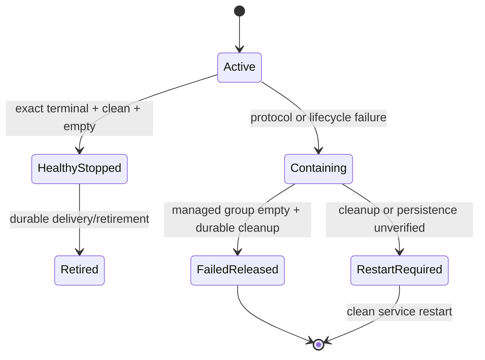

# Codex Process-Local Recovery - Plan

## Goal Capsule

- **Objective:** Remove the reboot-only Codex quarantine and deliver a recoverable Codex backend. A failed managed generation must terminate and release its runtime slot without disabling Codex for the host.
- **Authority:** Runtime availability follows this plan. Existing permission-profile, credential, stale-callback, and duplicate-prevention rules remain authoritative.
- **Execution profile:** Change Orchestra first, release it, then consume that release from the latest Polygram `main`. Roll out to the private VPS canary with native goals disabled.
- **Stop conditions:** Stop if the managed app-server process group cannot be closed and observed empty, if failed-generation evidence must be deleted to restore availability, or if Claude behavior changes.
- **Tail ownership:** Orchestra ships before Polygram. The VPS canary ships before any local Mac enablement. No host reboot is part of implementation or rollout.

---

## Product Contract

### Summary

Replace the persistent daemon-wide quarantine with generation-local failure and recovery.
Healthy Codex stop remains strict.
Abnormal failure closes the managed app-server process group, preserves uncertain input for explicit reconciliation, clears the failed Codex provider-thread binding, and admits a fresh generation.

### Problem Frame

The first VPS Codex canary completed a normal turn and then Codex native goals started an autonomous turn 109 ms later.
Orchestra correctly rejected that unowned turn, but Polygram converted the failure into a daemon-wide lock that survives service restarts and can be released only by a new kernel boot ID.
The lock now blocks the feature even though goals can be disabled and Orchestra already supervises the app-server in an owned process group.

The reboot rule couples two independent questions:

- whether the failed managed process can be replaced; and
- whether a prior user request may have executed and must not be replayed automatically.

The runtime can recover while the old request remains unresolved.
The implementation must preserve that distinction.

### Requirements

#### Runtime availability

- R1. Codex admission must never require a host reboot.
- R2. The existing one-live-Codex-generation capacity rule remains for this delivery, but a failed generation must not become a persistent daemon-wide admission block.
- R3. A containment failure must affect only the exact Codex generation and its provider-thread binding; Claude sessions and runtime switching remain available.
- R4. After successful managed app-server cleanup and durable cleanup acknowledgement, the next Codex request must be able to start a fresh generation.
- R5. After Polygram has proven exclusive daemon ownership, a well-formed same-host active or contained lease found at startup must be recorded as a failed prior generation and released without a boot-ID gate. The runtime identity, lease, generation, and optional provider-session tuple must agree; missing, corrupt, foreign, or internally inconsistent identity remains a non-mutating Codex-only integrity failure.

#### Process and session lifecycle

- R6. Healthy `/stop` keeps the exact-turn terminal reconciliation, tracked-terminal clean, fresh empty-registry observation, durable checkpoints, and strict retirement path.
- R7. Abnormal containment must close asynchronously through the existing supervisor, wait for successful process-group-empty proof, persist that proof, and only then release in-memory ownership.
- R8. A contained Codex provider thread must not be resumed; the failed-generation transaction must delete only the exact matching `codex:app-server` provider-session ID so the next request starts a fresh thread. Absence is idempotent; a different current thread is an integrity conflict and must remain untouched.
- R9. Late notifications, responses, delivery callbacks, and close events from the failed generation must not mutate or release a replacement generation.
- R10. If managed cleanup or its durability checkpoint fails, the current daemon must not admit a replacement. Same-host recovery may resume only after a clean Polygram service restart has exclusive daemon ownership, persistence is healthy, and the supervisor shutdown grace window has elapsed after an unclean takeover.

#### Durable ambiguity

- R11. `prepared`, `write-attempted`, `response-observed`, terminal, managed-group cleanup, delivery, and reconciliation evidence must remain durable.
- R12. Generation failure makes every bound input non-replayable. Prepared-only attempts, open reservations, and bound Telegram handler rows become cancelled or failed while retaining their evidence and require a new Telegram message. Write-attempted, response-observed, active-turn, and accepted-steer work remains ambiguous for owner reconciliation. `CODEX_RPC_NOT_SENT` retry remains available only inside a still-healthy generation.
- R13. Owner reconciliation may mark an ambiguous input incorporated, dismissed, or authorize one warned retry, but no disposition controls runtime availability.
- R14. The existing VPS quarantine must be released by the first upgraded Polygram startup while retaining its generation, reason, checkpoints, and ambiguous attempt.

#### Scope control

- R15. Polygram-managed Codex profiles keep `[features] goals = false`; native goals and autonomous turns remain deferred.
- R16. Detached/background servers remain unsupported. This release proves cleanup of the managed supervisor process group and Codex-tracked terminals, not arbitrary deliberately detached descendants.
- R17. Existing Claude SDK and CLI behavior must remain unchanged.
- R18. Failed-generation settlement must be self-sufficient: it must perform the complete failed-state, input-disposition, session-reset, and lease-release transaction even when the earlier `containment-entered` checkpoint did not commit.
- R19. Live and startup recovery must use one idempotent database-owned failed-generation settlement transaction. Live settlement must compare the generation, session, stable and boot identities, lease state, provider thread, and app-server session; any conflicting replacement ownership must roll back the whole transaction.
- R20. Containment recovery is supported only where Orchestra can prove its managed process group empty with the current supervisor contract (Darwin and Linux). Other platforms must fail Codex preflight rather than treating an unsupported signal result as cleanup proof.

### Key Flows

- F1. Generation-local containment
  - **Trigger:** A Codex generation reports an unexpected turn, protocol fault, ambiguous state-changing request, or another containment reason.
  - **Steps:** Attempt to persist initial containment; close the owned app-server through the supervisor; prove its managed process group empty; invoke one database transaction that verifies exact ownership, creates an audit-only failed generation if containment preceded the first durable checkpoint, settles every bound input, records cleanup proof, deletes only the matching Codex provider thread, and clears the exact lease; then clear exact controller ownership and remove the failed process under the manager lifecycle gate.
  - **Outcome:** The incident remains auditable and Codex can accept a fresh user request.
- F2. Daemon-start recovery
  - **Trigger:** Polygram starts with an active or contained lease from a prior daemon process.
  - **Steps:** Prove exclusive daemon ownership; validate the full persisted ownership tuple without mutating it on failure; after any unclean-takeover supervisor grace, run the same failed-generation settlement transaction; then initialize the manager with either `clear` or a distinct Codex-only integrity block.
  - **Outcome:** A service restart restores Codex without replaying old input or requiring a host reboot.
- F3. Healthy operation
  - **Trigger:** The user sends, steers, stops, follows up, or switches providers without a containment failure.
  - **Steps:** Use the existing owned-turn, steering, delivery, strict-stop, and runtime-switch paths unchanged.
  - **Outcome:** Removing persistent quarantine does not weaken normal lifecycle guarantees.

### Acceptance Examples

- AE1. Given goals are disabled, when an unexpected `turn/started` notification arrives, then its generation produces no assistant delivery, is closed and released, and a later user message starts a fresh Codex thread.
- AE2. Given `thread/start` succeeded but startup validation then failed, when supervisor cleanup succeeds, then the next Codex request is admitted without reboot and without resuming the rejected thread.
- AE3. Given a `turn/start` or `turn/steer` outcome is unknown, when the process is replaced, then the original attempt remains visible for reconciliation and is not replayed automatically.
- AE4. Given a failed generation emits a late callback after replacement, when the callback reaches Orchestra or Polygram, then it is rejected as stale and cannot affect the new lease, thread, delivery, or settings.
- AE5. Given managed process-group cleanup or its checkpoint fails, when another message arrives in the same daemon, then Codex remains unavailable with an actionable service-restart diagnostic rather than a reboot instruction.
- AE6. Given Polygram restarts with the current VPS `unexpected-turn-start` quarantine, when startup recovery runs, then the lease becomes available, the old incident remains queryable, and no prior prompt is replayed.
- AE7. Given a historical ambiguous Codex attempt remains unresolved, when the user switches the chat to Claude, then the switch succeeds immediately.
- AE8. Given a healthy Codex turn, when the user steers, follows up, or sends `/stop`, then existing steering order, exact terminal settlement, tracked-terminal cleanup, and delivery behavior remain unchanged.
- AE9. Given the first containment checkpoint failed but managed process cleanup succeeded, when failed-generation settlement runs, then it independently records the failed state, makes every bound input non-replayable, clears exact ownership, and admits a fresh generation.
- AE10. Given persisted Codex ownership has missing, corrupt, foreign, or internally inconsistent identity, when Polygram starts, then Codex reports an integrity error while Claude remains available; all operational ownership rows remain byte-for-byte unchanged.
- AE11. Given generation A cleanup arrives after generation B owns the chat and has stored a new provider thread, when A attempts settlement or close, then B's lease, thread, controller, and delivery state remain byte-for-byte unchanged.
- AE12. Given two Polygram daemons overlap or the predecessor cannot be proven gone, when startup recovery runs, then Codex remains unavailable until exclusive ownership and the supervisor grace are proven; Claude may start immediately.

### Scope Boundaries

#### Included

- Orchestra process-local containment completion and exact-generation lease release.
- Polygram persistence, startup recovery, provider-thread reset, diagnostics, and reconciliation decoupling.
- Existing-quarantine migration by upgraded startup logic.
- Private VPS canary with goals disabled.

#### Deferred to Follow-Up Work

- Native Codex and Claude goal support from `docs/NATIVE_PROVIDER_GOALS_SPEC.md`.
- Multiple concurrent Codex generations.
- Per-generation Linux cgroups or a container boundary for deliberately detached descendants.
- Same-thread recovery after abnormal containment.

#### Outside This Change

- Codex CLI or tmux integration.
- Replacing the request-attempt or Telegram delivery ledgers.
- Replaying outcome-unknown work automatically.
- Rebooting the Mac or VPS.

---

## Planning Contract

### Key Technical Decisions

- KTD1. **Delete reboot as a runtime state transition.** (session-settled: user-directed — chosen over reboot-only daemon quarantine: the quarantine prevents delivery after recoverable managed-process failures.) The singleton lease remains a live-capacity lock, not a persistent host-disable switch. Governs R1-R5 and R14.
- KTD2. **Accept the native managed-process boundary.** (session-settled: user-directed — chosen over blocking delivery on cgroups, containers, or host reboot: detached servers are unsupported and the product must ship with a stated residual risk.) Successful supervisor close plus process-group-empty proof is sufficient for abnormal generation replacement. It does not claim arbitrary descendant death. Governs R7, R10, R16, and R20.
- KTD3. **Finish containment asynchronously and self-sufficiently.** `containment-entered` attempts to record failure before the notification returns. A later exact-generation cleanup settlement records the complete failed state and successful supervisor teardown before the process emits its terminal close event. This avoids notification-sink deadlock and does not depend on the first checkpoint succeeding. Governs R7, R9, and R18.
- KTD4. **Separate runtime release from input disposition.** A contained generation may release its runtime slot while write-attempted work remains ambiguous. The attempt ledger, reconciliation UI, and no-auto-replay rule survive unchanged. Governs R11-R14.
- KTD5. **Rotate the provider thread after abnormal containment.** Clear only the `codex:app-server` session record. Telegram chat history and Claude provider sessions remain intact. Governs R3, R8, and R17.
- KTD6. **Treat same-host daemon restart as crash recovery, not containment authorization.** Startup converts well-formed stale active or contained ownership to failed historical state and starts with a clear capacity lease. Boot identity remains audit data rather than an admission gate. Missing, corrupt, or foreign host identity still blocks Codex because ownership cannot be attributed safely. Governs R1, R5, R10, and R14.
- KTD7. **Implement from current release heads.** Orchestra work starts from `origin/main` at or beyond 0.10.6. Polygram work starts from `origin/main` at or beyond 0.32.0 after Orchestra is released. The existing 0.30.0 feature worktree is planning-only and must not become a deployment source.
- KTD8. **Use one schema-light failed-generation transaction.** Reuse the generation, attempt, reservation, message, provider-session, and lease records plus at most one idempotent `containment-cleanup-completed` checkpoint. Do not add a new failure ledger, release state machine, operator-clear path, or destructive migration. Governs R8, R11-R14, and R18-R19.
- KTD9. **Keep startup recovery single-owner.** The existing daemon-ownership mechanism must prove the predecessor gone before Codex persistence is changed; an unclean takeover waits the existing supervisor maximum EOF-to-kill grace. This is a bounded service-start condition, not a reboot or infrastructure requirement. Governs R5 and R10.

### High-Level Technical Design

The diagrams are directional. Exact identifiers remain implementation choices.

```mermaid
sequenceDiagram
  participant C as CodexProcess
  participant S as App-server supervisor
  participant P as ProcessManager
  participant D as Polygram durability

  C->>D: attempt containment-entered checkpoint
  C->>S: close managed app-server group
  S-->>C: supervisor exited; group observed empty
  C->>D: compare-and-settle exact failed generation and bound inputs
  D-->>C: exact lease and matching Codex thread durably released
  C-->>P: exact-generation terminal close
  P->>P: under lifecycle gate, release exact in-memory ownership
  Note over P: next Codex input may start a fresh generation
```



### System-Wide Impact

- **Users:** A fatal Codex incident resets only Codex context and asks for a fresh message. It no longer disables the backend until a machine reboot.
- **Operations:** Diagnostics and runbooks prescribe a Polygram service restart only when managed cleanup cannot be verified. Ordinary containment self-recovers.
- **Persistence:** Failed generations and ambiguous attempts remain retained. Boot identity and historical reboot-release rows may remain schema-compatible but are no longer admission authorities.
- **Security:** Permission profiles, credential isolation, filesystem/network denial, exact-generation fencing, and stale-callback rejection do not change. The accepted residual risk is a deliberately detached native descendant.
- **Crash recovery:** A parent crash cannot re-run live empty-group proof because the old PID is not persisted and may be recycled. After exclusive daemon takeover, Codex admission waits the supervisor's existing maximum EOF-to-kill grace before stale ownership is settled; no host reboot is involved.

### Dependencies and Sequencing

1. Land and release Orchestra containment completion.
2. Land Polygram persistence and runtime-controller changes against the newest `main`, consuming the new Orchestra version.
3. Run both full test suites and the real app-server compatibility gate.
4. Release Polygram from the newest release head.
5. Deploy to the VPS, enable the private Shumabit Codex route with goals disabled, restart the owning service once, and execute the canary matrix.

### Alternatives Considered

- **Keep reboot-only quarantine:** Rejected because it converts recoverable lifecycle faults into indefinite product outage.
- **Clear only the database row:** Rejected because the in-memory manager and failed process can still own the generation; it also creates a stale-callback race.
- **Delete the ambiguity ledger:** Rejected because runtime availability does not make an outcome-unknown prompt safe to replay.
- **Add per-generation cgroups now:** Deferred because it expands the change into Linux-specific infrastructure and does not help the current JavaScript cross-platform delivery. It remains the strong-containment option for detached servers.
- **Resume the contained provider thread:** Rejected for the first delivery because a late or autonomous provider turn may still be associated with that thread.

### Risks and Mitigations

- **Detached descendant survives:** State the limitation, keep detached/background servers unsupported, and defer cgroups or containers. Do not reintroduce host reboot as an availability gate.
- **Cleanup checkpoint races process close:** The process emits terminal close only after the exact cleanup checkpoint commits. Generation and process-object checks prevent stale release.
- **Old ambiguous input reaches a new generation:** Never transfer queued reservations or replay write-attempted input. Require a new Telegram input or explicit warned retry.
- **Startup cleanup races replacement:** Prove exclusive daemon ownership, serialize cleanup settlement and process removal through the manager lifecycle gate, and wait for the in-flight start promise before admitting a replacement.
- **Stale cleanup targets replacement state:** The database transaction and both in-memory ownership layers compare generation, process object, session, identities, lease, and provider-session IDs. Any mismatch is a no-op or integrity conflict, never a broad delete.
- **Daemon restarts before old group proof:** Wait the bounded existing supervisor grace after unclean takeover. Do not describe daemon boot as equivalent to live process-group proof.
- **Parallel releases move `main`:** Refresh both repositories before implementation and again before release. Never deploy the older versions in this planning worktree.
- **Persistence is unhealthy:** Fail the current Codex generation and require a clean service restart after database health is restored. Claude remains available.

### Sources and Research

- `docs/plans/2026-07-26-002-codex-native-macos-beta-amendment.md` documents both the useful strict-stop contract and the unsupported detached-descendant case.
- `docs/plans/2026-07-28-004-codex-named-profile-attestation-hotfix.md` demonstrates a harmless post-`thread/start` mismatch causing daemon-wide outage.
- `docs/NATIVE_PROVIDER_GOALS_SPEC.md` records the 109 ms native-goal continuation that caused the VPS incident and the temporary goals-off decision.
- Orchestra `lib/codex/app-server-supervisor.mjs` and `lib/codex/app-server-client.js` already implement managed process-group termination and empty-group proof.

---

## Implementation Units

### U1. Complete process-local containment in Orchestra

- **Goal:** Turn successful abnormal cleanup into an exact-generation terminal close that releases the manager capacity lease.
- **Requirements:** R2-R4, R7, R9-R10, R16-R20; KTD2-KTD3.
- **Target repo:** `@shumkov/orchestra`.
- **Files:** `lib/process/codex-process.js`, `lib/process/process-manager.js`, `lib/process-guard.js`, `tests/codex-process.test.js`, `tests/process-manager-generic.test.js`, `tests/process-guard.test.js`; touch `lib/codex/app-server-client.js` and its tests only if the existing close result needs a typed proof.
- **Approach:** Preserve `ContainmentFailed` as the failed generation state. A contained finalizer awaits `client.close()` without swallowing failure, waits for Polygram's durable exact-generation acknowledgement, stores an immutable cleanup-committed marker, then sets `closed` and emits one terminal close detail. Under `_withLifecycleGate(sessionKey)`, the manager rechecks the session map's process object, generation, global lease, and absence of a competing start before deleting the exact entry and clearing the lease. Any close or checkpoint failure leaves both layers fenced. Codex preflight permits this recovery contract only on Darwin and Linux.
- **Test Scenarios:**
  - An unexpected turn records containment, closes asynchronously, and releases the single-generation slot only after cleanup.
  - A failed initial containment checkpoint still proceeds to managed cleanup and the later self-sufficient settlement path.
  - A late notification, close, checkpoint, or delivery callback from the old process cannot release or mutate a replacement generation.
  - Startup failure after accepted `thread/start` cannot resurrect a closed failed process in the manager map.
  - Cleanup completion racing an in-progress start cannot create two owned generations.
  - Cleanup timeout or process-group proof failure keeps replacement unavailable in the current manager.
  - Process-guard takeover reports success only after the prior daemon is proven gone; an unkillable predecessor leaves Codex fenced.
  - `/stop` that enters containment drives cleanup independently of the failed interrupt path and does not strand ownership.
  - Unsupported platforms fail Codex preflight instead of interpreting process-group signalling as proof.
  - Healthy stop, steering, and strict retirement retain their current results.
- **Verification:** Orchestra focused lifecycle tests pass, followed by its complete test suite with no new skips.

### U2. Decouple Polygram runtime availability from ambiguous input

- **Goal:** Persist contained cleanup, clear exact runtime ownership, and reconstruct old incidents without a reboot gate.
- **Requirements:** R1-R5, R7-R14, R18-R19; KTD1, KTD4, KTD6, KTD8-KTD9.
- **Target repo:** `polygram`.
- **Files:** `polygram.js`, `lib/db.js`, `lib/db/codex-reconciliation.js`, `lib/db/codex-retention.js`, `lib/codex/runtime-controller.js`, `tests/db.test.js`, `tests/codex-reconciliation.test.js`, `tests/codex-retention.test.js`, `tests/codex-runtime-controller.test.js`, `tests/codex-runtime-integration.test.js`, `tests/process-guard.test.js`.
- **Approach:** Add one reusable, idempotent, database-owned failed-generation settlement transaction used by live cleanup and startup recovery. It verifies the exact ownership tuple, records managed-group cleanup, creates an audit-only failed generation when containment preceded the first durable checkpoint, dispositions every generation-bound attempt/reservation/linked input/message, deletes only the matching Codex provider-session ID, and clears only the exact lease. Every statement rolls back on conflict. Only after commit may the lifecycle gate clear exact controller/process/receipt maps. Startup recovery first proves exclusive daemon ownership, validates the persisted tuple, waits the supervisor grace after an unclean takeover, and then calls the same transaction. Replace the manager's `quarantined`/new-boot transition with `clear` after settlement or a distinct Codex-only integrity block. Keep compatibility tables, but remove reboot-release rows from admission, retention, and retry predicates.
- **Execution note:** Write regressions first for the current VPS `unexpected-turn-start` lease and the prior `thread-accepted-before-startup-failure` incident, verify they fail, then implement.
- **Test Scenarios:**
  - Containment cleanup clears only the matching lease and provider-session ID and preserves the incident and ambiguous attempt.
  - Failed initial containment checkpoint plus successful managed close atomically creates the missing audit-only failure and settles any bound input.
  - Injected failure at each transaction step leaves generation, attempts, reservations, messages, provider session, and lease unchanged.
  - A repeated exact settlement is idempotent; a stale settlement after replacement changes every replacement row by zero bytes.
  - Same-boot and changed-boot startup with a valid ownership tuple both return available and do not create a reboot-release prerequisite.
  - Crash startup with an active lease marks the generation failed, preserves input ambiguity, and clears runtime admission.
  - Prepared-only attempts, open reservations, queue-authorized or manager-queued sends, and bound Telegram rows become cancelled/failed and cannot enter generic boot replay; write-attempted, response-observed, active-turn, and accepted-steer work remains ambiguous.
  - Generation-bound inputs found through attempt IDs, reservations, or immutable runtime selections are all dispositioned, while identical rows for another generation remain unchanged.
  - Missing/corrupt/foreign identity, missing generation, or inconsistent host/boot tuple blocks only Codex and leaves every operational row unchanged.
  - Concurrent startup, an unproven predecessor, and unclean takeover prevent Codex admission until exclusive ownership and the supervisor grace are satisfied.
  - Warned retry requires a different failed-settled original generation and the new exact active lease; it needs no reboot-release row and remains single-use.
  - Reconciliation displays the historical generation's failure rather than borrowing a newer singleton lease's state.
  - Unresolved ambiguity remains retained indefinitely; existing 90-day reconciled and 30-day settled/cancelled policies remain; failed generations are pruneable only after attempts are gone and never while referenced by the live lease.
- **Verification:** Focused DB/controller/integration tests pass, followed by the complete Polygram suite with no new skips.

### U3. Reset only the failed Codex thread and simplify diagnostics

- **Goal:** Make abnormal recovery understandable and immediately usable without affecting Claude context.
- **Requirements:** R1, R3-R5, R8, R13-R17; KTD4-KTD6.
- **Target repo:** `polygram`.
- **Files:** `lib/codex/diagnostics.js`, `lib/handlers/codex-reconciliation.js`, `tests/doctor.test.js`, `tests/handlers-codex-reconciliation.test.js`, and relevant runtime-switch integration tests.
- **Approach:** Keep durable provider-thread deletion and ownership cleanup in U2's single transaction. This unit changes only diagnostics and reconciliation presentation: keep Claude context untouched, replace reboot instructions with automatic recovery or a clean-service-restart action when cleanup/persistence remains unverified, and display ambiguity independently from the current singleton lease.
- **Test Scenarios:**
  - The next Codex request starts a new thread while the Claude provider session remains unchanged.
  - Historical ambiguity does not block Codex-to-Claude switching.
  - Diagnostics never report that host reboot is required.
  - Reconciliation still displays duplicate-risk choices without claiming that they control runtime availability.
- **Verification:** Diagnostics, reconciliation, session isolation, and runtime-switch tests pass.

### U4. Release from current heads and prove the VPS canary

- **Goal:** Ship the recovery behavior without downgrading the versions already released in parallel.
- **Requirements:** R1-R20; KTD7.
- **Target repos:** `@shumkov/orchestra`, then `polygram`.
- **Files:** Both `package.json` and lockfiles as required by release conventions; operational documentation that still prescribes a host reboot for Codex containment.
- **Approach:** Create implementation work from the newest remote main branches. Release Orchestra first and update Polygram to that exact version. Release Polygram from the newest release head. Deploy only after package, native binding, profile, sandbox, and service topology checks pass.
- **Test Scenarios:**
  - The upgraded VPS startup releases the existing quarantine but preserves its incident and ambiguous attempt.
  - A simple Codex prompt replies in the private Shumabit chat.
  - A second message during the turn steers it; a follow-up after completion resumes the healthy provider thread.
  - `/stop` settles and a later message succeeds.
  - Switching Codex to Claude and back succeeds.
  - A deliberately injected unexpected-turn fixture resets only Codex and permits a fresh prompt without service or host reboot.
- **Verification:** VPS services and both bot IPC endpoints are healthy; structured events show no stale callback acceptance, old-input replay, or reboot requirement. Production versions are newer than or equal to the versions present before deployment.

---

## Verification Contract

| Gate | Applies to | Done signal |
|---|---|---|
| Orchestra focused tests | U1 | Containment close, cleanup failure, stale callback, and startup race regressions pass. |
| Orchestra `npm test` | U1 | Complete suite passes with zero failures and no new skips. |
| Polygram focused tests | U2-U3 | Current production incidents fail before the fix and pass after it; runtime switching and reconciliation remain green. |
| Polygram `npm test` | U2-U3 | Complete suite passes with zero failures and no new skips. |
| Real Codex app-server compatibility gate | U1-U4 | Pinned Codex starts, replies, steers, stops, and closes its managed process group under the production profile. |
| Package/release validation | U4 | Polygram consumes the released Orchestra version and neither artifact is older than the current production release. |
| Private VPS canary | U4 | Prompt, steering, follow-up, stop, provider switching, and generation-local recovery work without a host reboot. |
| Claude non-regression | U1-U4 | Existing Claude SDK and CLI suites and one VPS health check remain unchanged. |

---

## Definition of Done

- The reboot-only Codex admission rule is absent from Orchestra, Polygram recovery, diagnostics, and operator guidance.
- Successful abnormal cleanup releases only the exact failed generation after durable managed-process cleanup proof.
- The current VPS quarantine is released by upgraded startup without deleting its incident or ambiguous attempt.
- A contained provider thread is never resumed; the next Codex request starts fresh.
- Outcome-unknown input is never replayed automatically and remains owner-reconcilable.
- Healthy steering, follow-up, `/stop`, delivery, model/effort, session isolation, and runtime switching retain their existing contracts.
- Claude SDK and CLI behavior is unchanged.
- Orchestra and Polygram full suites pass without new skips.
- The private VPS Codex canary passes without rebooting the Mac or VPS.
- Implementation and release start from current remote heads, abandoned approaches are removed, and no older package is deployed.
