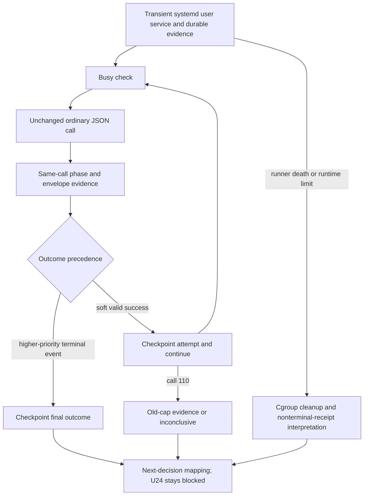

# U24 Timeout Characterization - Plan

## Goal Capsule

- **Objective:** Determine whether U24's five 60-second failures were false rejections by an undersized deadline, same-call adapter/process-boundary failures, or evidence that the fixed Claude CLI/Haiku route is operationally unsuitable.
- **Authority:** This plan is subordinate to `docs/plans/2026-07-31-002-feat-shumabit-scoped-memory-plan.md`, `docs/plans/2026-08-18-002-u24-single-retry-amendment.md`, and the terminal evidence in `docs/2026-08-18-001-u24-memory-routing-gate-findings.md`.
- **Execution profile:** Characterization-first, content-free instrumentation, reviewed local tests, then one authorized background VPS run.
- **Stop conditions:** Stop on scope drift, a busy production owner, runtime or authentication mismatch, unavailable or mismatched systemd user-service containment, unsafe evidence retention, unproved cleanup, or any need to change the model, prompt, retry policy, queue, or production memory behavior.
- **Tail ownership:** This plan produces diagnostic evidence and a next-decision recommendation. No outcome automatically unblocks U24.

---

## Product Contract

### Summary

Add content-free same-call phase and timing evidence to the U24 spike, then run one bounded 110-call campaign against the unchanged subscription-backed Claude CLI/Haiku JSON route inside a transient systemd user service.
The campaign records valid completions beyond the old 60-second cap while continuing the corpus, stops only for a higher-priority terminal event, and preserves crash evidence outside disposable scratch.

### Problem Frame

The full U24 receipt recorded five timeouts at real adapter attempt ordinals 77, 78, 87, 88, and 101.
The same `personal-02` and `mixed-03` fixtures succeeded in earlier or later repetitions, so fixture content alone does not explain the failures.
The current 60-second timer spans process spawn through process close, and the receipt cannot show whether the child was starting, waiting for output, had begun output, had completed a JSON envelope, or was only waiting to close.

Read-only Netdata observations from the 2026-08-18 approximately 15:55-16:30 UTC gate window showed eight cores, average load about 8.9 versus 5.4 before the run, CPU some-pressure about 14.8 versus 9.2, no OOM, and ample free memory.
These historical values were not captured by the gate receipt, remain context and a possible confounder only, and do not prove a cause.
The existing receipt therefore proves operational timeouts and confirmed cleanup, but it cannot attribute them to Claude/provider latency, host contention, or the adapter boundary.

### Requirements

**Evidence contract**

- R1. Every diagnostic attempt must emit a closed, content-free phase record. Any emitted monotonic timing, byte count, Claude success metric, or campaign counter must enforce a declared numeric bound; invalid values become closed unavailable or over-limit states without retaining prompts, output bodies, stderr, paths, process names, or source-derived digests.
- R2. A successful ordinary call requires a clean exit and close, exactly one valid final JSON envelope with no trailing payload bytes, exact configured model identity, and successful routing/schema/coverage validation; a pre-close complete JSON boundary is phase evidence only.

**Diagnostic campaign**

- R3. The diagnostic runner must make exactly the current 22 non-secret fixtures in manifest order for up to five repetitions, use no automatic retry, preserve the exact Claude CLI 2.1.220/Haiku JSON invocation and security boundary, and permit at most 110 ordinary primary calls.
- R4. The runner must treat 60 seconds as a soft observation threshold and 120 seconds as the hard call deadline. A valid success after 60 seconds and by 120 seconds records `slow_valid: true` on that attempt and continues; primary-corpus progression stops only on a higher-priority hard timeout, router-quality failure, process-boundary fault, diagnostic-integrity failure, production-busy abort, or the 110-call ceiling.

**Operational and decision boundary**

- R5. One reviewed background VPS run may execute inside a preflighted transient systemd user service from private scratch and emit one primary outcome without changing U24 acceptance: `old-cap-false-rejection`, `route-unsuitable-at-diagnostic-ceiling`, `process-boundary-fault`, `router-quality-failure`, `diagnostic-failure`, or `inconclusive`. It must recheck zero-busy before every call, preserve a crash-survivable receipt and closed unit witness, prove the unit inactive with an empty cgroup before interpretation, and cause no diagnostic-initiated Polygram application, managed-service, database, deployment-configuration, package, production-memory, or Telegram mutation.

### Key Decisions

- **Characterize before changing behavior.** The observed failures do not justify changing the model, prompt, retry count, queue semantics, or production architecture. Governs R1-R5.
- **Accumulate soft-cap evidence.** One slow valid result proves the old cap rejected that call but cannot hide a later hard failure elsewhere in the corpus. Governs R2-R4.
- **One finite campaign, never retry-until-green.** Operator procedure forbids rerunning a terminal or inconclusive campaign unchanged and permits retrying a diagnostic failure only after a reviewed change; the runner does not maintain an implementation-identity registry. Governs R3-R5.

### Acceptance Examples

- AE1. Covers R2-R5. An ordinary JSON call exits and closes cleanly after 60 seconds and by 120 seconds with exactly one valid final envelope, exact model identity, no trailing payload, and successful routing validation; its single completed-attempt checkpoint records `slow_valid: true` and the campaign continues.
- AE2. Covers R1, R4, R5. A later ordinary call reaches 120 seconds after stdin flush or first output without a valid final envelope; confirmed cleanup yields `route-unsuitable-at-diagnostic-ceiling` and retains the earlier soft-cap observation without claiming provider or host cause.
- AE3. Covers R1, R2, R4, R5. The same ordinary call produces exactly one final envelope whose framing, model, and routing checks pass, reaches stdout end, then exits non-zero, is signalled, or fails to close; confirmed cleanup yields `process-boundary-fault`.
- AE4. Covers R2, R4, R5. A completed ordinary envelope at any latency has exact model evidence but fails routing, schema, coverage, or extractive validation; the runner stops with `router-quality-failure` and retains any prior soft-cap observation.
- AE5. Covers R3-R5. The campaign reaches 110 valid ordinary calls with one or more slow valid successes and no higher-priority terminal event; the primary outcome is `old-cap-false-rejection`.
- AE6. Covers R5. The normal zero-busy check becomes non-zero before a call; the runner makes no further live call and terminates as `inconclusive` while preserving completed evidence.
- AE7. Covers R1, R5. The runner dies without a terminal checkpoint; after the outside launcher proves the transient unit inactive and its cgroup empty, interpretation classifies the preserved nonterminal receipt as `diagnostic-failure` without rewriting it or claiming a process close that was not observed.
- AE8. Covers R3-R5. All 110 ordinary calls satisfy R2 within 60 seconds; the primary outcome is `inconclusive`, and U24 remains blocked.

### Scope Boundaries

**In scope**

- Content-free same-call timing, envelope, and phase evidence in the U24 spike adapter and receipt.
- A dedicated no-retry diagnostic runner, deterministic tests, one reviewed VPS run, and durable U24 documentation updates.
- A preflighted transient systemd user-service boundary, a closed unit witness, and a crash-survivable receipt outside disposable scratch.

**Out of scope**

- Production memory implementation, durable routing queues, session pooling, existing managed-service changes, deployments, package changes, or Telegram actions.
- Model, prompt, schema, fixture, security-flag, environment allowlist, retry, routing, or publication-policy changes.
- Statistical proof of production reliability from a finite sample.
- Provider/host causal attribution or new live host-pressure sampling.
- Whole-host filesystem immutability or inspection of Claude provider-owned state under shared `HOME`/`CLAUDE_CONFIG_DIR`.

### Deferred to Follow-Up Work

- The duplicated 1,147-character router prompt is unrelated cleanup and must not enter this change.
- Sonnet, commercial API, SDK, or other router characterization is considered only through the next-decision contract after this campaign.
- Accepting terminal failures through U15/U16's future durable queue requires a separate product and gate decision.
- A persistent process or session pool is a separate architecture change.

### Success Criteria

- The receipt can locate each attempt in a closed phase, enforce the R2 final-envelope contract, and reconcile bounded timing, byte-count, and campaign arithmetic without content retention.
- The runner enforces exact corpus order, no automatic retry, a 110-call ceiling, both time boundaries, per-call busy preflight, outcome precedence, and durable checkpoints.
- One authorized run yields exactly one primary R5 outcome, retains any soft-cap observation under a higher-priority result, maps that outcome to one practical next decision, and keeps U24 blocked.

---

## Planning Contract

### Key Technical Decisions

- KTD1. **Closed process evidence.** Each attempt advances only through `starting`, `awaiting_output`, `output_started`, and `awaiting_close`. From the attempt start, record monotonic offsets for stdin flush, first stdout, complete JSON candidate, stdout end, close, and total elapsed time. Attempt offsets accept finite integers from 0 through 180,000 milliseconds. Stdout and stderr counts accept integers from 0 through the existing 1,000,000-byte and 256,000-byte limits; a crossing becomes a closed over-limit state instead of an overflowing count. Implements R1.
- KTD2. **Final-envelope acceptance.** Incremental complete-JSON detection sets phase evidence only. A call is `payload_valid` only after stdout end proves exactly one JSON document, with no second value or bytes outside its permitted JSON whitespace framing, followed by exact model and routing validation. R2 succeeds only when that predicate is joined by clean process exit and close. Implements R2.
- KTD3. **Closed numeric sanitizer.** Success-only `duration_ms` and `duration_api_ms` accept finite integers from 0 through 120,000, and `num_turns` must equal 1. Attempt count accepts integers from 0 through 110, checkpoint sequence accepts integers from 0 through 112, and campaign elapsed time accepts integers from 0 through 14,950,000 milliseconds. Missing, non-finite, fractional, negative, or overflowing required values make the campaign `diagnostic-failure`. Implements R1, R2.
- KTD4. **Deterministic primary runner.** Traverse the 22 non-secret fixtures in manifest order for five repetitions and call the single-pass boundary with no retry. All calls preserve the exact ordinary JSON argv, Claude CLI 2.1.220 binary, subscription auth, exact expected Haiku identity, prompt, schema, environment allowlist, and security flags. Implements R3.
- KTD5. **Attempt-local soft threshold and fail-closed precedence.** Mark a valid R2 success after 60,000 and by 120,000 milliseconds with `slow_valid: true` on its completed attempt, then continue. Derive the campaign observation from whether any attempt is slow-valid rather than storing a separate counter. A later terminal event wins as the primary outcome while the earlier attempt remains in the receipt. At call 110, select `old-cap-false-rejection` when any attempt is slow-valid; otherwise select `inconclusive`. Implements R2-R4.
- KTD6. **Truthful shared provider state.** Use the existing shared `HOME`/`CLAUDE_CONFIG_DIR` without copying credentials. The pinned Claude CLI may perform its normal provider-owned writes there; the campaign does not inspect, classify, attribute, or claim immutability for those writes. Diagnostic code writes only to its private scratch and explicit evidence artifacts. Operational witnesses cover only diagnostic-initiated Polygram application, managed-service, database, deployment-configuration, package, production-memory, and Telegram mutation. Implements R5.
- KTD7. **Transient systemd user-service containment.** The outside launcher must preflight the user manager and authorization, then create a transient user service, never a scope. Before any model call, launcher and runner must verify the unique unit identity, runner cgroup membership, and exact properties: `KillMode=control-group`, `RuntimeMaxSec=14940s`, `TimeoutStopSec=10s`, `SendSIGKILL=yes`, `RemainAfterExit=yes`, `StandardOutput=null`, `StandardError=null`, and `WorkingDirectory=<private scratch>`. The unit command receives explicit private scratch, receipt, and unit-witness paths; their ownership and modes are also verified before a model call. The runner and every detached Claude descendant remain in that unit cgroup; the existing Node per-call timeout and process-group cleanup remain responsible for each ordinary call. The outside launcher binds Node's Linux monotonic clock to `ActiveEnterTimestampMonotonic`, polls against the resulting absolute outer deadline, clamps each manager timeout and sleep to the remaining wall time, and uses a count cap only as a secondary bound. It issues a bounded explicit stop even after a post-activation run failure, and then independently proves the unit inactive and its cgroup empty. Only cgroup `ENOENT` after explicit inactive/not-found proof counts as empty; manager errors or other cgroup errors fail closed. Missing manager support, authorization, property equality, path privacy, or cgroup membership fails before a model call. Local tests inject the unit-launcher, compatible monotonic clock, and manager seam; ordinary portable tests do not require live systemd. Implements R5.
- KTD8. **Wall-clock and crash-survivable evidence.** The systemd service is the only campaign watchdog: its 14,940-second runtime plus 10-second stop window creates a 14,950-second outer maximum. The runner uses a monotonic terminal-checkpoint deadline 14,930 seconds after the verified unit activation timestamp and starts no call unless its 130-second reservation -- 120 seconds for the call, five seconds for Node cleanup, and a distinct five seconds for its atomic checkpoint -- fits before that deadline. This retains 630 seconds inside the runner budget for preflight, per-call busy checks, and campaign overhead without adding another watchdog. The operator supplies explicit receipt and unit-witness paths under a separate mode-0700 evidence directory outside scratch. Create the mode-0600 receipt exclusively at sequence 0, checkpoint preflight at sequence 1, then write exactly one atomic fsync checkpoint per completed attempt containing any slow flag and attempted-call terminal result; at most one additional checkpoint records a true out-of-band terminal result. Sequence 112 is the closed upper bound. After its final state and cgroup checks, the outside launcher creates and fsyncs the separate mode-0600 content-free unit witness exclusively; it never rewrites the receipt after runner death. A preserved nonterminal receipt plus a verified inactive, empty unit is interpreted as `diagnostic-failure`; unconfirmed cleanup preserves the last receipt and unit evidence, remains `diagnostic-failure`, and does not claim process close. Validate, copy, and hash both artifacts before removing scratch. Neither artifact retains unit names, PIDs, paths, prompt/output bodies, stderr, or source-derived digests. Implements R1, R5.

### Outcome and Precedence Contract

Higher rows win when evidence matches more than one row.
Any previously checkpointed `slow_valid: true` attempt remains attached to the winning outcome.
`Diagnostic-failure` means the characterization itself is invalid; `inconclusive` means the campaign stayed valid but did not answer the latency question.

| Priority | Evidence | Primary outcome and action |
| --- | --- | --- |
| 1 | Runtime/auth attestation, exact model configuration or observed identity, prompt/schema manifest, tool prohibition, environment allowlist, security flags, systemd user-manager authorization or properties, unit cgroup membership, receipt privacy, or exclusive receipt creation fails | `diagnostic-failure`; stop before the next live call. |
| 2 | Required evidence is unknown, missing, non-finite, fractional, negative, overflowing, internally non-monotonic, or arithmetically inconsistent | `diagnostic-failure`; stop and infer no latency or causality. |
| 3 | Per-call cleanup, process close, receipt checkpoint or fsync, final unit inactivity, or empty cgroup cannot be confirmed | `diagnostic-failure`; preserve the last receipt and unit evidence without claiming an unobserved close. |
| 4 | Normal zero-busy is non-zero before a call | `inconclusive` with reason `production-became-busy`; make no further live call. |
| 5 | Stdout or stderr crosses its fixed limit | `diagnostic-failure`; terminate, confirm cleanup, checkpoint, and stop. |
| 6 | The same ordinary call becomes `payload_valid`, but then exits non-zero, is signalled, or fails to close by the deadline | `process-boundary-fault` after confirmed cleanup; only this same-call shape supports that outcome. |
| 7 | An ordinary call closes cleanly with exact model evidence but fails routing, schema, coverage, or extractive validation at any latency | `router-quality-failure`; checkpoint and stop. |
| 8 | The 120,000-millisecond deadline fires after stdin flush or first output without the call becoming `payload_valid` | `route-unsuitable-at-diagnostic-ceiling` after confirmed cleanup; name no provider, host, or adapter root cause. |
| 9 | The deadline fires in `starting`, stdin never flushes, or the process exits early without becoming `payload_valid` | `diagnostic-failure`; record the closed phase, checkpoint, and stop. |
| 10 | Clean close contains incomplete JSON, a second value, or trailing payload outside one JSON document | `diagnostic-failure` with invalid-envelope framing; pre-close completeness cannot promote it. |
| 11 | An ordinary call satisfies all of R2 after more than 60,000 and no more than 120,000 milliseconds | Its single completed-attempt checkpoint records `slow_valid: true`; continue in corpus order. |
| 12 | An ordinary call satisfies all of R2 in at most 60,000 milliseconds | Checkpoint the attempt and continue in corpus order. |
| 13 | The runner dies or the systemd runtime expires before a terminal checkpoint | After the launcher proves the unit inactive and cgroup empty, interpret the preserved nonterminal receipt as `diagnostic-failure` without rewriting it; unconfirmed cleanup is also `diagnostic-failure` and claims no close. |
| 14 | The next call's 130-second reservation does not fit before the runner's terminal-checkpoint deadline | Checkpoint `diagnostic-failure` with reason `campaign-budget-exhausted` without starting the call, then stop. |
| 15 | Call 110 completes with no higher-priority terminal event | Select `old-cap-false-rejection` when any attempt is slow-valid; otherwise select `inconclusive`. Include the decision in call 110's single checkpoint and stop. |

### Next-Decision Contract

No row authorizes implementation or unblocks U24 automatically.

| Final outcome | Proposed next decision |
| --- | --- |
| `old-cap-false-rejection` | Propose a reviewed timeout amendment, then run a fresh U24 gate under that changed contract. |
| `process-boundary-fault` | Fix the adapter/process boundary and rerun only the changed diagnostic. |
| `route-unsuitable-at-diagnostic-ceiling` | Ask Ivan to choose an alternate subscription-backed router/model or an explicitly queue-tolerant future policy. |
| `router-quality-failure` | Revise the router contract or prompt in a separate reviewed plan. |
| `diagnostic-failure` | Fix the instrumentation or containment, review that change, then rerun the changed campaign only. |
| `inconclusive` | Preserve the historical U24 STOP and ask Ivan to choose an alternate route or the future queue-tolerant policy. |

### High-Level Technical Design

### Sequencing

U1 establishes same-call evidence before U2 builds accumulation, precedence, systemd containment, and durable checkpoints on it.
U3 starts only after U1 and U2 pass local verification and independent code review.

---

## Implementation Units

### U1. Add content-free attempt evidence

- **Goal:** Make the existing U24 adapter and receipt locate same-call process progress and preserve bounded successful-envelope timing without changing routing behavior.
- **Requirements:** R1, R2.
- **Dependencies:** None.
- **Files:** `scripts/spikes/memory-routing-gate/adapters.mjs`, `scripts/spikes/memory-routing-gate/harness.mjs`, `tests/scoped-memory-routing-gate.test.js`.
- **Approach:** Implement KTD1-KTD3 behind the spike boundary, propagate sanitized evidence through attempt rows, and keep the existing cleanup and error-code contracts unchanged.
- **Execution note:** Write failing tests for phase transitions, timing bounds, and content rejection before changing the adapter.
- **Patterns to follow:** Reuse the closed sanitizers, bounded process diagnostics, model-evidence filtering, and content-free receipt projection already present in the U24 harness.
- **Test scenarios:**
  - A fake child flushes stdin, emits stdout, completes one JSON candidate, ends stdout, and closes; every KTD1 offset is monotonic and the phase reaches `awaiting_close` before close evidence.
  - A child emits stderr before stdout; its bounded stderr byte count is retained without bytes, text, or a redundant first-stderr timestamp.
  - A complete JSON candidate arrives before close, but later payload bytes or a second value arrive; the candidate remains phase evidence and cannot satisfy R2.
  - A final envelope with permitted JSON whitespace framing, exact model evidence, bounded Claude durations, and `num_turns: 1` satisfies R2 after clean close.
  - Every KTD3 lower and upper bound is accepted; missing, non-finite, fractional, negative, string-valued, and one-over-bound values become the required unavailable or failure state.
  - Stdout and stderr stop at their declared bounds; a crossing produces only an over-limit sentinel and confirmed cleanup.
  - Exactly one final envelope whose framing, model, and routing checks pass, followed by non-zero exit, signal, or close timeout, is distinguishable from an incomplete or multiply framed response.
  - A malicious error, event, output, or path string cannot appear in serialized evidence, and no source-derived digest is introduced.
- **Verification:** Focused Node 24 tests prove red-to-green behavior, existing timeout cleanup tests remain green, and attempt arithmetic still reconciles.

### U2. Add the bounded timeout diagnostic runner

- **Goal:** Execute the unchanged router under the diagnostic timing contract and emit one crash-survivable primary outcome plus its next-decision recommendation.
- **Requirements:** R3-R5; AE1-AE8.
- **Dependencies:** U1.
- **Files:** `scripts/spikes/memory-routing-gate/adapters.mjs`, `scripts/spikes/memory-routing-gate/diagnose-timeouts.mjs`, `scripts/spikes/memory-routing-gate/runtime-attestation.mjs`, `scripts/spikes/memory-routing-gate/run.mjs`, `scripts/spikes/memory-routing-gate/README.md`, `tests/memory-routing-timeout-diagnostic.test.js`, `tests/scoped-memory-routing-gate.test.js`.
- **Approach:** Implement KTD4-KTD8 plus every row of both contracts through the outside launcher, transient user service, and runner; the existing shape/full gate keeps its behavior and acceptance contract.
- **Execution note:** Build every accumulation, precedence, crash, checkpoint, and classification branch with deterministic injected-process tests before allowing a live runtime.
- **Patterns to follow:** Reuse exact binary/auth attestation, `subscriptionOnlyEnv`, exclusive mode-0600 receipt creation, and closed STOP evidence from `scripts/spikes/memory-routing-gate/run.mjs`.
- **Test scenarios:**
  - All calls are the unchanged ordinary JSON invocation; the runner evaluates the 22 fixtures in manifest order for five repetitions with no retry and no more than 110 calls. The launcher binds the canonical pinned Claude path, version, digest, device, inode, size, mode, ctime, and mtime; each spawn uses a cheap opened-file identity check, and one final digest check runs after unit cleanup and before receipt interpretation.
  - Each of the 15 precedence rows has a deterministic case, and overlap tests prove that the higher row wins while retaining any earlier soft-cap observation.
  - A clean result at 60,001 and 120,000 milliseconds records `slow_valid: true` in its single attempt checkpoint and continues; close failure, a second envelope, trailing payload, wrong model, or failed routing validation cannot create that observation.
  - One or many slow-valid attempts followed by call 110 yield `old-cap-false-rejection` through an `attempts.some(slow_valid)` derivation; 110 fast valid successes yield `inconclusive` without a separate counter.
  - A later timeout, router-quality failure, process-boundary fault, integrity failure, or busy abort wins the primary outcome and preserves the soft observation.
  - Each 120-second phase maps through the table with confirmed cleanup, and unconfirmed cleanup overrides every substantive outcome.
  - Early exit, output/stderr limit, auth/model/tool/security fault, missing evidence, and numeric overflow fail closed with no causal label.
  - Zero-busy is checked before every call; a transition to busy aborts inconclusive before spawn.
  - Shared Claude config is neither scanned nor classified, and the diagnostic exposes no write target beyond private scratch and the explicit evidence paths.
  - The injected systemd seam requires a transient user service rather than a scope, exact KTD7 properties, verified manager authorization and runner cgroup membership before any model call, and fail-closed handling of every mismatch.
  - An injected detached child remains in the unit cgroup and is removed by unit stop; a bounded Linux-only capability check before U3 proves the real user manager has the same behavior, while the ordinary portable unit suite never requires live systemd.
  - Runtime arithmetic proves `14940s + 10s = 14950s`, the runner's 14,930-second terminal-checkpoint deadline, the 130-second call reservation, and refusal to start an under-reserved call without adding another watchdog.
  - VPS staging uses the seven-file `STAGING_SOURCE_FILES` allowlist from one reviewed Git commit, a commit-scoped `source-receipt-$source_commit.json` containing the Git-archive SHA-256, owner-only source/evidence directories under `~/.local/state/polygram/u24-timeout`, scratch under `/run/user/$UID`, and an owner-only `node_modules` symlink to `/usr/lib/node_modules/polygram/node_modules`; a staged top-level import and injected launch smoke run without systemd or a model.
  - Receipt tests cover exclusive sequence 0 creation, sequence 1 preflight, one atomic fsync checkpoint per attempt containing any soft flag or attempted-call terminal result, at most one out-of-band terminal checkpoint, the sequence-112 bound, corrupted checkpoints, nonterminal interpretation without rewriting, unit-witness validation, copy/hash validation, and scratch cleanup.
  - An unconfirmed process close, unit stop, or empty-cgroup check preserves the last artifacts and yields `diagnostic-failure` without a false close claim.
- **Verification:** The focused Node 24 suite proves deterministic classification, unit-launcher contracts, durable content-free checkpoints, exact call arithmetic, and next-decision mapping; the bounded Linux capability preflight proves the real transient-user-service boundary before U3.

### U3. Run once and fold the evidence

- **Goal:** Produce one reviewed VPS diagnostic receipt and update U24's durable decision record without diagnostic-initiated production mutation.
- **Requirements:** R5.
- **Dependencies:** U1, U2, completed independent code review.
- **Files:** `docs/2026-08-18-001-u24-memory-routing-gate-findings.md`, `docs/plans/2026-07-31-002-feat-shumabit-scoped-memory-plan.md`.
- **Approach:**
  1. Require exact runtime/auth/model/prompt/schema/environment/security attestation, the KTD7 transient-user-service capability preflight, a private working/scratch directory, and the operator-supplied KTD8 evidence paths before the first call.
  2. Execute once inside the verified transient service, rechecking zero-busy before every call and checkpointing durable evidence throughout.
  3. After the outside launcher proves the unit inactive and cgroup empty, interpret the receipt and unit witness, validate/copy/hash both artifacts, apply only the Next-Decision Contract, update both durable documents, and remove scratch.
- **Execution note:** Do not launch the ordinary full gate in this unit. Operator procedure forbids rerunning a terminal or inconclusive campaign unchanged and permits retrying a diagnostic failure only after a reviewed change; the runner does not enforce implementation identity.
- **Test expectation:** None -- this unit consumes the already-tested diagnostic runner against the real pinned runtime; its proof is the durable attested receipt, closed unit witness, per-call busy witnesses, and verified empty unit cgroup.
- **Verification:** Operational checks show no diagnostic-initiated Polygram application, managed-service, database, deployment-configuration, package, production-memory, or Telegram mutation. They make no whole-host filesystem or shared Claude provider-state immutability claim.

---

## Verification Contract

| Gate | Applies to | Required evidence |
| --- | --- | --- |
| Focused Node 24 suite | U1, U2 | `node --test tests/scoped-memory-routing-gate.test.js tests/memory-routing-timeout-diagnostic.test.js` passes with zero failures and zero unreported skips. |
| Adjacent Node 24 suite | U1, U2 | The established six-file U24/secret/memory suite passes under the repository Node 24 runtime with zero failures and zero unreported skips. |
| Static diff check | U1-U3 | `git diff --check` is clean, and changed paths stay within this plan's declared files. |
| Independent code review | U1, U2 | Correctness, simplicity/scope, failure/operability, process-safety, and privacy reviewers report no unresolved must-fixes. |
| Live diagnostic | U3 | Exactly one authorized VPS run uses 110 or fewer unchanged ordinary JSON calls inside the verified transient systemd user service, rechecks zero-busy before every call, and produces a validated crash-survivable receipt plus closed unit witness under R5. |
| Operational preservation | U3 | No diagnostic-initiated Polygram application, managed-service, database, deployment-configuration, package, production-memory, or Telegram mutation occurs; shared Claude provider state remains outside the inspection claim. |

Live interpretation follows the Outcome and Precedence Contract and then the Next-Decision Contract.
No result automatically greens U24.

---

## Risks and Dependencies

- **Instrumentation perturbation:** Keep bookkeeping monotonic, in-process, bounded, and free of periodic polling.
- **Buffered CLI output:** Ordinary JSON mode may expose no intermediate output; same-call complete-candidate, stdout-end, and close evidence are the only accepted discriminators.
- **Historical host contention:** The 2026-08-18 Netdata observations remain context and a possible confounder only; this campaign adds no live host-pressure instrumentation or causal claim.
- **Shared provider state:** Subscription-backed CLI use may perform normal provider-owned writes under shared `HOME`/`CLAUDE_CONFIG_DIR`; the plan neither attributes nor constrains them.
- **User-service containment:** The live run depends on an authorized systemd user manager honoring the exact transient-service properties. KTD7 fails before a model call when that boundary or cgroup membership cannot be proved.
- **Receipt durability:** A disposable-scratch receipt would erase the campaign on crash. KTD8 places exclusive checkpointed evidence outside scratch before the first call and interprets a preserved nonterminal receipt without rewriting it.
- **Single-campaign limit:** A clean fast sample cannot establish a tail-latency rate. The `inconclusive` result prevents false confidence.
- **Pinned internal surface:** Claude CLI envelope fields are version-bound to 2.1.220; runtime attestation must fail closed.

### Alternatives Considered

- **Raise the timeout now:** Rejected because it changes the gate before characterizing the observed failures.
- **Run a 12-call mini-check:** Rejected because the first historical timeout appeared only at attempt ordinal 77.
- **Switch to Sonnet, an API, or an SDK now:** Deferred to the outcome-specific next decision.
- **Accept failures through a future durable queue:** Deferred to U15/U16 because it changes product acceptance and requires persistence/idempotency guarantees absent from U24.
- **Build a persistent process pool:** Rejected as disproportionate lifecycle and isolation complexity for one characterization campaign.
- **Require a dedicated authenticated config root:** Rejected for this run because it adds subscription-account migration without improving same-call timing evidence.
- **Track detached children with PID/PGID and `/proc` identity:** Rejected because spawn-then-record has an orphan window and duplicates containment already provided by the VPS systemd user-service cgroup.

---

## Definition of Done

- R1-R5 and AE1-AE8 are covered by U1-U3 with no unresolved planning blocker.
- U1 and U2 pass focused and adjacent Node 24 verification, static checks, and independent code review.
- Every durable receipt and unit-witness field is closed, bounded, content-free, and covered at exact lower, upper, invalid, non-finite, and overflow cases.
- Every precedence and next-decision row has deterministic coverage, including soft-observation accumulation, a later winning terminal result, call 110, every timeout phase, validation failure, same-call close failure, early exit, limits, security faults, busy abort, crash, unknown evidence, and unconfirmed cleanup.
- The runner proves exact corpus order, unchanged ordinary JSON argv, no automatic retry, a 110-call ceiling, the 60/120-second contract, and per-call busy checks without live host-pressure instrumentation.
- The systemd boundary proves the authorized transient user service, exact KTD7 properties, runner and detached-child cgroup membership, unit-stop cleanup, final inactive state, and empty cgroup; the portable unit suite uses an injected seam and U3 requires the bounded real-Linux capability check.
- The wall contract proves `RuntimeMaxSec=14940s` plus `TimeoutStopSec=10s` equals the 14,950-second outer maximum, the 14,930-second internal terminal-checkpoint deadline, and refusal to start a call whose 130-second reservation does not fit; systemd remains the only campaign watchdog.
- The operator-supplied evidence paths prove exclusive mode-0600 sequence 0 creation, sequence 1 preflight, one atomic fsync checkpoint per completed attempt, at most one out-of-band terminal checkpoint, the sequence-112 bound, nonterminal interpretation without a post-crash rewrite, receipt/unit-witness validation and copy/hash, and scratch cleanup.
- One authorized VPS campaign yields one primary outcome and practical next-decision recommendation, retains any soft-cap observation, and never unblocks U24 automatically.
- Operator procedure never reruns a terminal or inconclusive campaign unchanged and retries a diagnostic failure only after a reviewed change; the runner carries no implementation-identity registry.
- Durable findings and the main scoped-memory plan record the receipt and preserve the U24 STOP until a later reviewed decision changes it.
- The diagnostic causes no Polygram production behavior, application data, model, prompt, schema, fixture, retry, queue, managed-service, deployment config, package, memory, or Telegram state change. Shared Claude provider-owned writes are expressly outside that claim.
- Temporary scratch and abandoned diagnostic code are removed after durable evidence is preserved.
