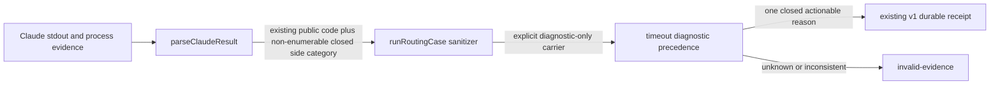

# U24 Envelope Diagnostic Discriminator - Plan

## Goal Capsule

- **Objective:** Make the U24 timeout diagnostic distinguish the five content-free Claude response failure classes currently collapsed into `invalid-envelope`, so one changed VPS campaign can select the next narrow investigation or contract review without exposing response content.
- **Authority:** This plan is subordinate to `docs/plans/2026-08-19-0012-fix-u24-timeout-characterization-plan.md`, `docs/plans/2026-07-31-002-feat-shumabit-scoped-memory-plan.md`, and the preserved first-call evidence in `docs/2026-08-18-001-u24-memory-routing-gate-findings.md`.
- **Execution profile:** Test-first parser-side classification, deterministic local verification, independent code review, then a newly authorized changed diagnostic campaign.
- **Stop conditions:** Stop on any need to retain raw stdout, stderr, response fields, error strings, paths, identifiers, or source-derived digests; any change to normal router acceptance/retry behavior; any uncertainty about lifecycle-fault precedence; or any live action without a fresh explicit approval.
- **Tail ownership:** This plan diagnoses the existing U24 blocker. It does not implement production memory, release Polygram, or unblock U24 by itself.

---

## Product Contract

### Summary

The first reviewed timeout-characterization campaign stopped safely after one call with a clean process boundary but the broad terminal reason `invalid-envelope`.
The retained content-free evidence proves that a balanced JSON candidate appeared and the process closed, but it cannot distinguish JSON framing, a missing structured result, invalid Claude duration metrics, an invalid `num_turns`, or simultaneous metric and turn-count failure.

Add a closed internal discriminator exactly where the Claude result is parsed. Preserve the existing public router error codes and ordinary shape/full gate behavior, but let the diagnostic map that discriminator to one of five closed terminal reasons. Then, after review and fresh approval, stage a new immutable commit and run the changed diagnostic once.

### Requirements

**Failure-source classification**

- R1. The Claude adapter must classify only these five response failures: `json-framing`, `output-missing`, `duration-metrics-invalid`, `turn-count-invalid`, and `duration-and-turn-count-invalid`.
- R2. The classification must be derived before broad error wrapping from structural checks only. It must retain no raw response value, output body, stderr, error message, path, identifier, account data, timing value, turn-count value, or secret-derived digest.

**Compatibility and precedence**

- R3. Existing callers must continue to receive the same `ROUTER_OUTPUT_MALFORMED` or `ROUTER_OUTPUT_MISSING` codes, with unchanged retry eligibility, projections, accepted results, model checks, prompt, schema, fixtures, tool boundary, and environment allowlist.
- R4. The discriminator may refine only a diagnostic failure reached after the existing higher-priority lifecycle and security checks. Cleanup failure, byte overflow, timeout, process exit, authentication, runtime, model identity, tool-use, and security faults must continue to win.

**Durable evidence and rerun**

- R5. The diagnostic must fail closed when the discriminator is missing, unknown, malformed, or inconsistent with the public router code. A valid discriminator maps to one of five closed durable terminal reasons while the primary outcome remains `diagnostic-failure`.
- R6. The existing failed receipt remains immutable. A changed rerun requires a new reviewed commit, fresh source/evidence identities, the unchanged 110-call ceiling and operational boundary, and fresh explicit approval because the prior authorization was consumed by the first live call.

### Key Decisions

- **Classify at the fault source.** The parser knows which structural check failed; reconstructing that distinction later from a broad error code would be ambiguous. Governs R1, R2, R5.
- **Keep serialized ordinary router outputs, public error fields, and routing behavior compatible.** The side discriminator is diagnostic evidence, not a new routing error taxonomy. Governs R3, R4.
- **Use five categories, not three.** Separating the duration-validation family from `num_turns` is enough to choose between a framing/parser investigation, a duration-contract review, and a turn-count/invocation review. The plan does not claim to distinguish `duration_ms` from `duration_api_ms`; that finer split is unnecessary until the duration family is actually observed. Governs R1, R5.
- **Keep receipt schema v1 and one durable label.** The diagnostic validates the public-code/discriminator pair before checkpointing, then persists the matching specific terminal reason as the sole actionable class. The receipt proves that closed class plus clean process evidence; it does not claim independent provenance for the parser's transient classification. Preserved v1 artifacts, attempt keys, and ordinary shape/full receipts remain unchanged. Governs R2, R5.
- **One changed campaign only after approval.** The first authorization permitted the run that made one model call and is now consumed. Governs R6.

### Acceptance Examples

- AE1. Invalid or incomplete JSON, multiple JSON values, or non-whitespace trailing bytes yields public code `ROUTER_OUTPUT_MALFORMED`, internal discriminator `json-framing`, and diagnostic reason `invalid-envelope-framing`.
- AE2. A syntactically valid Claude envelope lacks both a non-null object `structured_output` and any string-valued `result`; it yields `ROUTER_OUTPUT_MISSING`, `output-missing`, and `missing-envelope-payload`. An empty string remains a present `result`, matching current behavior.
- AE3. The final envelope has output but either parsed duration field is missing, `null`, the wrong type, fractional, negative, or outside the reviewed bound while `num_turns` is exactly one; it yields `duration-metrics-invalid` and `invalid-envelope-duration-metrics`. Raw `NaN` or `Infinity` tokens are invalid JSON and therefore framing failures.
- AE4. The duration fields are valid but `num_turns` is not exactly one; it yields `turn-count-invalid` and `invalid-envelope-turn-count`.
- AE5. Duration and turn-count checks both fail; it yields `duration-and-turn-count-invalid` and `invalid-envelope-duration-and-turn-count`.
- AE6. A parser failure after an otherwise clean process close uses the new envelope reason. A parser failure encountered while handling byte overflow, timeout, non-zero exit, or unconfirmed cleanup leaves that reachable process outcome primary; authentication, runtime, model, tool, and security faults likewise keep their existing outcomes. None checkpoint an envelope reason.
- AE7. A caller supplies an arbitrary discriminator, a missing discriminator for one of the two output codes, or an inconsistent code/discriminator pair; the diagnostic produces content-free `invalid-evidence` rather than guessing.
- AE8. A valid accepted Claude response and every existing normal shape/full routing result remain unchanged.

### Scope Boundaries

**In scope**

- Parser-local closed classification in the U24 Claude adapter.
- Allowlisted propagation through the U24 harness.
- Diagnostic classification, receipt validation, focused tests, and durable findings/parent-plan updates.
- One separately approved rerun of the already reviewed timeout campaign after immutable staging.

**Out of scope**

- Production memory routing, publication, queues, Polygram application code, release, deploy, or service changes.
- Raw response capture, excerpts, hashes, generalized telemetry, new metrics, or provider/host causal claims.
- Changes to Claude model, CLI pin, prompt, schema, fixtures, tools, environment, auth, timeout, retry, or systemd containment.
- Relaxing the current duration or `num_turns === 1` contract before live evidence identifies that as the failure class.

### Success Criteria

- Every parser failure in scope maps to exactly one closed internal category and the category cannot contain response-derived content.
- Existing router codes, retry behavior, normal gate receipts, and accepted outputs are unchanged.
- Classifier and durable-receipt grammar agree for all five reasons and reject all unknown or inconsistent evidence.
- Focused, adjacent, and repository tests pass under the repository Node 24 runtime with zero hidden skips, and independent review reports no must-fix.
- A newly approved changed VPS run either proceeds past call one or stops with a specific content-free reason that selects one narrow next decision.

---

## Planning Contract

### Key Technical Decisions

- KTD1. **Closed non-enumerable side evidence on existing errors.** Attach a single allowlisted `claudeEnvelopeFailure` value with a non-enumerable property before the existing error leaves `parseClaudeResult`. `runRoutingCase` explicitly allowlists it and attaches the same non-enumerable property to its diagnostic result. It stays outside `attemptEvidence`, object spreads, JSON serialization, retry evidence, ordinary shape/full evaluation receipts, and accepted values. Do not change `.code`, `.message`, `observedModels`, or normal adapter return values. Implements R1-R3.
- KTD2. **Independent structural predicates.** After successful JSON parsing and output-presence validation, evaluate the existing duration predicate and the existing exact-one-turn predicate separately, then select duration-only, turn-only, or combined failure. Do not relax either predicate. Implements R1, R3.
- KTD3. **Sanitize at every boundary.** The harness projects the discriminator only when both the public code and closed category are valid, using an explicit non-enumerable diagnostic carrier rather than the attempt-evidence object. It drops arbitrary properties and never serializes error messages or response values. Implements R2, R5.
- KTD4. **Existing precedence remains authoritative.** The discriminator is emitted only for parser failures after the ordinary process completed cleanly. Parser failures encountered while recovering a process-boundary error remain swallowed and the original process error stays primary. Diagnostic classification consults the discriminator only when an envelope output code reaches the current invalid-envelope branch after evidence validation and all higher-priority lifecycle, bounds, authentication, runtime, model, tool, and security branches. Implements R4.
- KTD5. **Closed v1 durable reason with legacy read compatibility.** Map the five valid public-code/discriminator pairs to the five AE1-AE5 reasons before checkpointing. Keep `polygram-memory-routing-timeout-diagnostic/v1`, every attempt key, and content-free evidence unchanged. The durable validator continues accepting the broad `invalid-envelope` only so the already preserved first-campaign receipt remains readable; the changed classifier and checkpoint producer must never create that reason. New reasons prove a closed class compatible with clean-close envelope-failure evidence but do not reconstruct or claim independent proof of the discarded transient category. Implements R2, R5.
- KTD6. **Fresh live identity.** Preserve the old receipt and witness, stage only an immutable reviewed commit, choose unused evidence paths, re-run all existing runtime/auth/model/systemd/busy checks, and require a new explicit approval immediately before launch. Implements R6.

### Closed Mapping

| Existing public code | Internal discriminator | Durable diagnostic reason |
| --- | --- | --- |
| `ROUTER_OUTPUT_MALFORMED` | `json-framing` | `invalid-envelope-framing` |
| `ROUTER_OUTPUT_MISSING` | `output-missing` | `missing-envelope-payload` |
| `ROUTER_OUTPUT_MALFORMED` | `duration-metrics-invalid` | `invalid-envelope-duration-metrics` |
| `ROUTER_OUTPUT_MALFORMED` | `turn-count-invalid` | `invalid-envelope-turn-count` |
| `ROUTER_OUTPUT_MALFORMED` | `duration-and-turn-count-invalid` | `invalid-envelope-duration-and-turn-count` |

Every other pair is invalid evidence.

### Next-Decision Mapping

| Changed campaign reason | Next narrow action |
| --- | --- |
| `invalid-envelope-framing` | Inspect the pinned Claude stream-json framing contract in a separate content-safe adapter investigation; do not alter routing policy. |
| `missing-envelope-payload` | Verify the pinned CLI structured-output/result shape and invocation in a separate parser compatibility fix. |
| `invalid-envelope-duration-metrics` | Review and amend only the duration evidence contract if the live envelope otherwise remains valid. |
| `invalid-envelope-turn-count` | Determine why a nominal single call reports a non-one turn count, then review whether the diagnostic predicate or invocation is wrong. |
| `invalid-envelope-duration-and-turn-count` | Inspect the complete success-metadata contract before relaxing either predicate. |

No row authorizes production memory, release, deploy, or a second unchanged rerun.

### Data Flow

### Sequencing

U1 defines and tests the source-side contract. U2 consumes only that contract in the diagnostic and durable receipt. U3 begins only after local verification, independent code review, immutable staging, and fresh user approval.

---

## Implementation Units

### U1. Classify Claude envelope failures at the parser boundary

- **Goal:** Preserve the precise structural cause without changing ordinary router behavior.
- **Requirements:** R1-R3; AE1-AE5, AE8.
- **Dependencies:** None.
- **Files:** `scripts/spikes/memory-routing-gate/adapters.mjs`, `scripts/spikes/memory-routing-gate/harness.mjs`, `tests/scoped-memory-routing-gate.test.js`.
- **Approach:** Implement KTD1-KTD3 with a frozen enum/helper local to the spike, attach it non-enumerably only to the existing output errors, and explicitly carry the allowlisted value as a non-enumerable top-level diagnostic result property. Keep `attemptEvidence` and ordinary serialized results byte-for-byte unchanged.
- **Test-first scenarios:**
  - Invalid, incomplete, multiple, and trailing JSON shapes select only `json-framing`.
  - Valid JSON without either accepted output field selects only `output-missing`; any string `result`, including `''`, retains the current present-output behavior.
  - Every invalid parsed duration boundary with exact-one turn selects duration-only; raw non-finite tokens select framing because they are not JSON.
  - Every invalid turn-count boundary with valid durations selects turn-only.
  - Both invalid groups select combined.
  - Accepted output remains byte-for-byte equivalent at the harness seam.
  - Existing public codes and retry eligibility remain identical.
  - Framing errors retain their current absence of `observedModels`, so they cannot be reclassified as model-identity failures.
  - The direct `parseClaudeResult` -> adapter -> `runRoutingCase` -> diagnostic seam preserves the non-enumerable category, while `Object.keys`, object spread, JSON serialization, retry evidence, and ordinary evaluation summaries expose exactly their pre-change keys.
  - Arbitrary fields, values, messages, and response content cannot enter attempt evidence or ordinary serialized results.

### U2. Refine the diagnostic and durable receipt

- **Goal:** Turn the closed side category into one actionable, content-free terminal reason while preserving lifecycle precedence.
- **Requirements:** R4-R5; AE6-AE8.
- **Dependencies:** U1.
- **Files:** `scripts/spikes/memory-routing-gate/diagnose-timeouts.mjs`, `tests/memory-routing-timeout-diagnostic.test.js`.
- **Approach:** Implement KTD4-KTD5, extend the closed terminal vocabulary, and add positive classifier-to-checkpoint round trips plus adverse pair tests.
- **Test-first scenarios:**
  - Each of the five mapping rows validates its public-code/discriminator pair before checkpointing and persists only its matching closed reason.
  - Missing, unknown, malformed, or code-inconsistent categories become `invalid-evidence` without an attempt-evidence dereference failure.
  - Reachable precedence shapes stay unchanged: clean-close parser failures use the new reasons; a parse failure during process-error recovery leaves the original process fault primary; valid recovered payload plus process failure stays a process-boundary fault; cleanup-unconfirmed and overflow process errors retain their existing outcomes; auth, runtime, model, tool, and security faults remain primary.
  - A clean accepted envelope still follows the existing success/slow-valid path.
  - Receipt schema, attempt keys, sequence arithmetic, witness relation, and all other content-free fields remain unchanged; the durable validator checks the specific closed reason against clean-close envelope-failure evidence without claiming parser provenance.
  - The preserved first-campaign v1 receipt with broad `invalid-envelope` remains readable, while direct use of that reason in the changed checkpoint producer is rejected so a changed run cannot silently collapse again.

### U3. Review, stage, and run the changed diagnostic

- **Goal:** Obtain one specific next-decision result without changing production.
- **Requirements:** R6.
- **Dependencies:** U1, U2, local verification, independent code review, and fresh explicit approval.
- **Files:** `docs/2026-08-18-001-u24-memory-routing-gate-findings.md`, `docs/plans/2026-07-31-002-feat-shumabit-scoped-memory-plan.md`; no production files.
- **Approach:** Preserve the original receipt/witness and their hashes, commit the reviewed change, stage that exact commit through the existing immutable archive procedure, use fresh receipt/witness paths, re-prove idle owners and all runtime/auth/model/systemd gates, then run the unchanged 110-call-ceiling campaign once.
- **Verification scenarios:**
  - The staged archive and source checkout match the reviewed commit and contain only the reviewed diagnostic delta.
  - Existing receipt/witness paths are never reused or overwritten.
  - Both managed bots are idle before launch and the per-call busy gate remains enabled.
  - A preflight or containment mismatch produces zero model calls.
  - The final artifacts are content-free, mode-0600, fsynced, copied, hashed, and interpreted only after unit inactivity and empty-cgroup proof.
  - Durable docs record exact call count, closed outcome/reason, cleanup proof, receipt/witness hashes, and next decision without raw provider content.

---

## Verification Contract

### Local gates

Run under the repository Node 24 runtime:

- Focused U24 routing and timeout-diagnostic tests, with exact pass/fail/skip totals.
- The disjoint six-file memory/secret adjacent suite already used by U24, with exact totals.
- Repository-standard `npm test`; report any force-exit behavior or skips rather than collapsing them into “green.”
- Syntax checks for every changed executable module and `git diff --check`.
- A content scan of serialized fixtures/receipts proving no raw response, stderr, error message, paths, identifiers, metric values, turn-count values, or source-derived digests were added.

### Review gates

- Spec review lenses: feasibility/correctness, simplicity/scope, failure/privacy, and operational domain fit.
- Code review lenses: parser correctness, receipt/classifier closure, lifecycle precedence, privacy/content boundaries, and regression-test strength.
- Every must-fix is folded and re-reviewed against a stable tree before staging.

### Live gate

- No live rerun occurs under the consumed authorization.
- After U1/U2 review and immutable staging, present the exact changed commit, command contract, maximum 110 calls, and unchanged production boundary to Ivan and obtain fresh explicit approval.
- Stop after the first terminal result. Never rerun the same implementation/evidence identity unchanged.

---

## Risks and Mitigations

- **Risk:** Side evidence accidentally becomes a second public error API. **Mitigation:** Preserve `.code` and normal projections; consume the discriminator only in the diagnostic path.
- **Risk:** A new label bypasses a lifecycle or security outcome. **Mitigation:** Keep classification at the existing invalid-envelope precedence row and add overlap tests for every higher-priority family.
- **Risk:** The richer label leaks provider response data. **Mitigation:** Five hard-coded enum values only; no raw values, strings, counts, or hashes cross the parser boundary.
- **Risk:** Receipt v1 cannot independently prove which transient parser predicate selected a specific reason. **Mitigation:** Validate the closed public-code/discriminator pair before checkpointing, preserve only one actionable terminal label, and state the evidence limit explicitly. The existing same-UID private-file trust boundary remains unchanged; duplicating the same classifier decision in another field would not strengthen it.
- **Risk:** The next live result reveals a wrong metric predicate rather than a provider failure. **Mitigation:** Do not pre-emptively relax it; use the result to scope a separate reviewed amendment.
- **Risk:** Reusing the first approval or evidence path destroys auditability. **Mitigation:** Treat the approval as consumed, preserve old artifacts, use a new immutable commit and fresh paths, and ask again immediately before launch.

---

## Definition of Done

- [ ] U1 and U2 start with concrete failing tests and show red-to-green under Node 24.
- [ ] The five closed categories and mapping table are exhaustive and code/category inconsistencies fail closed.
- [ ] Ordinary shape/full router behavior, retry policy, and receipts are unchanged.
- [ ] Lifecycle/security precedence and content-free serialization are independently reviewed clean.
- [ ] Focused, adjacent, full, syntax, and diff gates are reported with exact totals and no silent skips.
- [ ] The reviewed change is committed and staged immutably only after user alignment.
- [ ] Fresh explicit approval is obtained before any changed live campaign.
- [ ] The changed campaign runs at most once, stops at its first terminal result, and proves cleanup before interpretation.
- [ ] Durable findings and the parent U24 plan record the new evidence and next decision.
- [ ] U24 remains blocked unless a later reviewed gate satisfies its own acceptance contract.
