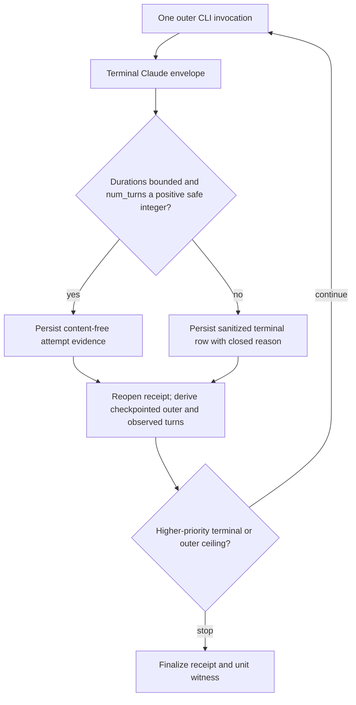

# U24 Claude Turn Accounting - Plan

## Goal Capsule

- **Objective:** Make the bounded U24 campaign accept valid structured-output repair while reporting truthful observed Claude turn accounting.
- **Means:** Treat `num_turns` as observed agent-loop evidence, keep the enforceable 110 outer-invocation and 120-second-per-invocation ceilings, and derive turn accounting from reopened receipt evidence (KTD1-KTD4).
- **Authority:** The exact Claude CLI 2.1.220 binary and its attested SHA, then the installed Claude Agent SDK 0.2.123 result types, then repository characterization evidence. Public CLI help does not define `num_turns` or expose a structured-output retry limit.
- **Stop conditions:** Stop before a live call if the exact runtime, environment, model, tool, receipt, or systemd boundaries drift. Stop after implementation review until Ivan separately approves a changed campaign using the enforceable outer-invocation and time limits and acknowledges that internal agent-loop turns and provider retries are not separately pre-capped.
- **Execution profile:** Test-first bug fix, independent code review, then at most one separately approved changed VPS campaign.
- **Tail ownership:** This plan can repair and characterize U24. It does not enable memory, release Polygram, deploy services, or unblock later memory units by itself.

---

## Product Contract

### Summary

Correct the false `num_turns === 1` invariant that stopped the `dfd2fc2` U24 campaign after one clean Claude Haiku CLI invocation. Preserve the existing classifier, content-free receipt, systemd containment, and fail-closed behavior. Make the next live authorization distinguish outer CLI invocations from internal Claude agent-loop turns.

### Problem Frame

The `dfd2fc2` campaign produced a complete JSON result and exited cleanly in 7,992 milliseconds, but U24 classified it as `invalid-envelope-turn-count`. The installed SDK types define `num_turns` on both success and error results as a numeric agent-loop count and do not promise that a successful result equals one. The pinned CLI also contains a separate private structured-output repair loop. Those facts disprove the diagnostic's exact-one contract, but they do not establish a shared finite upper bound.

The old wording also called the 110 outer subprocess invocations “Claude Haiku calls.” That is not precise. One outer invocation can contain multiple agent-loop turns, while provider transport retries are a separate implementation detail that `num_turns` does not measure. The exact binary's private structured-output retry default is not proof that `num_turns` is bounded by the same value, so this plan does not turn that observation into a cost ceiling.

### Requirements

**Envelope contract**

- R1. A successful Claude result is structurally valid when both duration fields remain within their existing bounds and `num_turns` is a positive safe integer under the exact attested Claude CLI 2.1.220 route. The actual value is evidence, not an authorization or cost limit.
- R2. Missing, fractional, zero, negative, non-safe, or non-numeric `num_turns` remains invalid under the existing layered mapping: the parser's content-free carrier is `turn-count-invalid`; the harness reports `ROUTER_OUTPUT_MALFORMED` with that carrier; and the diagnostic persists terminal outcome `diagnostic-failure` with reason `invalid-envelope-turn-count`. Invalid duration plus invalid turn evidence maps in parallel to `duration-and-turn-count-invalid` and `invalid-envelope-duration-and-turn-count`. V2 keeps these closed names; receipt versioning distinguishes v2 evidence semantics from the historical exact-one v1 contract.
- R3. Process, cleanup, stream, auth, model-identity, tool, privacy, timeout, and router-quality precedence remains unchanged. A completed parsed envelope may attach separately valid positive-safe turn evidence to those higher-priority public failures through a non-enumerable, content-free carrier; the public error and winning reason do not change. Terminal evidence rejects a close timestamp without total elapsed time and any close timestamp outside `awaiting_close`; confirmed timeout/process shapes use closed-phase offsets, while total elapsed time without close remains valid cleanup-unconfirmed evidence. A payload-valid or parsed-router envelope cannot also carry a stream-over-limit sentinel, so that contradiction stops as `invalid-evidence` before stream classification without weakening ordinary payload-false stream failures. If post-run runtime verification and artifact reopening both fail, a locally established clean unit witness preserves `integrity-failure` with accounting unavailable, while an unclean local witness preserves `cleanup-unconfirmed`; an artifact-read failure without runtime drift remains `checkpoint-unconfirmed`.

**Accounting and evidence**

- R4. The diagnostic must call each spawned Claude subprocess an outer invocation and must call `num_turns` an internal agent-loop turn count; neither term may claim to count provider HTTP requests or billable API calls. The existing 120-second deadline covers the whole outer invocation, including all internal turns and opaque provider retries.
- R5. New receipts use v2 and retain the actual valid `num_turns` on every completed attempt whose terminal envelope exposes it. Existing v1 receipts remain read-only, v1 cannot be appended, and interpretation supports both versions without rewriting either; every historical v1 discriminator-era envelope reason remains readable with its original all-null failure metrics, while v2 rejects the v1-only broad `invalid-envelope` reason. Each v2 out-of-band terminal durably records a closed `out_of_band_outer_invocation_started` boolean: pre-spawn busy, reservation, budget, and arithmetic paths record `false`, while route, result-validation, and attempt-checkpoint failures after launch record `true`. `interpretDiagnosticArtifacts` is the only aggregate-accounting surface: from the reopened validated receipt it derives checkpointed outer invocations, known internal turns, row-level unknown-turn invocations, and possible zero-or-one uncheckpointed outer work. Attempt-derived terminal receipts and v2 out-of-band rows whose launch boolean is false have exact outer counts; cleaned-up nonterminal receipts and v2 out-of-band rows whose launch boolean is true report a range from the row count through row count plus one. Historical v1 out-of-band receipts keep their closed reason-based interpretation. It persists no aggregate counters.
- R6. The campaign enforces at most 110 serial outer invocations and a 120-second deadline for each invocation. Internal agent-loop turns and provider retries are not separately pre-capped or fully observable. A completed valid envelope contributes its observed `num_turns`; missing or malformed turn evidence contributes no invented upper bound. Aggregate arithmetic that cannot remain exact fails closed during a clean interpretation, but it cannot mask an already established cleanup-unconfirmed or explicit launcher primary failure; those retain precedence with accounting unavailable.

**Operational boundary**

- R7. The changed diagnostic must preserve the exact fixture order, model, prompt, schema, disabled external/tool-execution boundary, positive environment allowlist, zero retry at the Polygram harness layer, timeout, receipt durability, busy checks, per-spawn runtime identity check, and transient systemd containment. Runtime identity is verified after busy/reservation checks but before incrementing the outer ordinal or calling the adapter; drift is therefore an exact pre-invocation out-of-band failure. The CLI-internal `StructuredOutput` schema mechanism remains enabled.
- R8. The structured-output retry environment variable must remain absent from the forwarded environment. The diagnostic must characterize the candidate route U24 evaluates rather than force an undocumented single-turn mode.
- R9. The `dfd2fc2` approval is consumed. No changed live campaign may run until Ivan approves a specific immutable commit, at most 110 outer invocations, a 120-second deadline per invocation, and the fact that internal agent-loop turns and provider retries are not separately pre-capped. The one-run rule is an operator procedure backed by exclusive evidence paths, not a global exactly-once ledger.
- R10. This correction produces diagnostic evidence and a reviewed next-decision recommendation; it never passes U24 by itself. U24 and dependent memory work remain blocked until a separately reviewed full-gate decision changes that status.

### Key Decisions

- **Keep schema-backed repair.** Structured output remains enabled because the router gate is meant to characterize the intended schema-validated route, not an easier but different text-parsing route. Governs R1, R7, R8.
- **Require renewed authorization.** The earlier approval used ambiguous “calls” wording and was consumed by the stopped run. A future campaign names the enforceable outer/time limits and the separately unbounded/opaque inner work. Governs R6, R9.

### Acceptance Examples

- AE1. Covers R1, R5. A clean success with valid durations and `num_turns: 2` is accepted, retains `2` in its v2 attempt evidence, and contributes two observed internal turns to the derived total.
- AE2. Covers R1, R6. A 110-attempt synthetic v2 receipt containing positive safe turn counts whose aggregate remains safe is valid and derives an exact observed sum without claiming that the sum was pre-capped. Individually valid values whose aggregate would exceed the safe-integer range fail closed during interpretation.
- AE3. Covers R2. A clean envelope with `num_turns: 0`, `-1`, `1.5`, `null`, an unsafe integer, or an absent field stops with the existing closed turn-count reason without storing raw output.
- AE4. Covers R3, R5. A process failure, API/auth error, or missing-output failure with an otherwise parseable positive-safe multi-turn result keeps its existing public error and reason precedence while retaining only the sanitized turn count in v2 attempt evidence.
- AE5. Covers R3. If post-run runtime verification and artifact reopening both fail, a locally established clean witness reports `integrity-failure` with unavailable accounting, an unclean witness reports `cleanup-unconfirmed`, and artifact-read failure without runtime drift remains `checkpoint-unconfirmed`.
- AE6. Covers R6. An overflowing turn aggregate throws during a clean interpretation, but cleanup-unconfirmed and explicit `integrity-failure`/`runner-nonterminal` launcher reasons remain visible with accounting unavailable.
- AE7. Covers R7. Runtime identity drift after busy/reservation checks calls neither the adapter nor a model-backed route, checkpoints out-of-band launch state false, and derives an exact unchanged outer-invocation count.
- AE8. Covers R9. A reviewed commit cannot launch the VPS campaign until the authorization text names the immutable commit, the 110-outer and 120-second limits, and the lack of a separate internal-turn/provider-retry cap.

### Scope Boundaries

In scope:

- The U24 spike parser, attempt sanitizer, diagnostic validator, receipt interpretation, tests, and operator documentation.
- One independently reviewed implementation and at most one newly authorized changed VPS campaign.
- Durable findings and parent-plan updates after that campaign.

Outside this plan:

- Production memory routing, publication, recall, migration, or rollout.
- Changes to the router prompt, fixtures, privacy policy, model, timeout, retry policy, or process supervisor.
- Estimating provider HTTP retries or billing from `num_turns`.
- A Claude CLI pin upgrade or reliance on undocumented environment overrides.

### Success Criteria

- Positive safe integer values, including the exact observed repaired-output shape, round-trip through parser, harness, classifier, and v2 receipt validation.
- Invalid numeric shapes fail closed with the existing content-free turn-count reason and no raw payload persistence.
- Existing v1 receipts remain readable with their original exact-one-era reason semantics.
- Checkpointed outer count, possible uncheckpointed outer work, and observed internal-turn accounting are derived and test-pinned without adding a redundant durable counter or false upper bound.
- Existing U24 precedence, receipt compatibility, cleanup, and adjacent secret/memory tests stay green with zero unreported skips.
- Any live rerun uses a new immutable commit and a fresh authorization that states the enforceable limits and the opaque/unbounded inner-work caveat.

---

## Planning Contract

### Key Technical Decisions

- KTD1. **`num_turns` is accounting evidence, not an exact-one validity flag.** The installed SDK exposes it on terminal results as an agent-loop count, and existing repository research records a valid two-turn flow. U24 disables external and side-effecting tools, but its CLI-internal `StructuredOutput` mechanism can use more than one turn to repair schema output. A positive safe integer is accepted; no private retry constant is treated as a public turn-count bound. Implements R1-R5.
- KTD2. **Bind behavior, not an invented count ceiling, to the exact pin.** The attested Claude CLI 2.1.220 binary, SDK types, model, arguments, and environment define the candidate route. Turn evidence outside the positive-safe-integer shape fails closed, but the plan does not assert that the private structured-output attempt default equals `num_turns`. Any CLI pin change still requires re-characterization. Implements R1, R2, R6, R8.
- KTD3. **Write v2 and preserve v1 as historical evidence.** New receipts use v2 because a value other than one can now be valid evidence. The reader validates/interprets existing v1 and v2 receipts, rejects append attempts to v1, preserves every v1 discriminator-era all-null envelope row, and rejects the v1-only broad `invalid-envelope` reason from v2. V2 stores the actual valid value in `evidence.num_turns`; duration-only and missing-output rows may retain compatible turn-only evidence, while framing, invalid-turn, and combined-invalid rows cannot. Aggregate accounting is derived rather than duplicated. Implements R2-R6.
- KTD4. **Derive accounting once from durable evidence.** `interpretDiagnosticArtifacts` reopens and validates the receipt, then reports checkpointed outer invocations, the exact sum of known internal turns, the count of rows with unknown turn evidence, and possible uncheckpointed outer work. Attempt-derived terminal receipts are exact. Every v2 out-of-band checkpoint carries the exact closed `out_of_band_outer_invocation_started` boolean, threaded from the campaign through the in-service runner into the receipt; `false` is exact and `true` adds zero-or-one possible uncheckpointed outer invocation. The per-spawn runtime identity seam runs before the ordinal and adapter invocation, so its failure records false. Cleaned-up nonterminal receipts also report the one-invocation-wide range. Historical v1 receipts alone retain the closed reason-to-phase inference. If runtime verification and artifact reopening both fail, the already established local unit witness can preserve integrity/cleanup precedence but cannot supply receipt accounting. Aggregate overflow likewise cannot replace cleanup or an explicit launcher primary reason; accounting becomes unavailable on those paths, while a clean interpretation still fails closed. Unknown or uncheckpointed internal work has no fabricated finite upper bound. Implements R3, R5-R7, R9.
- KTD5. **Do not force a hidden turn limit.** Neither undocumented `--max-turns` nor `MAX_STRUCTURED_OUTPUT_RETRIES` is added. Either would change the candidate route and still would not make provider retries observable. The positive environment allowlist continues to omit the retry variable. Implements R7, R8.

### High-Level Technical Design

The envelope validator owns the per-attempt bound. The v2 receipt validator repeats the same contract at the durable boundary. Campaign arithmetic derives aggregate work from validated attempt rows. V1 remains a read-only compatibility path and is never rewritten.

### Sequencing

1. Correct the parser-to-receipt contract with failing tests that reproduce `num_turns: 2` being rejected.
2. Run focused and adjacent verification, then independent correctness, failure/accounting, and simplicity reviews.
3. Fold must-fixes and commit one immutable changed diagnostic.
4. Stage and attest that exact commit without a model call.
5. Explain the enforceable outer/time limits and the inner-work caveat, then obtain fresh explicit approval.
6. Run at most one changed campaign, preserve its artifacts, map its outcome through the existing next-decision table, and retain the U24 block pending that separate decision/full gate.

### Risks and Dependencies

- **Hidden upstream contract:** The exact relationship between the private structured-output retry loop and emitted `num_turns` is not public. Mitigation: accept only the SDK's positive numeric evidence shape, bind the route to the exact version/SHA, and make no internal-turn cost-cap claim.
- **Ambiguous cost language:** Agent-loop turns are not provider requests or billable calls. Mitigation: use the three distinct terms consistently and never infer transport retry count.
- **False green from widened validation:** Accepting positive safe integers could hide unrelated envelope defects. Mitigation: change only the turn-evidence predicate; preserve duration, model, schema, router-quality, and lifecycle gates, and keep all invalid numeric shapes closed.
- **Receipt drift:** Parser and durable validators could accept different ranges or reinterpret old reasons. Mitigation: table-driven parser-to-harness-to-classifier-to-checkpoint round trips cover every boundary value, plus v1-read/v2-write compatibility.
- **Crash accounting:** A serial outer invocation can launch and terminate before its attempt row is checkpointed. Mitigation: distinguish checkpointed rows from a cleaned-up nonterminal run's zero-or-one possible uncheckpointed invocation.
- **Live-run repetition:** Reusing the consumed approval or rerunning the same commit would violate operator policy. Mitigation: require a new immutable commit, exclusive evidence paths, and fresh approval; do not claim a global exactly-once ledger.
- **Inherited trust boundary:** This correction does not replace the reviewed timeout diagnostic's exact runtime/SHA, subscription-auth mode, exact model identity, positive environment, owner-only no-follow receipt/witness creation, atomic durability, cgroup cleanup, or content-free artifact checks. Same-UID malicious-code containment and provider-owned shared state remain outside the accepted diagnostic threat boundary; “no production mutation” describes diagnostic-initiated behavior, not an OS sandbox guarantee.

The one-run rule remains deliberately procedural. This campaign has no scheduler, public launch endpoint, or autonomous retry path; one authorized operator starts one reviewed command, and the durable findings record that the authorization was consumed. A commit-scoped authorization ledger would add production-like state to a one-off diagnostic without protecting against the same trusted operator intentionally choosing a different commit. If launch authority later becomes multi-operator or automated, this decision must be reopened.

### Alternatives Considered

- **Disable `--json-schema`:** Rejected because it changes the route under evaluation and weakens deterministic schema enforcement.
- **Add hidden `--max-turns` or set the undocumented retry environment variable:** Rejected because either change would make the diagnostic route different, neither exposes provider retry count, and the public pinned contract does not promise the flag/variable.
- **Treat the private retry default as a five-turn ceiling:** Rejected because the binary's structured-output retry count and emitted `num_turns` are separate signals; no reviewed proof equates them.
- **Reduce the campaign to 22 outer invocations:** Rejected because the historical timeout appeared at outer ordinal 77; the smaller sample cannot answer the existing U24 question.
- **Call 110 the total model-call budget:** Rejected because the CLI can perform several agent-loop turns per outer invocation and `num_turns` does not expose transport retry count.

---

## Implementation Units

### U1. Correct the terminal-envelope turn contract

- **Goal:** Accept valid repaired structured output while preserving every existing failure boundary.
- **Requirements:** R1-R3, R5, R8.
- **Dependencies:** None.
- **Files:** `scripts/spikes/memory-routing-gate/adapters.mjs`, `scripts/spikes/memory-routing-gate/harness.mjs`, `scripts/spikes/memory-routing-gate/diagnose-timeouts.mjs`, `tests/scoped-memory-routing-gate.test.js`, `tests/memory-routing-timeout-diagnostic.test.js`.
- **Approach:**
  1. Define one turn-evidence predicate and change the success-metric path and content-free sanitizers to retain positive safe integers.
  2. Reuse the predicate at classifier and v2 receipt-validation boundaries.
  3. Preserve the exact actual value instead of normalizing it to one.
  4. Preserve a separately valid sanitized turn value through a non-enumerable error carrier when a completed parsed envelope reaches duration-only, missing-output, or API/auth precedence, so the terminal v2 row retains known turn accounting without changing the public error or winning reason.
  5. Keep v1 exact-one-era validation read-only, including all discriminator-era all-null envelope rows; keep the closed reason vocabulary and parser-to-diagnostic mapping, reject the v1-only broad envelope reason from v2, and refuse to append fresh checkpoints to v1.
  6. Keep all higher-priority lifecycle classifications unchanged.
- **Execution note:** Start with an end-to-end failing regression for the exact `num_turns: 2` clean-success shape that `dfd2fc2` rejected.
- **Patterns to follow:** Reuse the existing closed envelope carrier, exact-key receipt grammar, table-driven terminal round trips, and content-free evidence projection.
- **Test scenarios:**
  - Parser results with valid durations and representative positive safe integers—including 1, 2, 5, and a value above 5—succeed and retain the exact value.
  - The exact `num_turns: 2` result passes adapter, harness, diagnostic classifier, and fresh v2 checkpoint validation.
  - Missing, null, zero, negative, fractional, string, unsafe-integer, and non-finite values retain the existing closed turn-count failure.
  - A valid turn count plus invalid duration retains the duration-only reason; both invalid retain the combined reason.
  - Duration-only, missing-output, and API/auth failures carry a compatible valid sanitized turn count through adapter, harness, classifier, and v2 checkpoint without changing public precedence or exposing raw output; framing, invalid-turn, and combined-invalid evidence cannot contradict their reason.
  - Process exit, cleanup-unconfirmed, overflow, auth, model-identity, tool-use, router-quality, timeout, and secret boundaries keep their existing precedence.
  - Close evidence without total elapsed time or outside `awaiting_close` is invalid; confirmed before-input and after-input timeout/process rows retain their closed classifications, while total elapsed time without close remains available to cleanup-unconfirmed.
  - Payload-valid and parsed-router envelopes with either stream-over-limit sentinel stop as invalid evidence; ordinary payload-false stdout/stderr overflow retains stream precedence and durable grammar.
  - Existing v1 receipts remain readable and immutable; fresh checkpoints require v2; unchanged framing, payload, duration, and combined reason names remain valid for their version.
- **Verification:** Focused tests prove parser-to-durable-receipt parity and the exact prior failure is green without changing unrelated result shapes.

### U2. Make campaign accounting and authorization explicit

- **Goal:** Enforce the outer/time campaign limits and report observed internal work without changing router behavior or rewriting historical receipts.
- **Requirements:** R4-R9.
- **Dependencies:** U1.
- **Files:** `scripts/spikes/memory-routing-gate/diagnose-timeouts.mjs`, `scripts/spikes/memory-routing-gate/README.md`, `tests/memory-routing-timeout-diagnostic.test.js`.
- **Approach:**
  1. In `interpretDiagnosticArtifacts`, derive checkpointed outer invocations, known internal agent-loop turns, row-level unknown-turn invocations, possible uncheckpointed outer work, and whether an exact internal-turn total is available from reopened validated evidence. For v2, use the durable out-of-band launch boolean rather than inferring launch phase from the terminal reason; keep the existing reason inference only for read-only v1 receipts.
  2. Keep 110 as the outer invocation ceiling and 120 seconds as the per-invocation deadline; do not manufacture a finite internal-turn or provider-retry ceiling.
  3. Route every launcher branch that successfully reopens a receipt and unit witness—including cleanup-failed and run/stop-error branches—through the same interpreter while preserving the existing primary reason. Pre-artifact failures explicitly report accounting unavailable. If runtime verification and artifact reopening both fail, use the already established local witness only to preserve cleanup precedence: clean means `integrity-failure`, unclean means `cleanup-unconfirmed`; without runtime drift, the artifact-read failure remains `checkpoint-unconfirmed`.
  4. Pin terminology and the fresh-approval format in the runbook.
  5. Assert that neither the undocumented structured-output retry environment variable nor hidden turn-limit flag is added.
- **Test scenarios:**
  - One attempt with `num_turns: 2` reports one checkpointed outer invocation, two known internal turns, zero unknown-turn invocations, and an exact observed total of two.
  - A complete 110-attempt terminal receipt reports 110 checkpointed outer invocations and the exact sum of its positive safe turn values.
  - A receipt containing individually safe values whose aggregate would overflow safe-integer arithmetic fails closed instead of emitting an inexact total.
  - Mixed valid values derive the exact sum after reopening the durable receipt rather than trusting an in-memory counter.
  - A sanitized terminal attempt with invalid or unavailable turn evidence persists its closed terminal row but reports an unknown turn contribution and no finite maximum.
  - Attempt-derived terminal receipts and v2 out-of-band checkpoints whose launch boolean is false report exact outer counts.
  - A route throw followed by an out-of-band terminal checkpoint, a result-validation failure, an attempt-checkpoint failure, and a cleaned-up nonterminal receipt each report checkpointed rows plus a zero-or-one possible uncheckpointed outer invocation; the corresponding v2 out-of-band rows record launch boolean true.
  - The v2 out-of-band grammar requires the exact launch boolean, rejects reason/phase contradictions, and leaves the v1 receipt schema unchanged.
  - Runtime identity drift after busy/reservation and before adapter invocation stores launch boolean false and exact accounting; the adapter is not called.
  - Invalid turn evidence selects the existing diagnostic failure path and remains durably represented without raw output.
  - The environment and arguments passed to Claude omit the structured-output retry override and hidden turn-limit flag.
  - Existing sequence, wall-time, reservation, cleanup, witness, and zero-busy arithmetic remains unchanged.
  - Launcher-level cleanup and run/stop failures include reopened-receipt accounting when artifacts are valid; failures before durable artifacts say accounting is unavailable.
  - Combined runtime-verification and artifact-read failures preserve locally proven cleanup precedence without inventing accounting; artifact-read failure alone keeps its checkpoint reason.
  - Aggregate turn overflow remains fail-closed for a clean interpretation but yields unavailable accounting instead of masking cleanup-unconfirmed or an explicit launcher primary reason.
- **Verification:** The operator can state the enforceable outer/time limits and the exact observed accounting—or explicit unknowns—from validated artifacts, and v2 adds no redundant aggregate field.

### U3. Review once, rerun once, and fold the disposition

- **Goal:** Produce one auditable changed result or retain the U24 block without mutating production.
- **Requirements:** R7, R9, R10.
- **Dependencies:** U1, U2.
- **Files:** `docs/2026-08-18-001-u24-memory-routing-gate-findings.md`, `docs/plans/2026-07-31-002-feat-shumabit-scoped-memory-plan.md`, `scripts/spikes/memory-routing-gate/README.md`.
- **Approach:**
  1. Before final code review, table-test every v2 terminal/accounting state against the inherited timeout-characterization next-decision table and amend any unmapped state.
  2. Complete independent code review and fold every must-fix before the immutable commit is created.
  3. Stage and attest only that exact commit, then rerun the timeout diagnostic's existing zero-model checks for the expected CLI path/SHA, subscription-auth mode, exact model, environment allowlist, owner-only no-follow evidence paths, content-free receipt/witness schemas, import boundary, and systemd capability. Persist no credential value, raw prompt, raw model output, or raw subprocess stream.
  4. Obtain fresh approval that names the commit, at most 110 outer invocations, the 120-second outer-invocation deadline, and that internal agent-loop turns and provider retries are not separately pre-capped or fully observable.
  5. Run at most one changed campaign and preserve the receipt, unit witness, hashes, cleanup proof, and exact disposition.
  6. Map the outcome through the reviewed table, update durable U24 evidence and parent dependencies, and keep U24 blocked pending the named follow-up. Do not enable, release, or deploy memory from this unit.
- **Test scenarios:**
  - Staging or runtime drift stops before a model invocation.
  - Approval that omits the outer-invocation limit, per-invocation deadline, or inner-work caveat is insufficient to launch.
  - A clean campaign result derives checkpointed outer invocations and observed internal turns from the reopened receipt.
  - Every v2 terminal/accounting state selects an explicit next-decision branch before live authorization.
  - Any terminal event stops the campaign once, preserves the higher-priority reason, and proves the unit inactive with an empty cgroup.
  - Every retained artifact and operator-visible log remains within the existing allowlisted content-free schemas and contains no fixture text, model payload, raw stream, or credential material.
  - No diagnostic action mutates the Polygram application, managed application services, packages/configuration, Telegram, databases, or memory stores. Transient diagnostic-unit state, private evidence artifacts, and opaque provider-owned shared state are explicit exceptions.
- **Verification:** One reviewed artifact set supports exactly one durable U24 disposition and no unchanged rerun occurs.

---

## Verification Contract

| Gate | Units | Required result |
|---|---|---|
| Focused Node 24 tests | U1, U2 | The scoped routing and timeout-diagnostic suites pass with zero failures and zero unreported skips. |
| Adjacent secret/memory tests | U1, U2 | The established six-file adjacent suite passes with zero failures and zero unreported skips. |
| Full repository tests | U1, U2 | The repository-standard suite passes; every explicit skip is reported separately. |
| Independent code review | U1-U3 | Correctness, failure/accounting, and simplicity reviewers report no remaining must-fix. |
| Immutable staging preflight | U3 | Exact commit, archive, runtime, auth, model, environment, systemd, busy, receipt, and cleanup evidence passes without a model call. |
| Live campaign | U3 | Only after fresh approval, at most one changed run uses no more than 110 outer invocations and 120 seconds per invocation; internal turns and provider retries are not separately pre-capped, observed turn evidence is reported without extrapolation, and the declared production-mutation boundary remains intact. |

No gate may interpret `num_turns` as provider HTTP request count. No live result automatically enables memory.

---

## Definition of Done

- The exact `dfd2fc2` false rejection is pinned by a red-to-green regression.
- Parser, harness, classifier, and v2 receipt validators share the exact positive-safe-integer evidence contract.
- Attempt evidence preserves the actual valid observed value; v1 stays readable; and aggregate accounting is derived without redundant durable fields.
- The enforceable outer/time limits and the internal-turn/provider-retry caveat are documented, test-pinned, and present in any new live authorization.
- Existing security, privacy, lifecycle, timeout, and receipt behavior remains green.
- Independent reviewers have no unresolved must-fix.
- At most one newly approved changed campaign has produced durable evidence and a named next decision, or U24 remains explicitly blocked without a rerun.
- The parent memory plan and findings record the resulting U24 disposition.
- No abandoned experimental code, temporary staging, or live service/process remains.
- No release, deployment, or memory enablement occurred under this plan. Transient diagnostic-unit state and private evidence artifacts are not represented as production changes.

---

## Appendix

### Sources and Research

- `docs/2026-08-18-001-u24-memory-routing-gate-findings.md` records the exact `dfd2fc2` receipt, hashes, timing, and cleanup proof.
- `docs/plans/2026-08-19-0012-fix-u24-timeout-characterization-plan.md` owns the original diagnostic and its exact-one assumption; this plan supersedes only that turn-count and accounting contract.
- `docs/sdk-query-lifecycle-research.md` records that `num_turns` is an agent-loop count and shows a valid two-turn result.
- `node_modules/@anthropic-ai/claude-agent-sdk/sdk.d.ts` from installed SDK 0.2.123 defines numeric `num_turns` on success and error terminal results and exposes `error_max_structured_output_retries`.
- The exact Claude CLI 2.1.220 `--help` documents `--json-schema` but no public max-turn or structured-output retry option. Inspection of the attested pinned binary shows a private structured-output attempt limit, but its emitted `num_turns` comes from a separate counter; this plan intentionally does not equate them.
