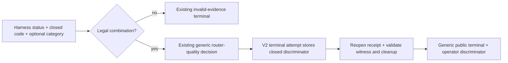

# U24 Router-Quality Discriminator - Plan

## Goal Capsule

- **Objective:** Preserve the exact closed router-quality failure code that the U24 harness already produces, so the next router change is based on evidence rather than a generic `router-quality-failure` result.
- **Means:** Add two content-free fields to the current internal v2 diagnostic attempt: `router_quality_code` and, only for expectation mismatch, `router_quality_observed_category`.
- **Boundary:** This changes diagnostic evidence only. It does not change the router prompt, contract, fixtures, retries, model, timeout, routing, publication, Telegram, or memory behavior.
- **Stop conditions:** Stop before a model call if local tests, code review, immutable staging, no-model systemd checks, fresh approval, or the existing runtime/auth/path/receipt/busy checks fail. Stop the campaign at its first terminal result and never rerun an unchanged commit.

## Product Contract

### Problem

The signed `6db4377` campaign stopped at outer invocation 53 with the generic result `router-quality-failure`. The harness had already produced one exact content-free failure code, but the diagnostic discarded it before writing the receipt. The stored evidence therefore cannot distinguish an expectation mismatch from schema, split, privacy-veto, extractiveness, or secret-output failures.

This is an evidence-loss bug, not evidence that the router prompt should change.

The diagnostic receipt is an internal spike artifact and has never been deployed as an application or public data contract. We will update its current v2 attempt format in place. Historical campaign evidence remains preserved in committed findings and hashes; the implementation does not add a migration layer, a third schema, or a compatibility framework for reopening old working receipts.

### Requirements

- R1. Before constructing a router-quality attempt, require the harness result's `fixtureId` and `expected` fields to match the loop's authoritative fixture, then accept exactly these source result shapes:
  - `status: 'mismatch'` with `ROUTER_EXPECTATION_MISMATCH` and observed category `work`, `personal`, or `mixed`. For expected `work` or `personal`, observed must differ. Expected `mixed` plus observed `mixed` is legal because its frozen part matchers may still fail.
  - `status: 'operational_error'` with one of the other nine frozen router-quality codes.
  Missing, unknown, or impossible combinations become the existing `diagnostic-failure / invalid-evidence` result.
- R2. Every newly written v2 attempt has exact keys `router_quality_code` and `router_quality_observed_category`. Both are normally `null`. Only the unique terminal `router-quality-failure` attempt may carry a code; only `ROUTER_EXPECTATION_MISMATCH` may carry an observed category.
- R3. Keep the discriminator check narrow: validate only the R1 status/code/category rule before classification, then validate frozen membership, expected-category relation, and terminal-only placement on append and reopen. The existing receipt grammar remains the sole owner of fixture/ordinal, timing, payload, and terminal validation. Derive the expected category during reopen from that existing ordinal-to-manifest fixture binding; do not create a code-to-fixture matrix for the nine operational codes.
- R4. Persist only the frozen code and optional three-value category. Never persist raw facts, model output, prompts, stderr, credentials, paths, explanations, or secret-derived digests.
- R5. Keep the public terminal `{ outcome, reason, next_decision }`, accounting, cleanup result, and campaign stop behavior unchanged.
- R6. Strip the discriminator from the ordinary in-memory `campaignResult`. `interpretDiagnosticArtifacts` structurally validates and extracts it from its receipt argument; the existing `runWithUnitLauncher` call path owns the guarantee that this argument was reopened alongside the witness and cleanup proof. `runSystemdDiagnostic` exposes it to the operator only after final copy and hash validation. No provenance token, branded receipt object, or new validation layer is required.
- R7. Do not change `contract.mjs`, `harness.mjs`, adapters, fixtures, prompt, model, retry, timeout, tools, environment, ordering, destinations, publisher, Telegram, memory policy, or the exact 22-fixture × 5-repetition campaign shape.
- R8. The `6db4377` approval is consumed. A future campaign requires a new signed commit, successful no-model staging/capability gates, and fresh explicit approval for at most 110 serial outer Claude CLI invocations with a 120-second deadline each and the existing internal-turn/provider-retry caveat.

### Frozen Codes

`ROUTER_EXPECTATION_MISMATCH`, `ROUTER_OUTPUT_SCHEMA`, `ROUTER_PARTS_OVERLAP`, `ROUTER_MIXED_AMBIGUOUS`, `ROUTER_MIXED_COVERAGE`, `ROUTER_MIXED_SENSITIVE_MISSING`, `ROUTER_MIXED_WORK_SENSITIVE`, `ROUTER_MIXED_NOT_EXTRACTIVE`, `ROUTER_PERSONAL_VETO`, and `ROUTER_OUTPUT_SECRET`.

Observed categories are limited to `work`, `personal`, and `mixed`.

### Acceptance Examples

- AE1. Mismatch + `ROUTER_EXPECTATION_MISMATCH`, expected `personal`, observed `work` produces the unchanged generic public terminal and a durable code/category on its terminal attempt.
- AE2. Operational error + `ROUTER_PERSONAL_VETO` produces the unchanged generic public terminal and durable code with category `null`.
- AE3. Mismatch + `ROUTER_PERSONAL_VETO`, operational error + `ROUTER_EXPECTATION_MISMATCH`, or an unknown code fails as invalid evidence before a router-quality attempt is written.
- AE4. Nonterminal attempts and non-router terminals require both fields to be `null`. Out-of-band terminals cannot carry them.
- AE5. Expected `work` or `personal` cannot equal the observed mismatch category. Expected `mixed` plus observed `mixed` is legal for a frozen part-matcher mismatch.
- AE6. A failed checkpoint, cleanup, receipt read, witness, copy, or hash does not expose the discriminator unless the existing outer call path later reopens and fully validates the terminal attempt. This uses the existing call-path ordering, not a new receipt-provenance mechanism.
- AE7. A synthetic ordinal-53 terminal writes exactly 53 attempts, exposes one discriminator only after artifact validation, and never invokes ordinal 54.

### Scope Boundaries

In scope:

- Current v2 attempt creation, exact-key validation, append/reopen validation, artifact interpretation, operator projection, tests, and runbook wording.
- Independent implementation review, signed commit, no-model staging, fresh authorization, and one unchanged-shape diagnostic campaign.
- Findings and parent-plan updates after that campaign.

Out of scope:

- Receipt migration or a new compatibility framework for old diagnostic working files.
- Router, prompt, schema, fixture, retry, model, timeout, destination, publication, memory, release, deployment, or service changes.
- Raw diagnostic content or dynamically generated labels.
- A reduced `personal-01` campaign or an unchanged rerun.

## Planning Contract

### Technical Design

The terminal attempt is the sole durable owner of the discriminator. The top-level terminal remains generic. The two attempt fields are always present on newly written receipts, normally as `null`, which keeps the grammar exact without creating a second top-level authority.

### Pre-registered Next Branch

| Durable code | Next reviewed branch |
|---|---|
| `ROUTER_EXPECTATION_MISMATCH` | Review category prompt/precedence; for equal `mixed`, review the frozen work/sensitive fixture matchers. |
| `ROUTER_OUTPUT_SCHEMA` | Review output-shape and prompt/schema compatibility without widening parsing from raw text. |
| `ROUTER_PARTS_OVERLAP` | Review extractive non-overlap rules while retaining zero destinations on failure. |
| `ROUTER_MIXED_AMBIGUOUS` | Review repeated-span ambiguity and source-owned slicing. |
| `ROUTER_MIXED_COVERAGE` | Review source coverage/connector expectations without accepting omissions. |
| `ROUTER_MIXED_SENSITIVE_MISSING` | Review sensitive-cue recognition without sending sensitive content to general memory. |
| `ROUTER_MIXED_WORK_SENSITIVE` | Review the work-span personal veto and split instruction without weakening the veto. |
| `ROUTER_MIXED_NOT_EXTRACTIVE` | Review prompt instructions versus exact source spans; never persist paraphrases. |
| `ROUTER_PERSONAL_VETO` | Review category prompt/precedence without weakening the deterministic personal-data guard. |
| `ROUTER_OUTPUT_SECRET` | Review sanitizer/validator interaction under a separate security review. |

### Risks

- **Unbound evidence:** Trusting an in-memory or top-level code would separate it from its invocation. Mitigation: store it only on the terminal attempt and expose it only after reopening the validated artifacts.
- **Privacy expansion:** Diagnostic usefulness could tempt raw-output storage. Mitigation: exact enums and serialized negative assertions.
- **Premature tuning:** A generic failure could still invite prompt changes. Mitigation: this plan changes no router behavior and maps each exact code to a separate reviewed next branch.
- **Campaign drift:** A reduced reproduction could hide order-dependent behavior. Mitigation: retain the exact 22 × 5 campaign.

### Alternatives Rejected

- Change the prompt now: the current evidence does not identify the failure class.
- Add receipt v3 plus migration/capability machinery: rejected because the diagnostic schema is internal and undeployed.
- Store the code at the top level: it would duplicate authority away from the originating attempt.
- Store raw output or explanations: unnecessary and outside the privacy boundary.
- Run only `personal-01`: it would be a different campaign.

## Implementation Units

### U1. Preserve the closed discriminator

- **Goal:** Make the exact router-quality code durable without changing public or routing behavior.
- **Requirements:** R1-R7.
- **Files:** `scripts/spikes/memory-routing-gate/diagnose-timeouts.mjs`, `tests/memory-routing-timeout-diagnostic.test.js`, `scripts/spikes/memory-routing-gate/README.md`.
- **Approach:**
  1. Add table-driven tests first and observe the current code lose the discriminator.
  2. Bind the result to the current fixture and validate the legal status/code/category combination before broad classification.
  3. Add the two exact fields to current v2 attempts and validate only their frozen values, expected-category relation, and terminal placement; reuse the existing receipt checks for everything else.
  4. Strip them from the ordinary campaign return and derive them only from reopened validated artifacts.
  5. Update the runbook with the current v2 contract and historical-evidence boundary.
- **Test scenarios:**
  - All ten codes reach the unchanged generic public result and round-trip through checkpoint, reopen, and interpretation.
  - All mismatch categories round-trip, including expected `mixed` plus observed `mixed`.
  - Impossible status/code/category combinations and illegal receipt placement fail closed.
  - Non-router attempts require null fields; serialized evidence remains content-free.
  - Campaign results suppress the fields; copy/hash/cleanup/primary failures suppress operator evidence.
  - A production-path test is red before the fix and green only after checkpoint plus artifact interpretation succeeds.
  - Synthetic ordinal 53 stops before ordinal 54.
- **Verification:** Node 24 focused tests with zero skips, the adjacent six-file secret/memory suite, repository-standard tests with skip accounting, and independent code review.

### U2. Sign, stage, run once, and record

- **Goal:** Obtain one auditable terminal disposition without changing production application state.
- **Requirements:** R8.
- **Dependencies:** U1 and clean independent review.
- **Files:** `docs/2026-08-18-001-u24-memory-routing-gate-findings.md`, `docs/plans/2026-07-31-002-feat-shumabit-scoped-memory-plan.md`, this plan, and the existing runbook evidence paths.
- **Approach:**
  1. Create one signed immutable commit after local verification and review.
  2. Run commit-scoped staging/import and no-model systemd capability checks.
  3. Obtain fresh approval naming the commit and exact outer/time/inner-work boundary.
  4. Run at most one exact 22 × 5 campaign, stopping at its first terminal.
  5. Validate copied receipt/witness hashes and record the terminal, accounting, cleanup, discriminator, and next reviewed branch while keeping U24 blocked.
- **Verification:** No application service, package, config, database, Telegram, or production-memory state changes; no invocation occurs after the first terminal.

## Verification Contract

| Gate | Required result |
|---|---|
| Focused Node 24 | `tests/scoped-memory-routing-gate.test.js` and `tests/memory-routing-timeout-diagnostic.test.js` pass with zero failures and zero unreported skips. |
| Adjacent memory/secret | The established disjoint six-file suite passes with zero failures and zero unreported skips. |
| Repository standard | The full suite passes with every skip and known force-exit behavior reported. |
| Independent review | Correctness, failure/privacy, operability, and simplicity review report no remaining must-fix. |
| No-model staging | Exact commit/archive import, schema tests, and transient-systemd capability gates pass without invoking Claude. |
| Live campaign | Only after fresh approval, one exact campaign runs up to 110 serial outer invocations at 120 seconds each and stops at its first terminal. |

## Definition of Done

- The ten-code and three-category vocabularies are frozen and no raw content is added.
- Legal shapes round-trip through the current v2 receipt; illegal shapes and placements fail closed.
- Only the reopened unique terminal attempt is authoritative; the public terminal stays generic.
- Prompt, contract, harness, fixtures, model, retry, timeout, tools, environment, destination, and publication behavior are unchanged.
- Focused, adjacent, and full tests plus independent review are clean with skips disclosed.
- A signed commit and no-model staging precede fresh authorization.
- At most one unchanged-shape campaign produces an exact discriminator or a different closed terminal; findings and the parent plan record the result and next reviewed branch.
- U24 and memory enablement remain blocked pending that separately reviewed next branch.
- No release, deploy, restart, or production application mutation occurs.

## Sources

- `scripts/spikes/memory-routing-gate/harness.mjs` owns the existing content-free status/code result.
- `scripts/spikes/memory-routing-gate/diagnose-timeouts.mjs` owns the broad classifier, receipt grammar, and artifact interpreter.
- `tests/memory-routing-timeout-diagnostic.test.js` owns the existing receipt, accounting, and lifecycle regression patterns.
- `docs/2026-08-18-001-u24-memory-routing-gate-findings.md` records the signed `6db4377` campaign and its generic ordinal-53 result.
- `docs/plans/2026-07-31-002-feat-shumabit-scoped-memory-plan.md` retains the U24 dependency block.

---

## Execution Outcome

U1 was independently reviewed, signed as exact commit
`54aa7f19bb49d07888c96d7903e25ff5af5c75b5`, and staged from an exact
seven-file Git archive with SHA-256
`87883bec83e59c5c0dd0ba8c06cf301ea2752b1274fe71c63931b97a8f9a8e74`.
Under exact Node `24.4.0`, the final focused suite passed 92/92 and the
disjoint adjacent memory/secret suite passed 91/91, both with zero skips. The
repository-standard suite reported 4,510 tests: 4,495 passed, zero failed, and
15 intentional capability/platform skips. Independent correctness, security,
testing, maintainability, reliability, and project-standards reviews were
clean after the one testing finding was fixed with a demonstrated red-to-green
regression.

The owner-only staging import and no-model transient-systemd capability gate
passed. After fresh approval of the exact outer-invocation boundary and the
internal-turn/provider-retry caveat, U2 ran one campaign and no unchanged
rerun.

The campaign reached all 110 outer invocations with 220 exact observed
internal agent-loop turns, zero unknown or possible uncheckpointed work, zero
slow-valid attempts, and no router-quality terminal. It ended with the
pre-registered `inconclusive / call-ceiling-fast-only` disposition and
`preserve-u24-stop-and-choose-alternate-policy` next decision. Consequently no
discriminator was present, which proves the earlier ordinal-53 generic failure
did not reproduce but does not establish the U24 pass bar.

The durable receipt SHA-256 is
`ce7e56069a4d6bcc2b6b73ec929cad108c5759b2a4defc2c0eb361d5296668c4`;
the unit-witness SHA-256 is
`44d8f58c715b6f20f8a67697e79b508e9b70485dc298a54b49d85083dc49f317`.
Independent validation proved byte-identical evidence copies, confirmed
cleanup, and removed scratch. U24 and memory enablement remain blocked pending
a separately reviewed alternate policy. No production application state,
release, deploy, or restart was involved.
